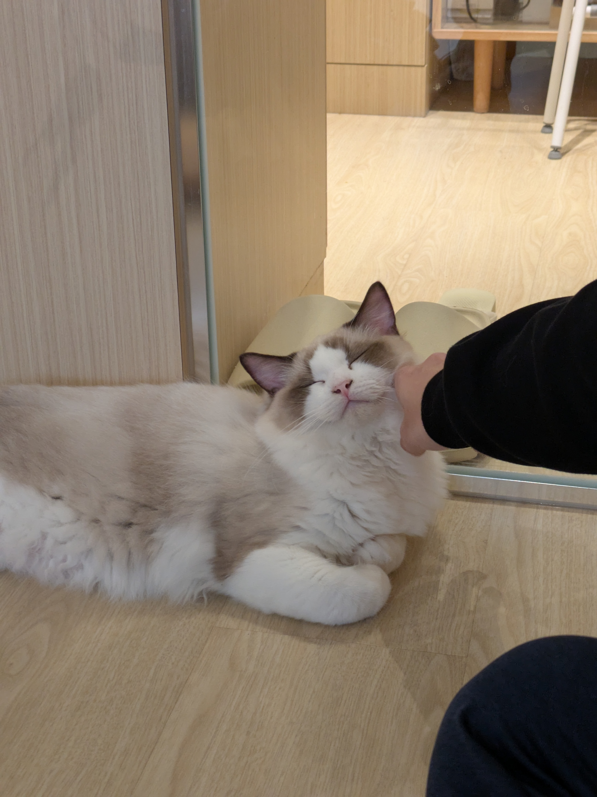

# whr_cat

## 题目简述

题目给出自定义字节码 `chall.sad`、对应解释器 `runner` 与被加密文件 `catt.enc`，要求恢复猫的照片，并从恢复文件中提取 flag。核心障碍是还原虚拟机执行的加密流程：先做循环异或，再对相邻字节执行模 $256$ 的二阶 Hill 变换。

## 解题过程

字节码文件前部保存字符串表，后部是指令流。根据解释器可建立操作码表，例如 `0x20` 为 `mov`、`0x22` 为 `movi`、`0x17` 为 `xor`、`0x38` 为 `jmp`、`0x3f` 为 `call`、`0x99` 为 `syscall`。反汇编后可将真正的数据变换归纳为两步：

1. 用字符串 `googoogaga` 循环异或全部密文字节。
2. 每两个字节组成列向量，使用矩阵

$$
K=\begin{pmatrix}
0x73 & 0x44\\
0x64 & 0x61
\end{pmatrix}
$$

在模 $256$ 下执行 Hill 变换。

解密需要求 $K$ 的逆矩阵。其行列式为

$$
\det(K)=0x73\times0x61-0x44\times0x64=4355,
$$

且 $4355^{-1}\equiv171\pmod{256}$，所以

$$
K^{-1}=171\begin{pmatrix}
0x61 & -0x44\\
-0x64 & 0x73
\end{pmatrix}\pmod{256}.
$$

完整恢复脚本如下：

```python
from pathlib import Path

xor_key = b"googoogaga"
data = bytearray(Path("catt.enc").read_bytes())

for i in range(len(data)):
    data[i] ^= xor_key[i % len(xor_key)]

det = 0x73 * 0x61 - 0x44 * 0x64
det_inv = pow(det, -1, 256)
inverse = [
    det_inv * 0x61 % 256,
    det_inv * -0x44 % 256,
    det_inv * -0x64 % 256,
    det_inv * 0x73 % 256,
]

plain = bytearray(len(data))
for i in range(0, len(data), 2):
    x, y = data[i : i + 2]
    plain[i] = (inverse[0] * x + inverse[1] * y) % 256
    plain[i + 1] = (inverse[2] * x + inverse[3] * y) % 256

Path("recovered-cat.jpg").write_bytes(plain)
```

输出以 JPEG 文件头开头，得到一张室内拍摄的布偶猫照片：猫趴在镜子前闭眼休息，右侧有人伸手抚摸它。该照片是本题被加密并要求恢复的主要视觉结果，因此保留如下。



flag 并未显示在画面像素中，而是作为附加文本留在 JPEG 尾部。对恢复文件搜索 `grey{` 即可得到：

```text
grey{wHy_1_d0_th1s_To_myself_263fea308}
```

## 方法总结

自定义虚拟机题不一定要把每条指令都翻译成高级语言；只需先识别文件读写和核心循环，再提炼真正改变数据的运算。这里的关键顺序是先撤销循环异或，再乘 Hill 矩阵的模逆。恢复出可正常显示的 JPEG 只证明主体数据正确，还要继续检查文件尾部与可打印字符串，才能找到追加在图像后的 flag。
