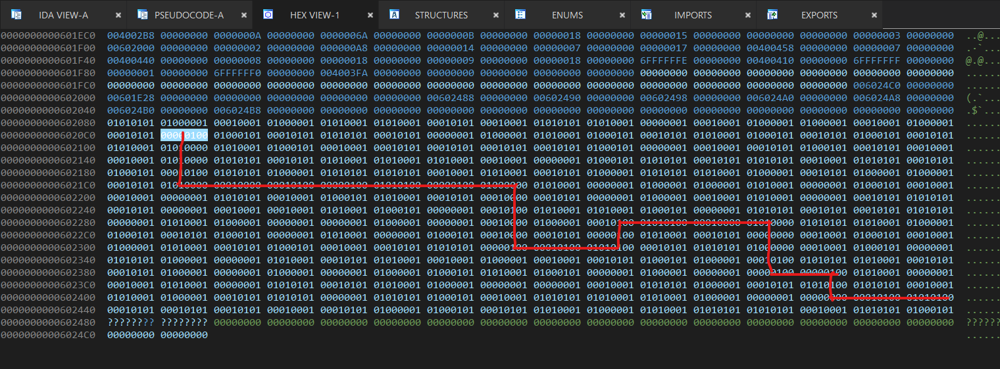

# maze

## 题目简述

程序把输入限制为 `w`、`a`、`s`、`d`，并按字符在一块全局整数数组中移动。目标是从起点走到指定终点。迷宫没有以普通二维字符图保存，而是由 IDA 数据段中的 32 位整数最低位表示墙与通路。

## 解题过程

沿输入处理函数整理四个方向对应的地址变化：

```text
d: 当前地址 + 4
a: 当前地址 - 4
s: 当前地址 + 64
w: 当前地址 - 64
```

每个格子占 4 字节，一行相邻逻辑格相差 4；上下移动相差 64，说明一行有 16 个格子。判断条件只使用整数最低位：最低位为 `1` 的格子不可通行，为 `0` 的格子可以经过。起点位于 `unk_6020C4`，终点位于 `unk_60243C`。

把数据段按上述布局排成网格并标记可通行格后，可得到如下路径。图中保留了 IDA 数据与人工标注，便于对照地址步长和转向位置：



从起点依次输入：

```text
ssssddddddsssssddwwdddssssdssdd
```

程序抵达终点后接受该字符串，flag 为：

```text
hgame{ssssddddddsssssddwwdddssssdssdd}
```

## 方法总结

- 核心技巧：从地址增量和元素宽度恢复二维数组布局，再用最低位判定墙与通路。
- 识别信号：方向字符对应固定指针加减，全局数据呈规则间隔，终点通过地址比较判断。
- 复用要点：不要把反汇编视图中的每个字节都当成独立格子；先确认元素大小、行跨度和真正参与判断的位。
