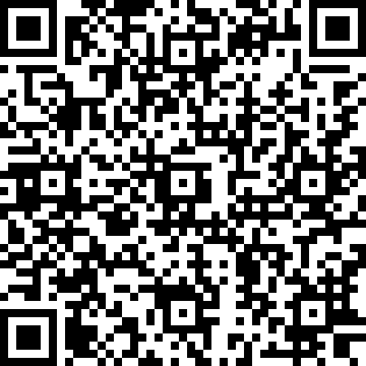

# A Five Second Challenge

## 题目简述

附件是 Unity IL2CPP 扫雷程序，棋盘为 $45\times45$。第一次查询后只给五秒操作时间，超时逻辑会让继续逐格点击失去意义；真正的雷区藏在 `BombChecker` 的三维数组 `matrix[45][15][3]` 中。每组三个系数通过二次多项式编码横向三个格子，离线还原全部 2025 个判断结果后会得到一张二维码。

## 解题过程

Unity IL2CPP 构建的主要游戏逻辑位于 `GameAssembly.dll`，类型和方法元数据位于 `global-metadata.dat`。有三条可行分析路径：

1. 阅读题目提供的 IL2CPP 中间源码，定位 `BombChecker::CheckBombAt` 与超时判断；
2. 用 Il2CppDumper 结合 `GameAssembly.dll`、`global-metadata.dat` 恢复类型和方法偏移，再在 IDA 中查看伪代码；
3. 用 dnSpy/ILSpy 打开可管理的备份 DLL，修补 `CheckBombAt` 或超时分支后观察棋盘。

静态恢复比手工点击稳定。`CheckIfExpired` 保存第一次查询时间，并判断当前 Unix 时间与它的差是否超过 `expireIn = 5`。真正决定某格是否为雷的函数可以化简为：

```csharp
double a = matrix[(int)vec.y, (int)vec.x / 3, 0];
double b = matrix[(int)vec.y, (int)vec.x / 3, 1];
double c = matrix[(int)vec.y, (int)vec.x / 3, 2];
double t = vec.x % 3 - 1;
return a * t * t + b * t + c > 0;
```

对固定的 `(y, x // 3)`，横向三个格子的 $t$ 依次为 $-1,0,1$。因此每组三个浮点数就能编码三个布尔值，15 组覆盖一行 45 格，45 行总计需要 675 组三元系数。

题目作者公开的 [`BombChecker.cs` 源码](https://gist.github.com/oyiadin/3a89737d7c8f51537e4474cafd7895b8) 保存了完整矩阵。把原始内容保存为 `BombChecker.cs` 后，可直接提取所有三元组并绘图：

```python
import re
from pathlib import Path

from PIL import Image


source = Path("BombChecker.cs").read_text(encoding="utf-8")
pattern = re.compile(
    r"\{\s*(-?[0-9]+(?:\.[0-9]+)?)\s*,"
    r"\s*(-?[0-9]+(?:\.[0-9]+)?)\s*,"
    r"\s*(-?[0-9]+(?:\.[0-9]+)?)\s*\}"
)
coefficients = [tuple(map(float, item)) for item in pattern.findall(source)]
assert len(coefficients) == 45 * 15

pixels = [255] * (45 * 45)
for y in range(45):
    for group in range(15):
        a, b, c = coefficients[y * 15 + group]
        for offset, t in enumerate((-1, 0, 1)):
            x = group * 3 + offset
            if a * t * t + b * t + c > 0:
                pixels[y * 45 + x] = 0

image = Image.new("L", (45, 45))
image.putdata(pixels)
image.resize((450, 450), Image.Resampling.NEAREST).save("minefield-qr.png")
```

必须使用最近邻缩放，否则插值会破坏模块边界。还原结果如下，只保留这张具有实际视觉验证价值的二维码，PDF 中工具界面和代码截图均已转写为文字：



扫描得到：

```text
hgame{YOU~hEn-duO_yOU-X|~DOU-sHi~un1Ty~k4i-fA_de_O}
```

其中 `X|~DOU` 中间包含竖线 `|`，不能误写为大写字母 `I` 或小写字母 `l`。

## 方法总结

题目的“五秒”限制只约束交互，不约束静态数据恢复。关键是看懂 `matrix[y][x/3][0..2]` 与 `x%3-1` 的组合：一个二次多项式在 $-1,0,1$ 三点的符号对应连续三格。IL2CPP 题应优先恢复类型、方法和全局数组，再把复杂伪代码压缩成数学表达式；最终二维码保留为图片，其余纯代码截图转写为可复制文本。
