# Androuge

## 题目简述

题目附件是 Android APK。APK 里包含 `assets/waw` 和 `assets/game`：`waw` 是魔改 Lua 5.4 虚拟机，`game` 是由该虚拟机执行的 Lua bytecode。Java 层的 MainActivity 会把两个文件复制出来，按键逻辑最终执行 `./waw game`。题目的 flag 逻辑藏在 `game` 中，但 `game` 文件整体被异或加密，且 `waw` 修改了 Lua opcode 编码，普通 luadec 无法直接反编译。

关键机制是：先恢复加密 bytecode，再按魔改 opcode 反汇编，定位密文数组和解密函数，最后按游戏配置计算出的 seed 还原 flag。

## 解题过程

先用 jadx 看 APK，确认 MainActivity 会复制 `waw` 和 `game`，并在 S 键逻辑中执行 `./waw game`。

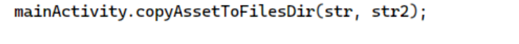

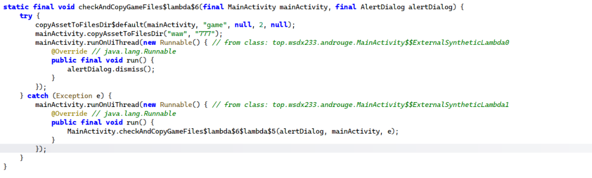

用 IDA 打开 `waw`，可以看出它是 arm64 的 Lua 虚拟机。

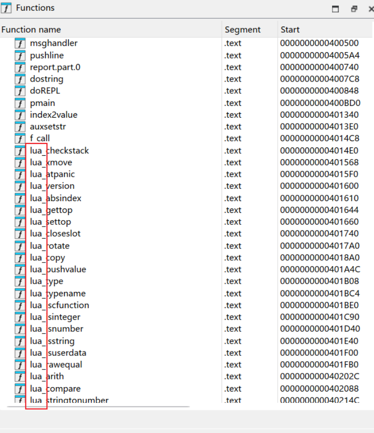

字符串显示 Lua 版本为 5.4。

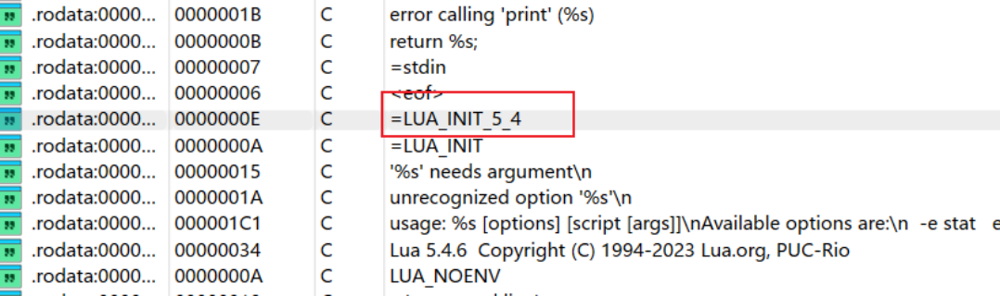

但 `game` 文件看不到正常 Lua 常量和标准魔数，说明 bytecode 被处理过。

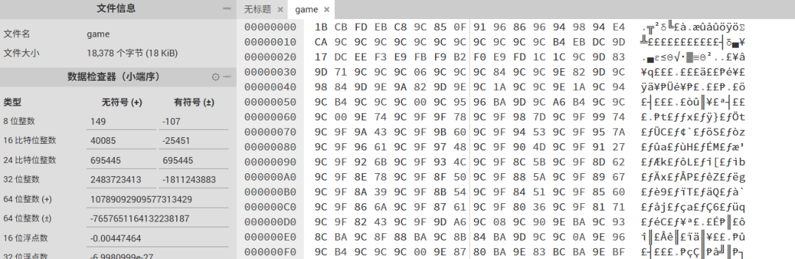

继续看 `luaU_undump` 和 `loadByte`，可以发现读取 bytecode 时会对除首字节外的每个字节异或 `0x9c`：

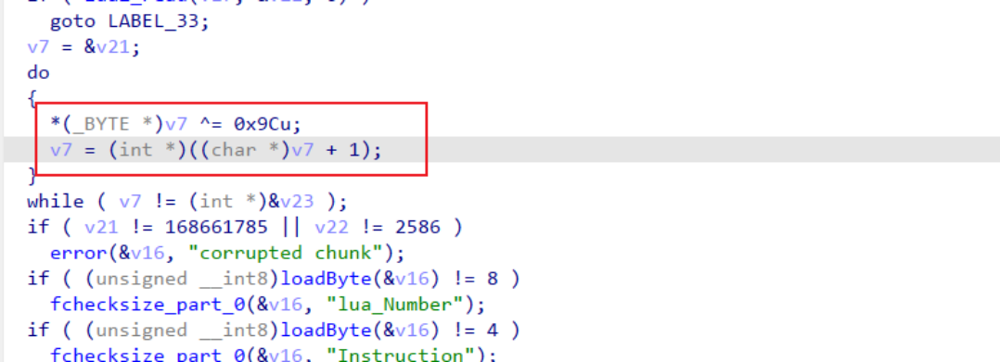

还原脚本如下：

```python
XOR_KEY = 0x9C

def decode_file(input_path, output_path):
    data = open(input_path, "rb").read()
    out = bytearray([data[0]])
    out.extend(b ^ XOR_KEY for b in data[1:])
    open(output_path, "wb").write(out)

decode_file("game", "game.dec")
```

解密后能看到 Lua 常量，说明方向正确。

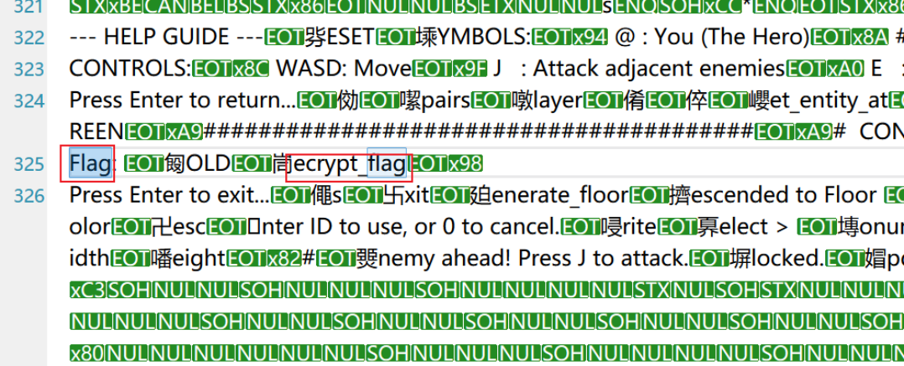

但改回标准 Lua 魔数后 luadec 仍会报错。继续对比 `luaV_execute` 与 Lua 5.4 源码，可以发现 opcode 顺序和指令位域被改过。

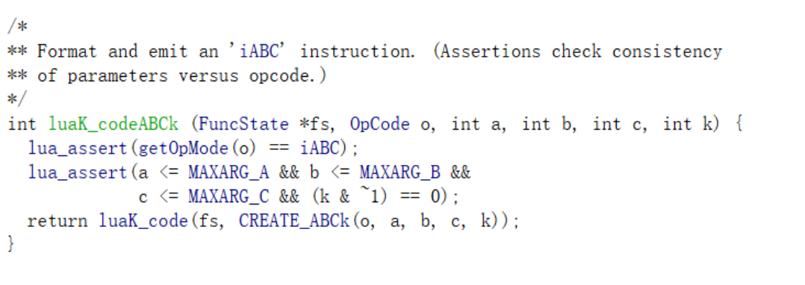

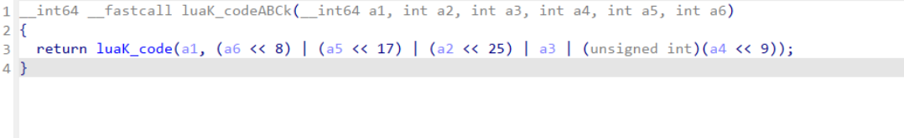

位域分布为：

```text
A  = inst & 0xff
k  = (inst >> 8) & 1
B  = (inst >> 9) & 0xff
C  = (inst >> 17) & 0xff
OP = (inst >> 25) & 0x7f
```

据此写一个轻量反汇编器，读取函数、常量、子函数并按魔改 opcode 表输出。反汇编结果里可以看到密文数组：

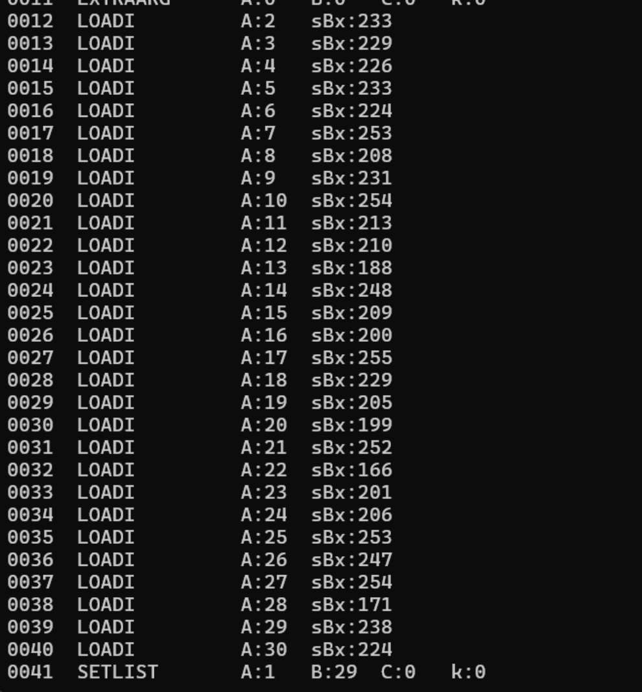

再定位解密函数：

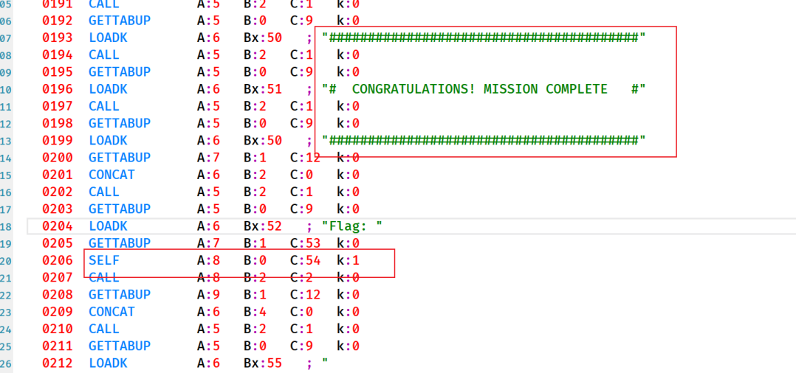

函数开头会把 `GameConfig` 里的值求和得到 seed，形成一个简单反作弊：

```text
seed = 18 + target_floor + boss_interval + view_radius
```

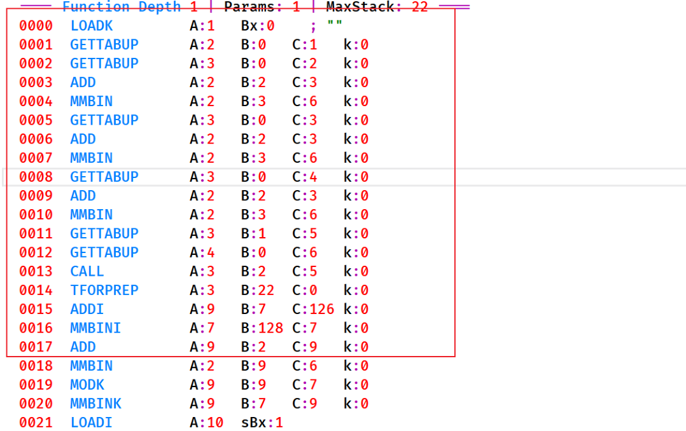

之后进入循环，mask 由 `(seed + (i - 1)) % 255` 生成。

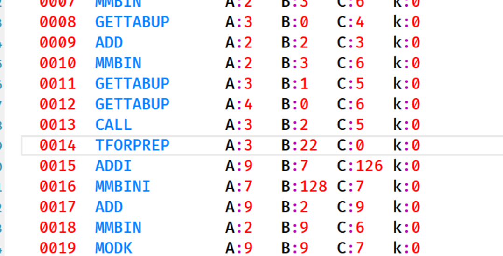

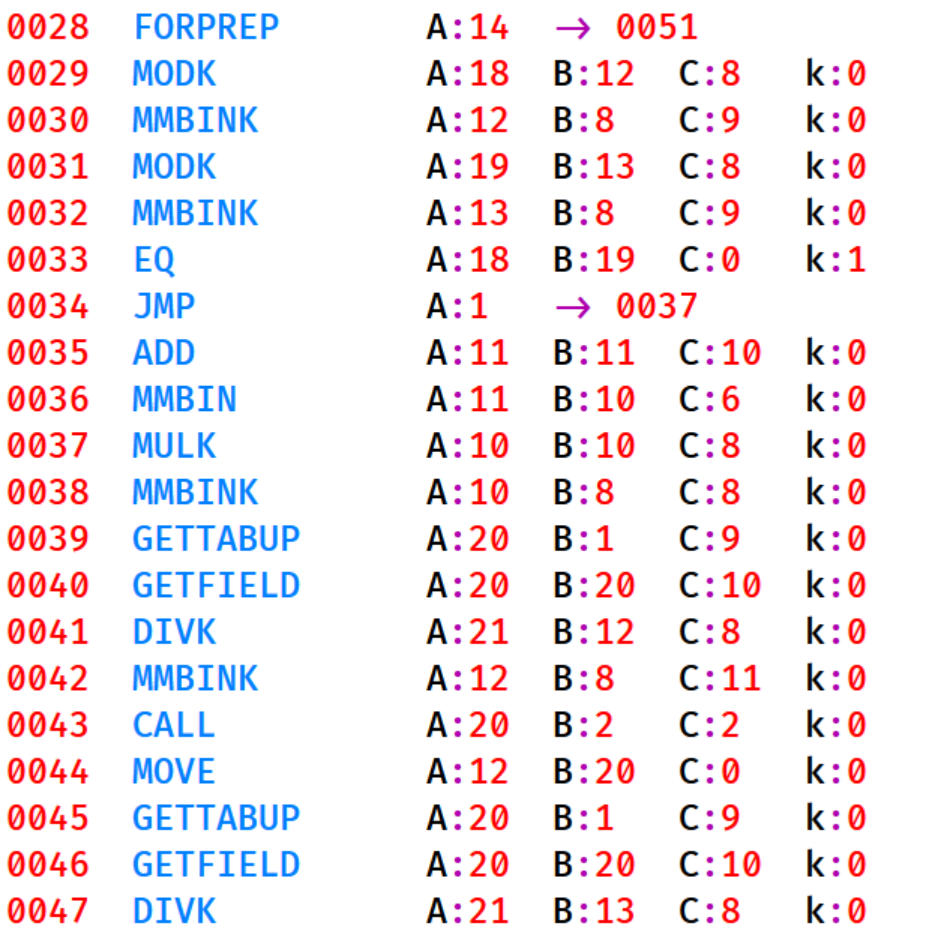

在题目给定配置下等价为逐字节异或 `i + 128`，恢复脚本如下：

```python
enc = [
    233, 229, 226, 233, 224, 253, 208, 231, 254, 213,
    210, 188, 248, 209, 200, 255, 229, 205, 199, 252,
    166, 201, 206, 253, 247, 254, 171, 238, 224,
]

flag = "".join(chr(v ^ (i + 128)) for i, v in enumerate(enc, start=1))
print(flag)
```

运行结果见图：

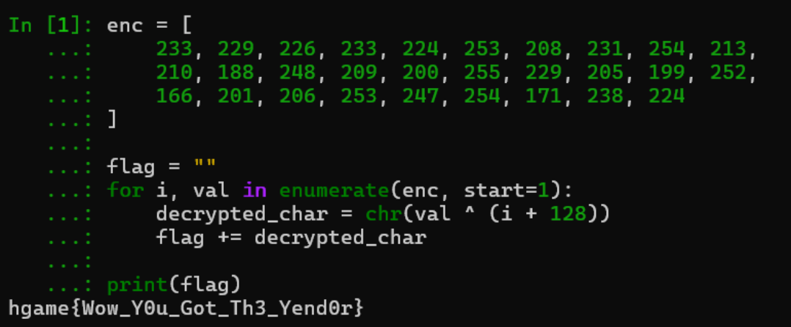

## 方法总结

- 核心技巧：APK 资源中提取自定义 VM 和 bytecode，先解 bytecode，再按修改后的 Lua opcode 反汇编。
- 识别信号：Lua bytecode 常量不可见、魔数异常、luadec 报错时，要检查加载函数是否做了解密或 opcode 乱序。
- 复用要点：自定义 Lua VM 不必完整反编译到源码，能恢复常量、定位关键函数和还原解密循环即可。
