# Marionette

## 题目简述

题目附件是 x86-64 ELF。程序读取 16 字节输入后 fork 出父子进程：子进程执行被切碎的加密逻辑，父进程通过 `ptrace` 监听子进程的 `int3` 断点并修改返回地址，驱动子进程按隐藏顺序执行 block。真正校验逻辑是“输入差分 + AES-128-ECB-NoPadding 的 12 轮变种”，最后与固定密文比较。

每个子进程 block 末尾都有固定形态：

```asm
sub rsp, 8
int3
ret
```

父进程维护一张断点表和一张经魔改 TEA 加密的下一跳表。恢复控制流后，可以看到有效指令里包含 AES key schedule、输入差分和 AES-NI 加密。

## 解题过程

程序基址固定为 `0x400000`。`main` 逻辑先解析 16 字节输入，再 fork：父进程负责 ptrace 调度，子进程负责执行加密 block。

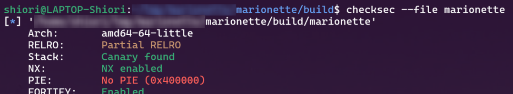

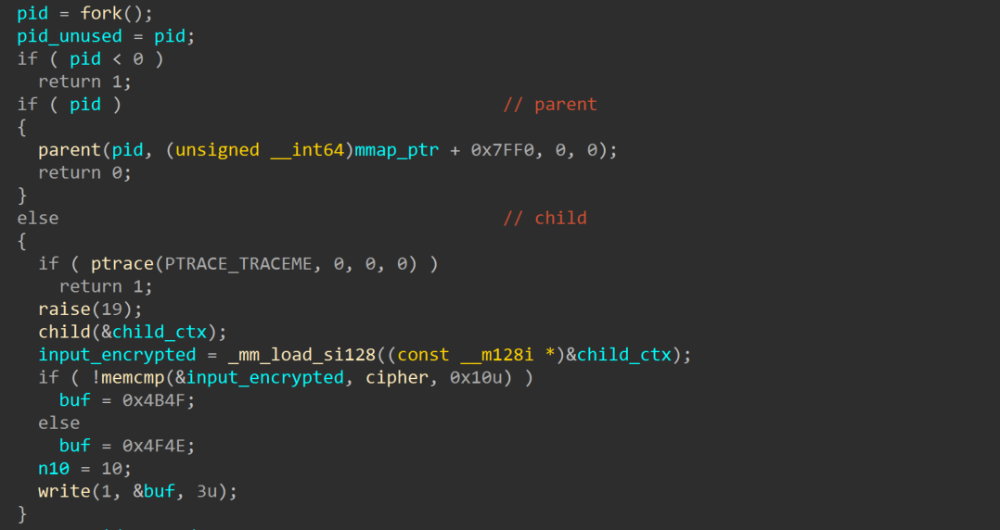

子进程中充满 `int3`。从 block 尾部可以归纳出固定终止模板：

```asm
sub rsp, 8
int3
ret
```

父进程侧没有强混淆，能看到断点地址到 `bp_table` 下标的映射。

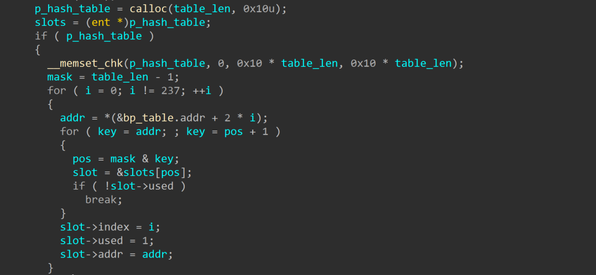

`bp_table` 第一个字段是断点地址，最后一个字段是 block 编号，中间字段是断点类型：`1` 表示普通断点，`2` 表示 `ret` 前断点。

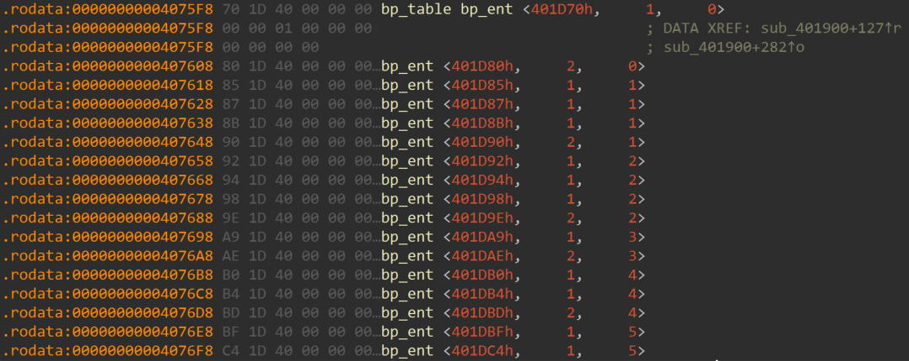

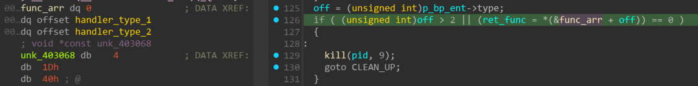

父进程处理断点时，类型 1 调用 `handler_type_1`，每次执行四轮魔改 TEA；类型 2 调用 `handler_type_2`，执行剩余轮数并改写子进程栈顶返回地址。这样子进程的 block 不按地址顺序执行。

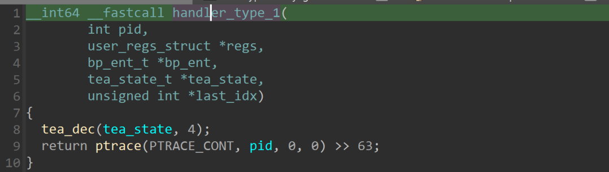

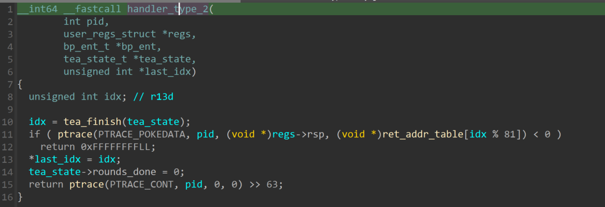

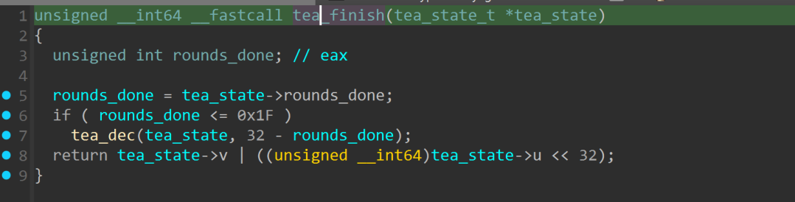

TEA 每次最终执行满 32 轮，核心解密函数如下：

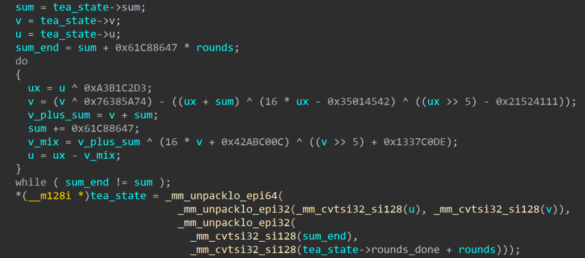

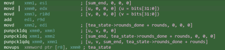

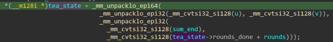

TEA 密文和返回地址表来自初始化函数：

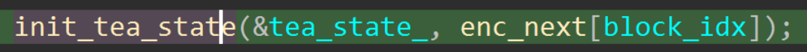

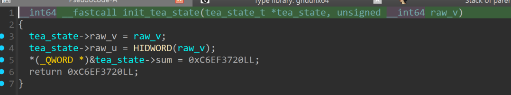

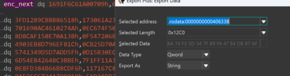

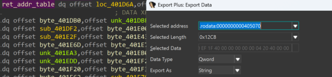

恢复下一跳的核心脚本：

```c
static uint64_t tea_decrypt32(uint64_t c) {
    uint32_t v0 = (uint32_t)(c >> 32);
    uint32_t v1 = (uint32_t)c;
    uint32_t sum = 0xC6EF3720u;

    for (int i = 0; i < 32; i++) {
        v0 ^= 0xA3B1C2D3u;
        v1 ^= 0x76385A74u;
        v1 -= ((v0 >> 5) - 0x21524111u) ^ ((v0 << 4) - 0x35014542u) ^ (v0 + sum);
        v0 -= ((v1 >> 5) + 0x1337C0DEu) ^ ((v1 << 4) + 0x42ABC00Cu) ^ (v1 + sum);
        sum += 0x61C88647u;
    }
    return ((uint64_t)v0 << 32) | v1;
}
```

因为 block 数量约 600，手工跟踪成本很高。可以用 `LD_PRELOAD` hook `ptrace`，记录每次 `PTRACE_GETREGS` 的 RIP，再从每个 `int3` 往前回溯反汇编，过滤 `int3`、`ret`、`sub rsp, 8`、`lea reg,[reg]` 等垃圾指令，得到子进程实际执行逻辑。

```c
long ptrace(enum __ptrace_request request, ...) {
    ...
    if (g_log && request == PTRACE_GETREGS && ret == 0 && data) {
        const struct user_regs_struct *regs = data;
        fprintf(g_log, "GETREGS pid=%d rip=0x%016" PRIx64 " rsp=0x%016" PRIx64 "\n",
                (int)pid, (uint64_t)regs->rip, (uint64_t)regs->rsp);
    }
    return ret;
}
```

再用 Capstone 从 trace 中恢复有效指令，能看到标准 AES key schedule 和 AES-NI 加密：

```asm
aeskeygenassist xmm2, xmm1, 0x01
pshufd          xmm2, xmm2, 0xff
pxor            xmm1, xmm3
movdqu          xmmword ptr [r12 + 0x10], xmm1
...
aesenc          xmm0, xmmword ptr [r12 + 0xb0]
aesenclast      xmm0, xmmword ptr [r12 + 0xc0]
```

整理后整体算法为：

```text
输入 16 字节
-> 从后向前做相邻字节异或差分
-> 用 key 5a097c137b8d4f2132be3b19af449c01 做 AES-128 key schedule
-> AES-128-ECB 加密 12 轮，RCON 为 01 02 04 08 10 20 40 80 1b 36 6c d8
-> 与密文 8cadb48febfd6fae8660ad44c3c75a31 比较
```

解密时做逆 AES-12，再撤销输入差分：

```python
KEY_HEX = "5a097c137b8d4f2132be3b19af449c01"
CIPHER_HEX = "8cadb48febfd6fae8660ad44c3c75a31"
ROUNDS = 12

def undo_diff(diff_block):
    plain = bytearray(16)
    plain[0] = diff_block[0]
    for i in range(1, 16):
        plain[i] = diff_block[i] ^ plain[i - 1]
    return bytes(plain)

# expand_key / inv AES-128 与标准 AES 相同，只是轮数扩展到 12 轮。
round_keys = expand_key(bytes.fromhex(KEY_HEX), rounds=ROUNDS)
diff_block = decrypt_block(bytes.fromhex(CIPHER_HEX), round_keys)
plain = undo_diff(diff_block)
print(plain.hex())
```

恢复结果为：

```text
deadbeef0ddba11dfeedfacecafebabe
```

## 方法总结

- 核心技巧：父进程 ptrace 调度子进程 `int3` block，先恢复真实执行顺序，再识别 AES-NI 加密逻辑。
- 识别信号：大量 `int3; ret`、父进程改写寄存器/栈返回地址、断点表和加密下一跳表同时出现时，说明控制流由外部调度。
- 复用要点：这类题不要硬啃地址顺序；hook `ptrace` 或调试父进程拿真实 RIP trace，再对 trace 做反汇编清洗更稳。
