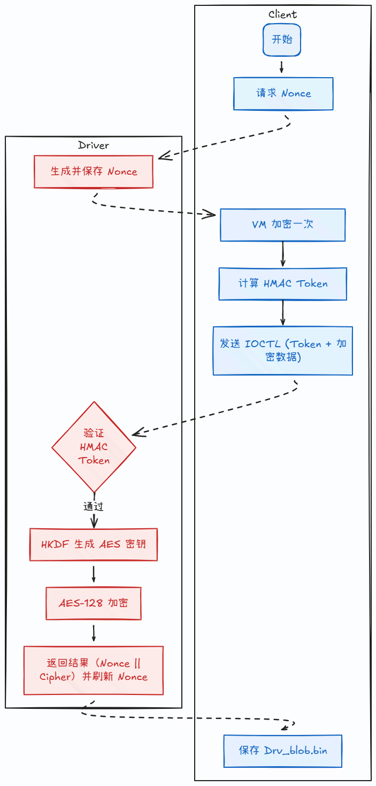

# NonceSense

## 题目简述

题面描述截获了一个基于 WDM 的内核加密系统和一次加密会话产物，并提示驱动必须在隔离虚拟机中运行。附件包含 `Client.exe`、`GateDriver.sys` 和 `Drv_blob.bin`。系统协议是：client 打开设备对象后，driver 通过 IOCTL `0x222000` 返回 16 字节 nonce；client 对输入做 VM 变换并计算 HMAC token，再通过 IOCTL `0x222004` 把 token 和变换后的输入发给 driver；driver 使用 nonce 派生 AES-128-ECB key 后输出 `nonce || cipher` 到 blob。

## 解题过程

Client 打开设备对象后，driver 生成 16 字节 nonce 并通过 IOCTL 返回给 client。Client 先对输入做 VM 变换，再使用输入和 nonce 计算 token；driver 验证 token 后使用 AES-128-ECB 继续加密，最终把 `nonce || cipher` 写入 `Drv_blob.bin`。整体加密逻辑拆在 client 和 driver 两侧，双方通过同一个 nonce 串联。

IOCTL 控制码 `0x222000` 是 `GET_NONCE`，`0x222004` 是 `DO_ENCRYPT`。Client 调用不同 API 时会产生不同主功能号，内核驱动根据 Major Function Code 进入对应分发函数；本题的重点就是把 client/driver 交互数据结构对齐。



Client的main有一个明显的虚拟机：

截图中的 VM 解释器按 `op` 分派，核心操作如下：

```c
switch (op) {
case 0:
    regs[dst] = regs[src];              // MOV
    break;
case 1:
    regs[dst] ^= regs[src];             // XOR reg
    break;
case 2:
    regs[dst] ^= src;                   // XOR imm
    break;
case 3:
    regs[dst] += src;                   // ADD imm
    break;
case 4:
    regs[dst] *= src;                   // MUL imm
    break;
case 5:
    regs[dst] &= src;                   // AND imm
    break;
case 6:
    regs[dst] = rol8(regs[dst], regs[src] & 7);
    break;
}
```

机器码定长，一条指令3字节，提取字节码写脚本反汇编：

```python
def disassemble_vm(bytecode):
    op_map = {
        0: ("MOV", "reg", "reg"),
        1: ("XOR", "reg", "reg"),
        2: ("XOR", "reg", "imm"),
        3: ("ADD", "reg", "imm"),
        4: ("MUL", "reg", "imm"),
        5: ("AND", "reg", "imm"),
        6: ("ROL", "reg", "reg")
    }
    print("IP  | Raw Bytes  | Disassembly")
    print("-" * 35)
    for i in range(0, len(bytecode), 3):
        if i + 2 >= len(bytecode):
            break
        b0, b1, b2 = bytecode[i], bytecode[i+1], bytecode[i+2]
        op = b0 - 1
        dst = b1
        src = b2
        if op not in op_map:
            print(f"{i:02X}  | {b0:02X} {b1:02X} {b2:02X}   | END (OUT)")
            break
        mnemonic, type1, type2 = op_map[op]
        op1_str = f"r{dst}"
        op2_str = f"r{src}" if type2 == "reg" else f"0x{src:02X}"
        print(f"{i:02X}  | {b0:02X} {b1:02X} {b2:02X}   | {mnemonic:<4} {op1_str}, {op2_str}")
bytecode = [0x5, 0x2, 0xd, 0x4, 0x2, 0xc3, 0x2, 0x0, 0x2, 0x1, 0x3, 0x1, 0x5,
0x3, 0x3, 0x4, 0x3, 0x1, 0x6, 0x3, 0x7, 0x7, 0x0, 0x3, 0x3, 0x0, 0x5a]
disassemble_vm(bytecode)
```

| IP | Byte 0 | Byte 1 | Byte 2 | Mnemonic | Operand 1 | Operand 2 |
| --- | --- | --- | --- | --- | --- | --- |
| 00 | 05 | 02 | 0D | MUL | r2 | 0x0D |
| 03 | 04 | 02 | C3 | ADD | r2 | 0xC3 |
| 06 | 02 | 00 | 02 | XOR | r0 | r2 |
| 09 | 01 | 03 | 01 | MOV | r3 | r1 |
| 0C | 05 | 03 | 03 | MUL | r3 | 0x03 |
| 0F | 04 | 03 | 01 | ADD | r3 | 0x01 |
| 12 | 06 | 03 | 07 | AND | r3 | 0x07 |
| 15 | 07 | 00 | 03 | ROL | r0 | r3 |
| 18 | 03 | 00 | 5A | XOR | r0 | 0x5A |

还原算法，是一个单字节变换：

```c
for (int idx = 0; idx < len; idx++) {
    uint8_t c = input[idx];
    c ^= (0xC3 + 13 * idx) & 0xFF;
    c = rol8(c, (idx * 3 + 1) & 7);
    c ^= 0x5A;
    input[idx] = c;
}
```

加密后的数据被送到 HMAC-SHA256，生成一个 16 bytes 的 token：

```asm
#pragma pack(push, 1)
struct _AUTH_MSG
{
  // header
  _BYTE header[6];
  _OWORD nonce;
  _DWORD padding;
  _WORD len;
  // body
  _BYTE data[516];
};
#pragma pack(pop)
```

HMAC 消息体的构造逻辑如下，固定头为 `AUTHv1`，再拼 nonce、counter、长度和 VM 后的数据：

```c
memcpy(&message, "AUTHv1", 6);
message.padding = 0;
message.len = len;
message.nonce = nonce;
memcpy(message.data, input, len);
hmac_sha256(K1, K1_len, &message, len + 28, &raw_token);
```

变换后的数据和 token 被包装成如下结构：

```asm
#pragma pack(push, 1)
struct _REQ_ENCRYPT_HDR{
  // header
  DWORD Counter;
  WORD DataLength;
  WORD Reserved;
  _OWORD Token;
  // body
  BYTE Data[1];
};
#pragma pack(pop)
```

调 DeviceIoControl（主功能号 IRP_MJ_DEVICE_CONTROL）把数据发给 driver：

```c
raw_lpInBuffer = (_REQ_ENCRYPT_HDR *)malloc(len + 24);
lpInBuffer = raw_lpInBuffer;
memset(raw_lpInBuffer, 0, len + 24);

lpInBuffer->Counter = 0;
lpInBuffer->DataLength = len;
lpInBuffer->Reserved = 0;
lpInBuffer->Token = token;
memcpy(lpInBuffer->Data, input, len);

memset(&OutBuffer, 0, 0x248);
DeviceIoControl(FileW, 0x222004, lpInBuffer, len + 24,
                &OutBuffer, 0x248, &BytesReturned, 0);
```

之后 driver 发回来神秘数据并被 client 写入 Drv_blob.bin：

```c
if (BytesReturned >= 8 &&
    OutBuffer.OK == 1 &&
    OutBuffer.Len &&
    BytesReturned >= OutBuffer.Len + 8) {
    raw_fp = fopen("Drv_blob.bin", "wb");
    if (raw_fp) {
        fwrite(OutBuffer.Data, 1, OutBuffer.Len, raw_fp);
        fclose(raw_fp);
        printf("data encrypted, plz check Drv_blob.bin (len=%u)\n", OutBuffer.Len);
    }
}
```

现在从 DriverEntry 开始分析 driver：

```c
DriverObject->MajorFunction[0] = (PDRIVER_DISPATCH)&DispatchCreateClose;
DriverObject->MajorFunction[2] = (PDRIVER_DISPATCH)&DispatchCreateClose;
DriverObject->MajorFunction[0xE] = (PDRIVER_DISPATCH)&DispatchDeviceControl;
DriverObject->DriverUnload = (PDRIVER_UNLOAD)DriverUnload;
```

[查阅文档，Client 调 CreateFileW 的时候对应的分发函数为 DispatchCreateClose，点进去看看：](https://gist.github.com/michaellrowley/0e6833a65300840e644ae66e2c343594#file-irps-h-L16)

```c
pSession = (SESSION *)ExAllocatePoolWithTag(...);
if (pSession) {
    pSession->Nonce = 0;
    pSession->Authenticated = 0;
    GenerateRandomNonce(&pSession->Nonce);
    pSession->Authenticated = 0;
    IrpSp->FileObject->FsContext = pSession;
    Status = 0;
    Irp->IoStatus.Status = 0;
}
```

可以看到调了 GenerateRandomNonce 生成了一个 Nonce。
[查阅文档，Client 调 DeviceIoControl 的时候对应的分发函数为 DispatchDeviceControl，ioctl code](https://gist.github.com/michaellrowley/0e6833a65300840e644ae66e2c343594#file-irps-h-L16)
= 0x222000 时给 Client 返回刚才的Nonce：

```c
BytesReturned = 16;
if (OutputBufferLength >= 0x10) {
    SystemBuffer->Counter = pSession->Nonce;
    pSession->Authenticated = 1;
} else {
    Status = 0xC0000023;
    Irp->IoStatus.Information = 0;
    Irp->IoStatus.Status = 0xC0000023;
}
IofCompleteRequest(Irp, 0);
```

ioctl code = 0x222004 时对接收到的数据进行 AES-128-ECB-PKCS#7 加密：

```c
pAllocTemp = (char *)ExAllocatePoolWithTag((POOL_TYPE)512, PayloadLength, ...);
PayloadCopy = pAllocTemp;
if (pAllocTemp) {
    mymemcpy(pAllocTemp, (char *)SystemBuffer->Data, PayloadLength);
}

if (TotalPaddedLen) {
    for (EncOffset = 0; EncOffset < TotalPaddedLen; EncOffset += 16) {
        AesEncryptBlock(RoundKeys,
                        &PlaintextBuf[EncOffset],
                        &CiphertextBuf[EncOffset]);
    }
    FinalEncSize = TotalPaddedLen;
}
```

现在需要知道 `DerivedKey` 是什么。`DerivedKey` 来自 HKDF：Salt 为 32 字节全零，IKM 为 16 字节 Nonce，Info 需要从混淆常量中解出：

```c
*Salt = 0;
SaltPadding = 0;
HMAC_SHA256(Salt, 0x20, IKM, 0x10, PRK);
InfoLen = 63;
if (KeyMaterialLen <= 0x3F)
    InfoLen = KeyMaterialLen;
mymemcpy(Salt, Info, InfoLen);
*(Salt + InfoLen) = 1;
HMAC_SHA256(PRK, 0x20, Salt, InfoLen + 1, OKM);
*pOutKey = *OKM;
```

```c
DecodedKeyMaterial[ByteIdx] =
    ror8(g_ObfuscatedAesKey[ByteIdx] ^ 0x5C, RotShift & 7) ^ 0xA7;

HKDF_DeriveKey(pSession, DecodedKeyMaterial, 0x20, &DerivedKey);
```

```python
g_ObfuscatedAesKey = [0xbf, 0xe7, 0x43, 0xba, 0xe2, 0xbf, 0xab, 0x52, 0x91,
0xe6, 0x4b, 0xa4, 0x20, 0xe, 0x2e, 0xd3, 0x91, 0x79, 0xfb, 0xa4, 0xc1, 0xa,
0x20, 0x0, 0xf9, 0xef, 0x2, 0x9f, 0xee, 0x2, 0x96, 0x45]
def ror8(val, n):
    n &= 7
    return ((val >> n) | (val << (8 - n))) & 0xff
decoded = []
for i in range(len(g_ObfuscatedAesKey)):
    RotShift = 1 - 3 * i
    decoded.append(ror8(g_ObfuscatedAesKey[i] ^ 0x5C, RotShift & 7) ^ 0xA7)
print(bytes(decoded))
# b'VIDAR_HGAME_D3C_A3S_K2_build2026'
```

现在 AESKey 可以使用 HKDF 算出来了。
还差 Nonce，Nonce 在一开始 CreateFileW 的时候生成了一个，Client，Driver 共享同一个 Nonce，
回去看 Client，OutBuffer结构是：

```c
struct _RSP_ENCRYPT_HDR {
    _DWORD OK;
    _DWORD Len;
    _BYTE Data[1];
};
```

Client 写回 `Drv_blob.bin` 的逻辑是把 `OutBuffer.Data` 写出：

```c
fwrite(OutBuffer.Data, 1, OutBuffer.Len, raw_fp);
```

Driver 写回的逻辑先放 Nonce，再接 CipherText：

```c
memcpy(SystemBuffer->Data, &pSession->Nonce, 16);
mymemcpy(&SystemBuffer->Data[16], CiphertextBuf, SavedPaddedLen);
```

得知 Data 的结构是 Nonce || CipherText (有padding)，也就是Nonce是Drv_blob.bin的前16字节。
已知：
client 逻辑：

```
input_vm = VM(input)
token = hmac_sha256(M = "AUTHv1" || nonce[16] || counter(u32) = 0x00000000 ||
inputLen(u16) || input_vm, K1 = 'VIDAR_HGAME_A0th_HMaC_K1_bu1ld2026')
(token，input_vm) 一起发给 driver
```

driver逻辑：

```
token = hmac_sha256(M = "AUTHv1" || nonce[16] || counter(u32) = 0x00000000 ||
inputLen(u16) || input_vm, K1 = 'VIDAR_HGAME_A0th_HMaC_K1_bu1ld2026')
cmp(token, expected_token[:16])，不通过直接 ok = 0, 若通过，继续对input加密
info明文 = "VIDAR_HGAME_D3C_A3S_K2_build2026"
K_AES = hkdf_sha256_16(IKM=nonce, Salt = 0, info明文)
AES-128-ECB(K_AES, input_vm)，padding 使用 PKCS#7，最后 nonce || cipher 发给
client，client写入Drv_blob.bin
```

```
// eas_enc:
info = 'VIDAR_HGAME_D3C_A3S_K2_build2026'
aes_key = hkdf_sha256_16(s->nonce, info, 32);
aes128_ecb_encrypt(aes_key ,_BYTE input_PKCS#7, _BYTE output);
Drv_blob.bin = nonce || cipher
```

解密时需要从.bin中提出nonce，使用HKDF生成aes_key进行解密，再逆向VM内的异或和移位逻辑，
exp：

```python
import hashlib
import hmac
from Crypto.Cipher import AES
from Crypto.Util.Padding import unpad
def ror8(val, r):
    r &= 7
    return ((val >> r) | (val << (8 - r))) & 0xFF
INFO_ENC = [
    0xbf, 0xe7, 0x43, 0xba, 0xe2, 0xbf, 0xab, 0x52,
    0x91, 0xe6, 0x4b, 0xa4, 0x20, 0x0e, 0x2e, 0xd3,
    0x91, 0x79, 0xfb, 0xa4, 0xc1, 0x0a, 0x20, 0x00,
    0xf9, 0xef, 0x02, 0x9f, 0xee, 0x02, 0x96, 0x45,
]
def read_blob(path="Drv_blob.bin"):
    with open(path, "rb") as f:
        return f.read()
def recover_info():
    info = bytearray(32)
    for i, b in enumerate(INFO_ENC):
        t = ror8(b ^ 0x5C, (i * 5 + 1) & 7)
        info[i] = t ^ 0xA7
    return info
def hkdf_sha256_16(ikm, info):
    prk = hmac.new(b"\x00" * 32, ikm, hashlib.sha256).digest()
    t1 = hmac.new(prk, info + b"\x01", hashlib.sha256).digest()
    return t1[:16]
def aes_ecb_decrypt(key, data):
    cipher = AES.new(key, AES.MODE_ECB)
    return unpad(cipher.decrypt(data), 16)
def vm_decode(data):
    out = bytearray()
    for i, b in enumerate(data):
        val = ror8(b ^ 0x5A, (i * 3 + 1) & 7)
        val ^= (0xC3 + 13 * i) & 0xFF
        out.append(val)
    return out
def solve():
    blob = read_blob()
    nonce = blob[:16]
    ciphertext = blob[16:]
    info_bytes = recover_info()
    aes_key = hkdf_sha256_16(nonce, info_bytes)
    vm_cipher = aes_ecb_decrypt(aes_key, ciphertext)
    flag_out = vm_decode(vm_cipher)
    print(f"[+] nonce: {nonce.hex()}")
    print(f"[+] cipher_len: {len(ciphertext)}")
    print(f"[+] info: {bytes(info_bytes)}")
    print(f"[+] aes_key: {aes_key.hex()}")
    print(f"[+] payload_len: {len(vm_cipher)}")
    print(f"[+] flag: {flag_out.decode('utf-8', errors='ignore')}")
if __name__ == '__main__':
    solve()
"""
[+] nonce: 8a8fa4ab7254811ef7a28a47394b66bf
[+] cipher_len: 64
[+] info: b'VIDAR_HGAME_D3C_A3S_K2_build2026'
[+] aes_key: deeccb8b3fbf0cb8dd14aa59b789522a
[+] payload_len: 55
[+] flag: hgame{n0w_y9u_2_a_n0nces3nser_9f3a1c0e7b2d4a8c1e3f5a7b}
"""
```


## 方法总结

驱动交互题要先固定设备对象、IOCTL 编号、输入输出缓冲区和结构体字段，再分析算法。client/driver 分摊加密逻辑时，nonce、token、cipher 的生命周期比单个函数更重要；VM 部分只需反汇编到能写出等价变换即可。
