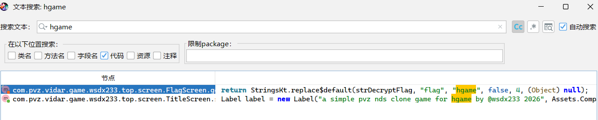
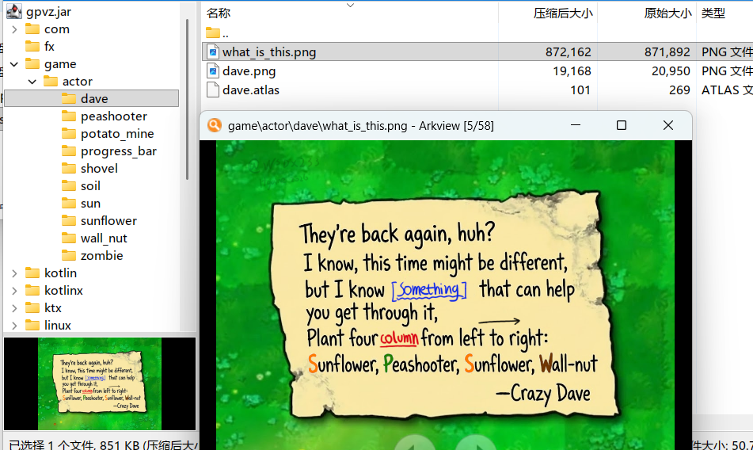

# PVZ

## 题目简述

题面：这是一个被诅咒的 PVZ 游戏，最后一波僵尸会变得刀枪不入，需要“神秘仪式”才能胜利。附件是 `gpvz.exe`，实际可按 Java/JAR 程序分析。程序里 `FlagScreen` 负责 flag 解密和校验，`GameScreen` 会把一个名为 `zombieKillCount` 的值传入；这个名字具有误导性，实际它来自场上植物阵型计算出的 hash。资源目录里还藏有未在游戏中直接使用的提示图片。

## 解题过程

这题本质是 Java 逆向和小范围 hash 爆破。`gpvz.exe` 可以按 JAR 包处理，改后缀或直接用 jadx 打开后搜索 `hgame`：



发现位于FlagScreen类中，此类包含大量解密和验证的算法。
`FlagScreen` 中包含解密和验证逻辑。key 来自 `GameScreen` 传入的变量，虽然变量名是 `zombieKillCount`，但数据流显示它实际是由场上植物阵型计算出的 hash，变量名主要用于误导。

继续看 `GameScreen` 的胜利逻辑，可以看出真正的胜利条件是阵型 hash 达到特定值。

方法一是从 `FlagScreen` 的解密逻辑反推。虽然能找到通过阵型生成 hash 的函数，但直接约束求解阵型耗时较长；而最终 key 只和中间变量 `i7` 有关，`i7` 又由 `i6` 派生，`i6` 范围只有 `0..65535`。因此可以枚举 `i6`，走完整个解密流程，再用 flag 格式筛选。

```python
import struct
plantLayoutEncryptedFlag = [0, -8, -6, 6, 31, -39, -104, 114, 86, -23, -35,
28, -122, 56, 29, -126, -29, 94, 23, -29, 46, -126, -4, 45, 20, -57]
plantLayoutEncryptedFlag = [b & 0xFF for b in plantLayoutEncryptedFlag]
xorKey1 = 102
xorKey2 = 119
aesEncryptedKey = [74, -111, -61, 127, 46, -75, 104, -44, 28, -119, 58, -14,
93, -90, 113, -66]
aesEncryptedKey = [b & 0xFF for b in aesEncryptedKey]
customBase64Table = (
    "QWERTYUIOPASDFGHJKLZXCVBNMqwertyuiopasdfghjklzxcvbnm0123456789+/"
)
sum_chars = sum(ord(c) for c in customBase64Table)
calculated_rot = sum_chars % 26
print(calculated_rot)
pairs = [
    ('A', 'Q'), ('B', 'W'), ('C', 'E'), ('D', 'R'), ('E', 'T'), ('F', 'Y'),
('G', 'U'),
    ('H', 'I'), ('I', 'O'), ('J', 'P'), ('K', 'A'), ('L', 'S'), ('M', 'D'),
('N', 'F'),
    ('O', 'G'), ('P', 'H'), ('Q', 'J'), ('R', 'K'), ('S', 'L'), ('T', 'Z'),
('U', 'X'),
    ('V', 'C'), ('W', 'V'), ('X', 'B'), ('Y', 'N'), ('Z', 'M'), ('_', '!'),
('{', '['),
    ('}', ']')
]
reverse_map = {ord(v): ord(k) for k, v in pairs}
def substitution_decrypt(s):
    res = []
    for char in s:
        c = ord(char)
        res.append(chr(reverse_map.get(c, c)))
    return "".join(res)
def rotate_decrypt(s, rot):
    res = []
    for char in s:
        c = ord(char)
        if ord('A') <= c <= ord('Z'):
            dec = 65 + (c - 65 - rot + 26) % 26
            res.append(chr(dec))
        elif ord('a') <= c <= ord('z'):
            dec = 97 + (c - 97 - rot + 26) % 26
            res.append(chr(dec))
        else:
            res.append(char)
    return "".join(res)
def derive_key(i6):
    bArr = bytearray(16)
    i7 = i6
    for j in range(16):
        i7 = ((i7 * 1103515245) + 12345) & 0x7FFFFFFF
        bArr[j] = (i7 >> 16) % 256
    return bArr
def solve():
    for i6 in range(65536):
        key_stream = derive_key(i6)
        # Step 1: Inverse decryptKey
        decrypted_with_PlantPlace = bytearray(len(plantLayoutEncryptedFlag))
        for i in range(len(plantLayoutEncryptedFlag)):
            val = plantLayoutEncryptedFlag[i]
            k = key_stream[i % 16]
            magic = (i * 13 + 7) % 256
            decrypted_with_PlantPlace[i] = val ^ k ^ magic
        # Step 2: Inverse XORs and Split
        length = len(decrypted_with_PlantPlace) // 2 # 13
        part1 = decrypted_with_PlantPlace[:length]
        part2 = decrypted_with_PlantPlace[length:]
        part1_xored = bytearray([b ^ xorKey1 for b in part1])
        part2_xored = bytearray([b ^ xorKey2 for b in part2])
        combined = part1_xored + part2_xored
        # Step 3: Inverse simpleAesDecrypt
        # bArr3[i] = (byte) (bArr[i] ^ bArr2[i % bArr2.length]);
        simple_aes_out = bytearray(len(combined))
        for i in range(len(combined)):
            simple_aes_out[i] = combined[i] ^ aesEncryptedKey[i % len(aesEncryptedKey)]
        try:
            candidate_str = simple_aes_out.decode('utf-8')
        except UnicodeDecodeError:
            continue
        # 原始flag 用flag替代hgame 用[替代{
        if len(candidate_str) >= 5 and candidate_str[4] == '[':
            c0 = ord(candidate_str[0])
            # if candidate is lowercase
            if ord('a') <= c0 <= ord('z'):
                # 已知原始flag开头为f
                rot = (c0 - ord('f')) % 26
                rotated = rotate_decrypt(candidate_str, rot)
                substituted = substitution_decrypt(rotated)
                if substituted.startswith("flag{") and substituted.endswith("}"):
                    print(f"Found flag with i6={i6}, rot={rot}")
                    final_flag = substituted.replace("flag", "hgame", 1)
                    print(f"Original Flag: {substituted}")
                    print(f"Final Flag: {final_flag}")
                    return
solve()
```

方法二是从资源文件下手。翻 `Asset` 类和资源目录时能看到游戏中未直接使用的图片：



这张隐藏图片给出了植物阵型提示。按提示在游戏里种出对应阵型，即可触发通关并显示 flag。

## 方法总结

Java 游戏题先确认外壳是不是 jar/launch4j 一类包装，再用 jadx 搜索 flag、decrypt、check 等关键字。变量名可能故意误导，判断依据应是数据流：谁生成 key、谁调用解密、用户能控制哪些游戏状态。
