# VidarChall

## 题目简述

题目附件是 Android APK。核心机制依赖 `android:zygotePreloadName`、`android:isolatedProcess` 和 `android:useAppZygote`：`MainActivity` 和独立进程 Service 都会加载同一个 native 库，但二者处在不同进程上下文中。native 层会根据进程名、进程隔离状态和多个埋点花指令更新全局变量，最终把该全局变量作为 XXTEA 的 delta，并用进程名 CRC 派生 key。

Java 层调用 AIDL 接口，先调用 `make` 生成 key，再调用 `encrypt` 加密输入并比较密文。真正的校验在 `libchall.so` 中。

## 解题过程

先确认 Android 进程模型。`android:zygotePreloadName` 指定 Zygote 预加载类，`isolatedProcess` 让 Service 运行在独立进程中，`useAppZygote` 使它共享 Zygote preload 的上下文。

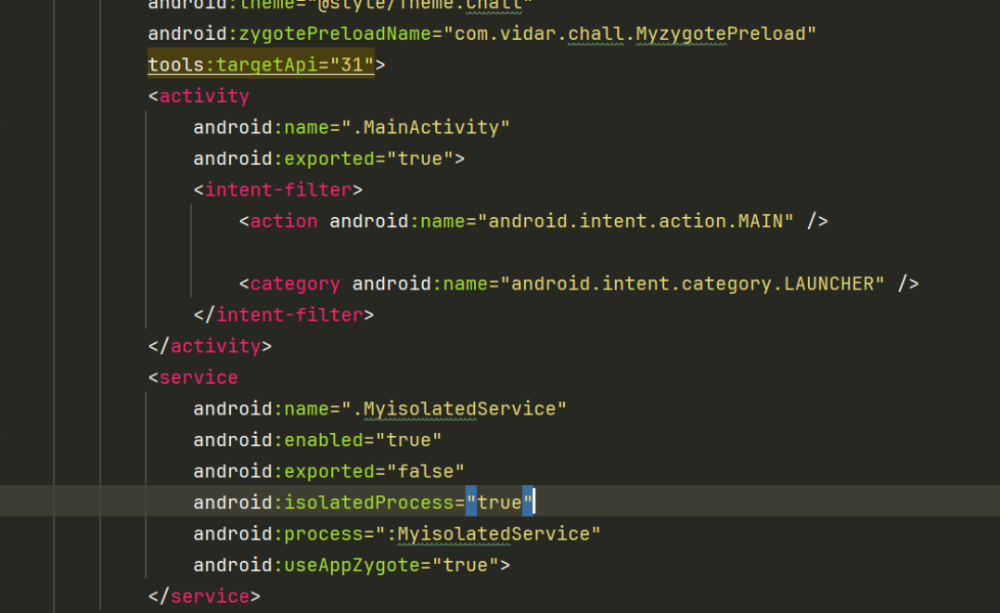

题目中 `MyzygotePreload` 和 `MainActivity` 都加载同一个 so，但由于进程上下文不同，native 层看到的进程名、PID、权限等信息不同。每个关键 native 函数都有花指令埋点，会按固定公式更新全局 `value`，最后参与加密 key/delta。

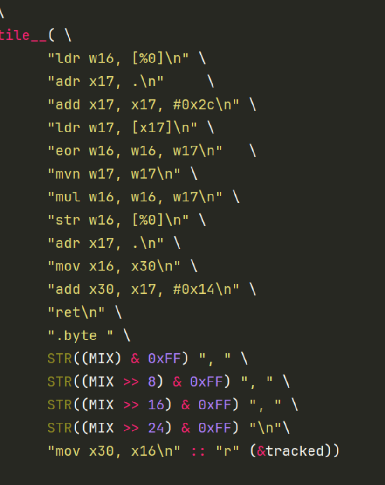

Java 层先调用 AIDL 的 `make`，再调用 `encrypt`：

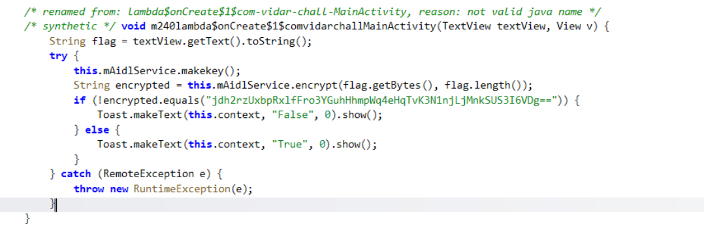

接口实现最终都进入 `Utils` 的 native 方法。

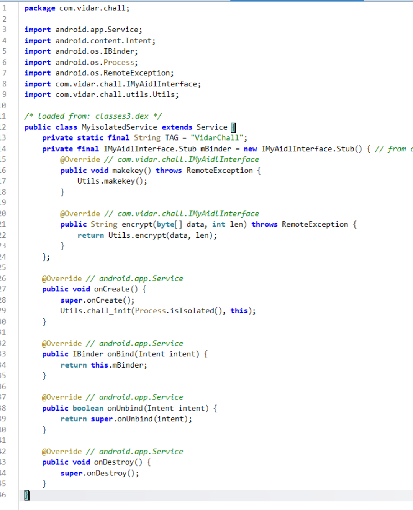

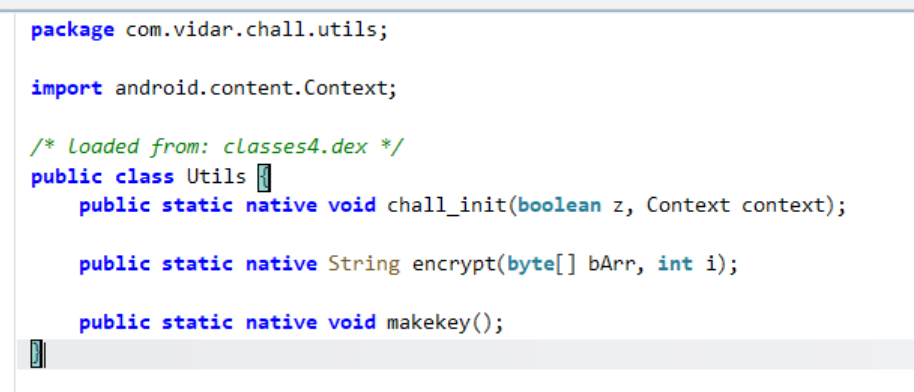

`MyisolatedService` 是独立进程，不能直接使用 MainActivity 进程加载的 lib；它依赖 `ZygotePreload` 预加载 `libchall.so`。

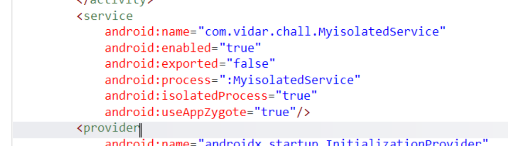

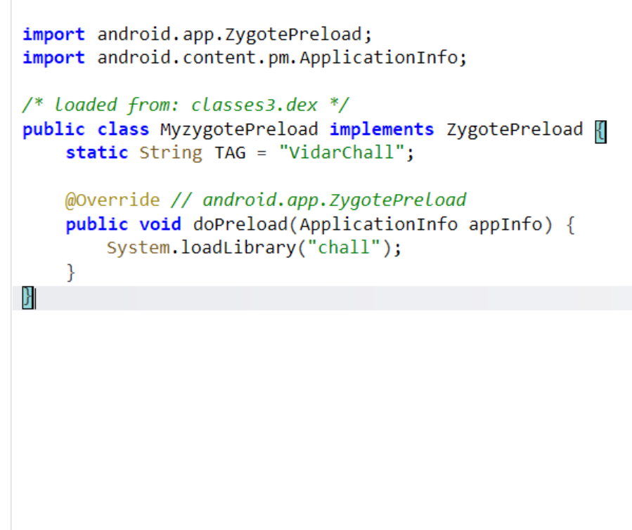

native 层的 `JNI_OnLoad` 有花指令，反编译不稳定。汇编中可以看到对全局变量的更新：

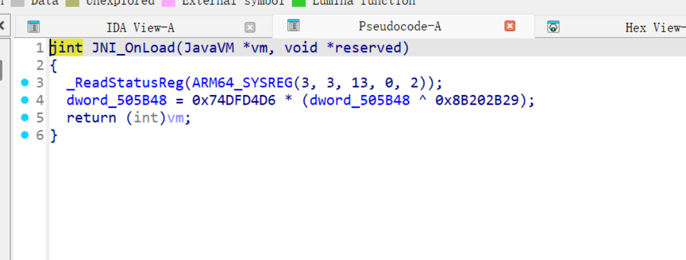

```c
value = 0x74DFD4D6 * (value ^ 0x8B202B29);
```

so 注册了三个 JNI 函数：

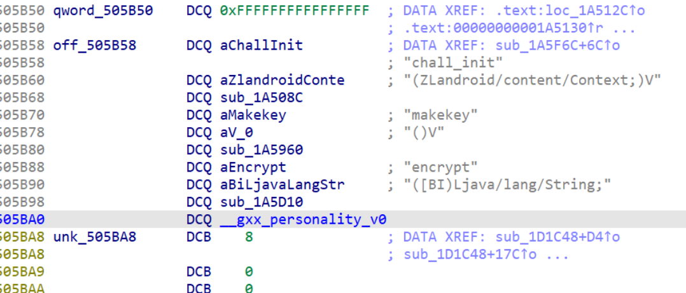

`chall_init` 由 Service 的 `onCreate` 调用。它保存 `isIsolated` 和 `Context`，并继续更新 `value`：

```c
value = 0xBD9DEE60 * (value ^ 0x4262119F);
```

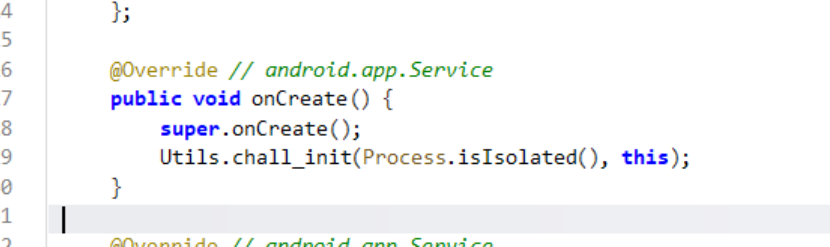

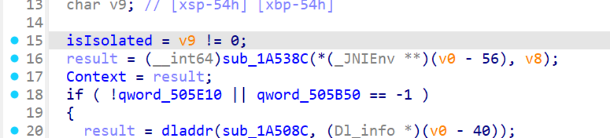

后续根据 `isIsolated` 走不同分支，还会触发检测函数和花指令：

```c
value = 0xAE3EE85B * (value ^ 0x51C117A4);
value = 0x87D3DB52 * (value ^ 0x782C24AD);
```

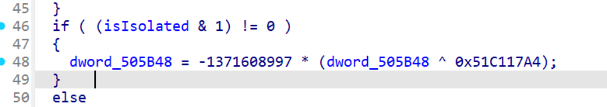

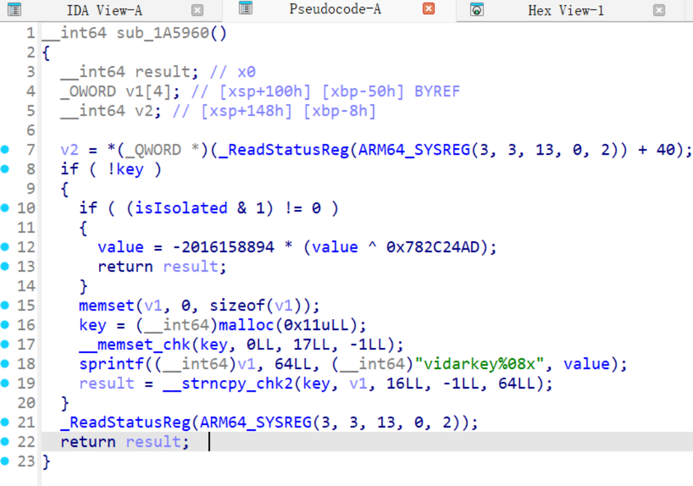

`makekey` 会读取 `qword_505E20`，计算进程名 CRC，再结合 `value` 生成 4 个 32-bit key。`qword_505E20` 在 `init_array` 中写入，那里也有两处会影响 `value` 的花指令。

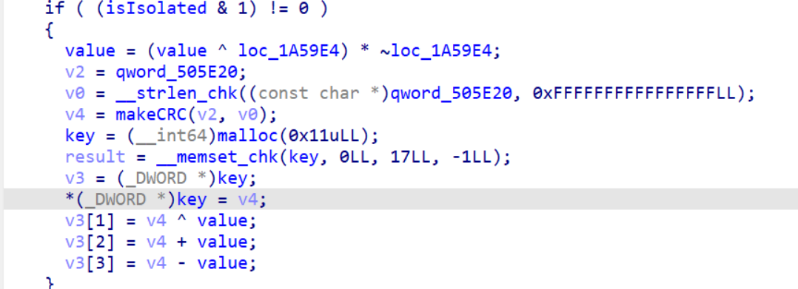

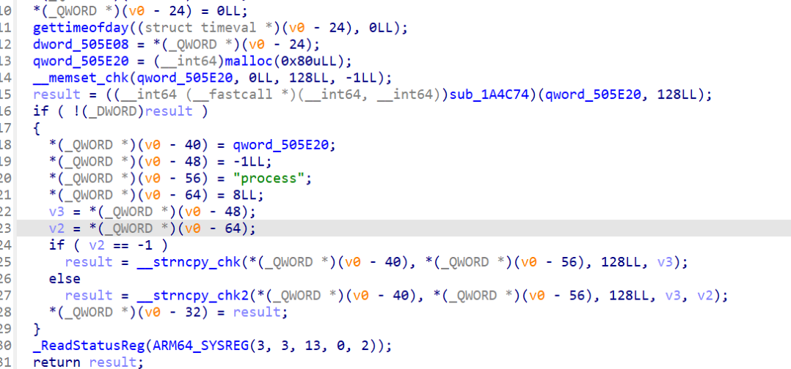

进程名取到的是 Zygote 预加载上下文里的 `com.vidar.chall_zygote`：

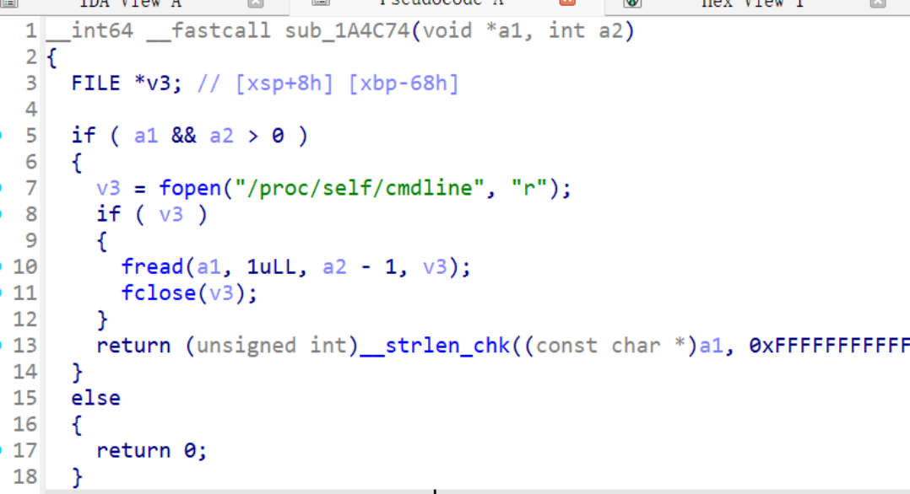

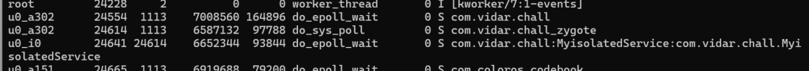

最后看 `encrypt`：它先使用 XXTEA 加密，再 Base64。`makekey` 生成的 key 作为 XXTEA key，累计出的 `value` 作为 delta。

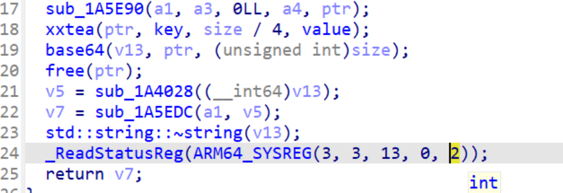

按调用顺序计算 `value`：

```text
init_array_1 -> init_array_2 -> JNI_OnLoad -> chall_init_1 -> chall_init_2 -> makekey
```

对应解密脚本核心如下：

```c
#define MX (((z >> 5 ^ y << 2) + (y >> 3 ^ z << 4)) ^ ((sum ^ y) + (key[(p & 3) ^ e] ^ z)))

uint32_t makeCRC(const char *data, size_t len) {
    uint32_t crc = 0xffffffff;
    uint32_t seed = 0xD5714649;
    for (int i = 0; i < len; i++) {
        crc ^= data[i];
        for (int j = 0; j < 8; j++) {
            uint32_t tmp = (crc & 1) ? seed : 0;
            crc >>= 1;
            crc ^= tmp;
        }
    }
    return crc ^ 0xffffffff;
}

delta = 0xDEADBEEF;
crc = makeCRC("com.vidar.chall_zygote", 22);

delta = 0xD325F938 * (delta ^ 0x2CDA06C7);
delta = 0xCC79F454 * (delta ^ 0x33860BAB);
delta = 0x74DFD4D6 * (delta ^ 0x8B202B29);
delta = 0xBD9DEE60 * (delta ^ 0x4262119F);
delta = 0xAE3EE85B * (delta ^ 0x51C117A4);
delta = 0x87D3DB52 * (delta ^ 0x782C24AD);

key[0] = crc;
key[1] = crc ^ delta;
key[2] = crc + delta;
key[3] = crc - delta;
```

密文用题解中提取的 40 字节数组，按 XXTEA 逆运算解密即可。

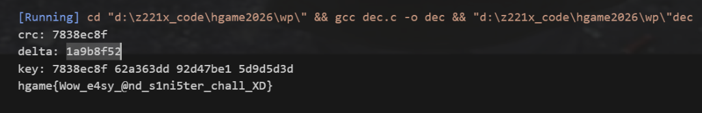

## 方法总结

- 核心技巧：结合 Android App Zygote/isolated process 语义还原 native 层进程上下文，再按花指令埋点顺序恢复 XXTEA key/delta。
- 识别信号：APK 同一 so 在不同进程加载、native 中频繁按固定公式更新全局变量时，要把这些埋点当作 key schedule 的一部分。
- 复用要点：Android 逆向里进程名、Zygote preload、AIDL 调用顺序都会影响 native 校验，不能只在主进程视角跑一遍逻辑。
