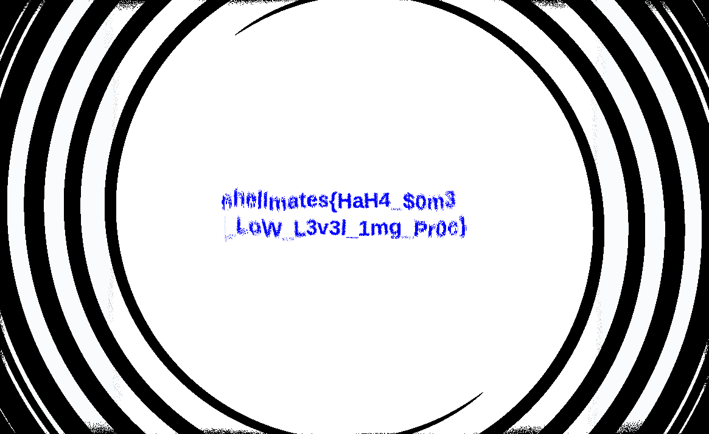

# maks

## 题目简述

附件只给出一张被旋成漩涡的 `output.png` 和处理程序。程序并不是普通的整图旋转，而是让每个像素的旋转角随其到图像中心的距离变化：距离越远，角度越大。由于旋转保持半径不变，可以为每个目标位置计算反向旋转后的采样坐标，从而恢复原图和其中的 flag。

## 解题过程

### 还原正向变换

源码对输出图中的每个位置 $(x,y)$ 计算：

$$
d_x=x-c_x,\qquad d_y=y-c_y
$$

$$
r=\sqrt{d_x^2+d_y^2},\qquad
\theta=\frac{r}{20}+42\times 0.01
$$

再以该角度旋转坐标并从原图采样：

$$
\begin{bmatrix}x_s-c_x\\y_s-c_y\end{bmatrix}
=
\begin{bmatrix}
\cos\theta&-\sin\theta\\
\sin\theta&\cos\theta
\end{bmatrix}
\begin{bmatrix}x-c_x\\y-c_y\end{bmatrix}
$$

对应源码为：

```c
float dist = sqrt(dx * dx + dy * dy);
float angle = (dist / 20.0) + SEED * 0.01;

float nx = cos(angle) * dx - sin(angle) * dy + cx;
float ny = sin(angle) * dx + cos(angle) * dy + cy;
dst[y][x] = src[round(ny)][round(nx)];
```

### 构造逐像素逆映射

旋转不改变 $r$，所以对于希望恢复的原图位置 $(x_s,y_s)$，仍可用该点半径计算同一个 $\theta$，然后旋转 $-\theta$ 找到 `output.png` 中的采样位置：

$$
\begin{bmatrix}x_o-c_x\\y_o-c_y\end{bmatrix}
=
\begin{bmatrix}
\cos\theta&\sin\theta\\
-\sin\theta&\cos\theta
\end{bmatrix}
\begin{bmatrix}x_s-c_x\\y_s-c_y\end{bmatrix}
$$

实现时沿用原程序的四舍五入和越界置黑规则：

```python
from PIL import Image
import numpy as np

src = np.array(Image.open("output.png").convert("RGB"))
h, w = src.shape[:2]
cy, cx = h // 2, w // 2

ys, xs = np.indices((h, w))
dx, dy = xs - cx, ys - cy
angle = np.sqrt(dx * dx + dy * dy) / 20.0 + 0.42

xo = np.rint(np.cos(angle) * dx + np.sin(angle) * dy + cx).astype(int)
yo = np.rint(-np.sin(angle) * dx + np.cos(angle) * dy + cy).astype(int)

valid = (0 <= xo) & (xo < w) & (0 <= yo) & (yo < h)
recovered = np.zeros_like(src)
recovered[valid] = src[yo[valid], xo[valid]]
Image.fromarray(recovered).save("recovered.png")
```

恢复图如下。边缘的黑白弧形缺口来自正向最近邻采样和越界丢失，属于不可逆的信息损耗；中心文字仍然完整可读。



图中文字为：

```text
shellmates{HaH4_$0m3_LoW_L3v3l_1mG_Pr0c}
```

## 方法总结

关键是把“漩涡滤镜”视为坐标映射，而不是尝试用图像编辑器反复旋转。只要变换角度仅依赖半径，而旋转又保持半径不变，就能在目标坐标上直接计算相反角度完成逆映射。最近邻取整会让外围像素不能完美恢复，但不会改变逆变换公式；应区分数学可逆部分与采样造成的实际信息损耗。
