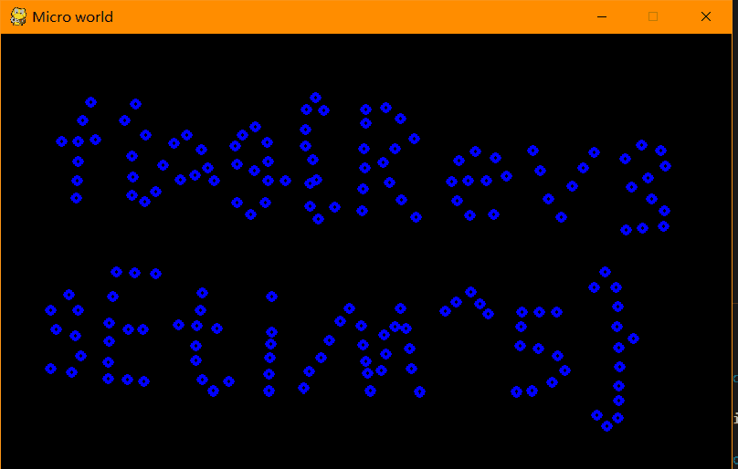

# Micro World

## 题目简述

附件是约二十多 MiB 的 Windows 可执行文件，运行后显示许多在二维周期边界中运动、发生弹性碰撞的粒子。程序由 PyInstaller 打包，粒子的初始状态其实是 flag 图形经过一段正向演化后的状态。由于理想弹性碰撞在速度反向后具有时间可逆性，恢复程序逻辑并把所有速度取反即可让系统回到原图。

## 解题过程

### 提取并反编译 Python

字符串中大量出现 `Python`、`pygame` 和 PyInstaller 运行时符号，可先用 `pyinstxtractor.py` 解包：

```bash
python pyinstxtractor.py microworld.exe
```

主逻辑位于提取出的 `2.pyc`。用与字节码版本匹配的 `uncompyle6` 反编译，再人工修复少量缩进和控制流，即可看到每个粒子的四元组：

```text
(x, y, vx, vy)
```

更新函数计算半径相同粒子的碰撞时刻，交换沿两粒子连线方向的速度分量，并对窗口宽高取模，形成周期边界。

### 反向演化

等质量、无耗散的弹性碰撞满足时间反演对称性。当前状态不变，把每个速度改为相反数：

```python
points = []
for x, y, vx, vy in saved_state:
    points.append(Point((x, y), -vx, -vy))
```

其余碰撞检测和位置更新保持原样。继续模拟时，粒子会按原轨迹逆行；运行到最初时刻附近，离散圆点重新组成清晰文字：



读取为：

```text
flag{Rev3sEtiM^5}
```

如果图形仍很模糊，应优先检查 `.pyc` 反编译是否匹配 Python 版本、速度是否只取反一次，以及碰撞更新中的缩进和时间条件是否在反编译时被破坏。

## 方法总结

- 核心技巧：识别 PyInstaller/Pygame，恢复粒子模拟器，并利用理想弹性碰撞的时间可逆性把速度整体取反。
- 识别信号：大型 Python 打包 EXE、显式保存的粒子位置/速度、无摩擦的等质量碰撞与周期边界。
- 复用要点：反编译 Python 字节码要匹配版本并人工核对控制流；物理仿真能否逆演取决于是否有耗散、随机扰动或数值不可逆操作。
