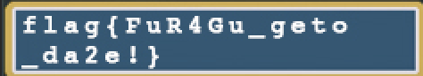

# 卷王与野生的 GPA

## 题目简述

附件是 Game Boy Advance ROM 及带符号 ELF，运行在 ARM7TDMI 的 Thumb 指令集上。输入经典按键序列后程序进入人为死循环；跳过死循环又会显示乱码，因为正常路径没有调用已有的 `decrypt` 函数。目标是在 ROM 中改写两个分支位置，让程序先解密图像再显示 flag。

## 解题过程

### 触发隐藏路径

在 GBA 模拟器中设置按键后输入：

```text
↑ ↑ ↓ ↓ ← → ← → B A B A
```

这是题目采用的 Konami Code 变体，也能从 `getkey` 函数的状态机中恢复。触发后程序执行到 `fail` 路径并陷入循环。

### 去掉回跳

在带符号 ELF 的 `main` 中，地址 `0x08000606` 有一条异常的 Thumb `b` 指令，回跳到初始化位置，使其后的代码永远不可达。将该 16 位指令替换为 Thumb NOP：

```text
机器码：46 c0    # little-endian 的 0xc046
```

ROM 的代码从 ELF `.text` 直接复制，因此地址 `0x08000000` 对应 ROM 文件偏移 0；可在 GBA 文件的相同相对位置修改。去掉回跳后程序继续运行，但画面提示“被跳过的加密函数”。

### 插入 decrypt 调用

函数表中存在未被正常调用的：

```text
decrypt @ 0x08000574
```

`0x08000634` 处恰好有连续两个 Thumb NOP，占 4 字节，足以替换为 `bl decrypt`。Thumb 分支以当前指令地址加 4 为 PC 基准，半字偏移为：

$$
\frac{0x08000574-(0x08000634+4)}{2}=-98=0xff9e
$$

最稳妥的做法是让 ARM/Thumb 汇编器生成 `bl 0x08000574`，再把 4 字节机器码写回 ROM，避免手工拆分 BL 的高、低偏移字段出错。

重新运行修改后的 ROM，`decrypt` 会反置乱 flag 像素并写入 GBA Mode 3 显存。该模式下显存从 `0x06000000` 开始，画面为 $240\times160$、每像素 16 位 BGR555。



读取结果：

```text
flag{FuR4Gu_geto_da2e!}
```

另一条路线是直接逆向 `decrypt`，提取内置密钥和被置乱像素，在宿主机上复现写入 `0x06000000` 的顺序；但调用现成函数更短，也更能验证控制流判断。

## 方法总结

- 核心技巧：用带符号 ELF 定位不可达分支与现成解密函数，在 GBA ROM 中打 Thumb NOP 和 BL 补丁。
- 识别信号：触发条件后死循环、不可达代码变红、函数列表里存在未调用的 `decrypt`，以及附近正好有可容纳跳转的填充指令。
- 复用要点：Thumb PC 相对分支以 `PC+4` 为基准且按半字编码；应确认 ROM 映射基址、指令状态和字节序后再写补丁。
