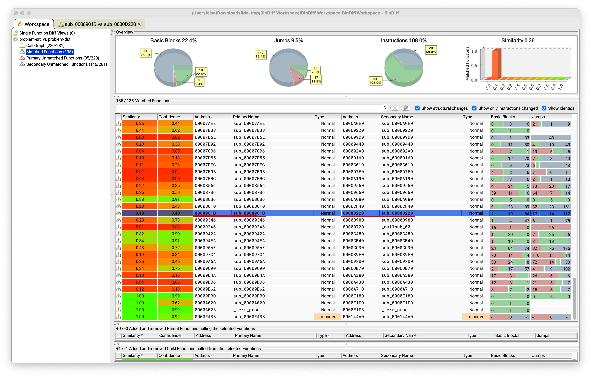
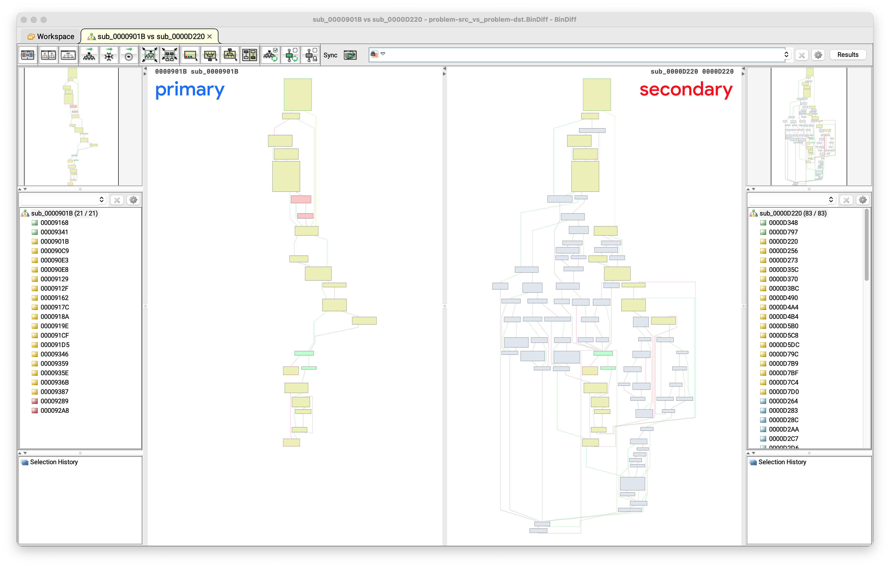

# 火眼金睛的小 E

## 题目简述

服务端每次给出若干对 ELF：已知源函数在左侧二进制中的地址，需要找出右侧二进制里由同一份源码编译得到的函数地址。三关逐步提高规模和编译优化差异：

| 关卡 | 样本数 | 编译优化 | 通过率 |
| --- | ---: | --- | ---: |
| 1 | 2 | `-O1` 对 `-O2` | 100% |
| 2 | 100 | `-O1` 对 `-O2` | 40% |
| 3 | 200 | `-O0` 对 `-O3` | 30% |

题目考查的是跨编译优化级别的二进制函数相似性，而不是利用程序漏洞；即使第三关使用了神经网络，目标也只是恢复程序对应关系，没有攻击模型本身，因此归入逆向。

## 解题过程

### 固定同一批题目

服务端随机种子为：

```python
random.seed((timestamp // 600) * 10000000 + user_id * 10 + level)
```

输入时间戳后，同一用户、同一关卡在同一个十分钟时间桶内会拿到相同任务。先抓取二进制、源函数地址和题号，离线分析完再在允许的时间范围内用相同时间戳重连提交，避免把反汇编和模型推理塞进交互超时窗口。

### 第一关：人工使用 BinDiff

两组样本适合人工处理。分别导入 IDA，生成 BinExport 文件后运行 BinDiff，在匹配列表中找到源地址对应项。例如官方样例里源函数 `0x901b` 被匹配到目标函数 `0xd220`。



优化会改变基本块数量、指令选择、寄存器分配和控制流形状，所以不能只比函数字节或地址。BinDiff 综合调用图、控制流图和指令特征给出候选；人工关重点检查源地址所在行，并用反编译结果复核语义。



### 第二关：批量调用 BinExport 和 BinDiff

100 对二进制必须自动化，但自动化的是分析流程，不是批量改写题解。官方脚本的处理链如下：

1. 按服务端返回的 URL 下载左右 ELF，并保存左侧目标函数地址。
2. 让 IDA 无界面加载每个 ELF，调用 BinExport 插件生成 `.BinExport`。
3. 对每一对导出文件运行 BinDiff，生成 SQLite 结果库。
4. 在函数匹配表中查询左侧目标地址对应的右侧地址，整理为提交序列。

新版 BinExport 可以通过 IDAPython 直接调用：

```python
import ida_idaapi
import idaapi

idaapi.ida_expr.eval_idc_expr(
    None,
    ida_idaapi.BADADDR,
    f'BinExportBinary("{save_path}.BinExport");',
)
```

随后执行：

```text
bindiff --primary=left.BinExport --secondary=right.BinExport --output_dir=result
```

解析数据库时应以左侧目标地址精确定位匹配行，而不是简单取最高相似度的全局第一行。`-O1` 与 `-O2` 的差异相对有限，BinDiff 的正确率足以越过 40% 门槛，少量未匹配项可填一个确定无效的占位地址。

### 第三关：用函数嵌入跨越 O0 与 O3

`-O0` 与 `-O3` 之间存在内联、循环变换、死代码删除和控制流重构，官方测试中仅靠 BinDiff 很难达到 30%。可以改用 SAFE 或 jTrans；这里采用官方附带包装脚本实现的 SAFE 流程。

SAFE 先反汇编函数，把每条指令规范化并映射成词表 ID，将函数截断或补齐到最多 150 条指令，再交给自注意力网络生成定长向量。对每个题目：

```text
source ELF 的指定函数 -> 向量 s
target ELF 的所有函数 -> 向量 t_0 ... t_n
answer = argmax cosine_similarity(s, t_i)
```

推理前要对向量做 $L_2$ 归一化，此时点积就是余弦相似度。官方 `batch-safe.py` 需要将 [SAFEtorch 上游仓库](https://github.com/facebookresearch/SAFEtorch) 放在脚本同级目录；正文所需的关键依赖是其中的指令词表 `model/word2id.json` 和预训练权重 `model/best_model.pth`，并非只安装一个同名 Python 包即可。脚本通过 radare2/Capstone 枚举和反汇编目标函数，批量计算相似度后输出候选地址。

jTrans 是另一条可行路线：它在函数表示中显式编码跳转目标，对控制流改写更敏感。官方仓库也附带了 ELF 预处理、模型适配补丁和批量提交脚本；两种方法择一达到 30% 即可，不需要把结果拼成完美的一一映射。

## 方法总结

三关对应了函数相似性分析的三个层次：少量样本人工审查、中等规模的传统图匹配、强优化差异下的学习型函数嵌入。稳定复现的关键是利用时间桶先固定题目，完整保存“样本编号—源地址—目标地址”的映射，再离线批处理。模型只负责给出候选，地址解析、函数边界和提交顺序仍须由脚本严格校验；这也是自动相似性工具最常见的工程失误点。
