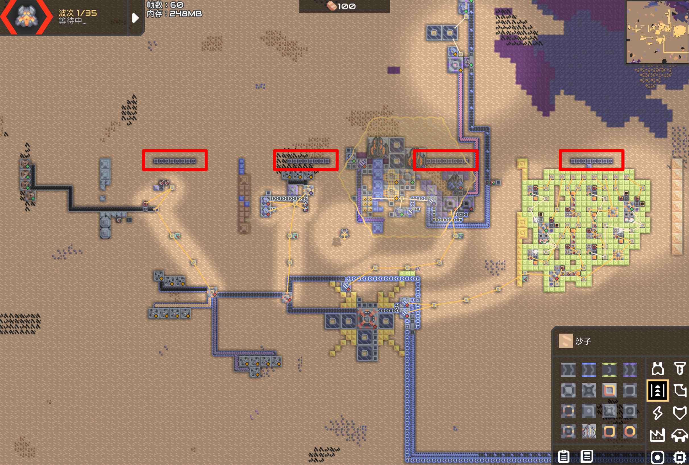

# 异星歧途

## 题目简述

附件是一张 Mindustry Build 146 地图。场景中有从左到右排列的 32 个按钮，分成四组；需要设置所有按钮，使冲击反应堆持续稳定运行。题目没有给出按钮语义，必须检查地图中的逻辑处理器、设备状态约束与方块搭建的逻辑门。

决定性步骤是恢复游戏地图内嵌程序和电路的行为，而不是攻击游戏或服务器，因此归入 reverse。

## 解题过程

### 确认布局与记号

把按钮从左到右分成四组，每组八位，按下/开启记为 `1`，关闭记为 `0`：



四组不能只靠枚举：它们分别对应条件分支、数值约束、设备状态和组合逻辑。逐组还原后再按顺序操作，避免先启动反应堆却没有冷却而引发爆炸。

### 第一组：反推处理器分支

第一组附近的逻辑处理器依次读取八个开关。每个开关都有一条形如“若当前状态等于某布尔值则跳过发电机启用语句”的分支，所以要让启用语句实际执行，就应把每一位设成该比较条件的反值。

按处理器中八条条件从左到右取反，得到：

```text
10100101
```

### 第二组：满足唯一平方数

第二个处理器把八个开关拼成无符号整数：第一个开关是最高位，第八个是最低位。它要求该数是 `0` 到 `15` 中某个整数的平方，同时还要求第一、六个开关开启。

满足这些条件的唯一值是 196，即：

```text
196 = 0b11000100
```

所以第二组为 `11000100`。

### 第三组：配置反应堆设备

第三组不是算术谜题，而是处理器对场上设备状态的逐项检查。目标状态为：两个导管关闭、闸门关闭、第二条传送带开启、混合器开启、提取器开启、两个反应堆开启、两个熔毁装置关闭；最后一个开关还必须与第二组最后一位一致。

将这些约束对应回第三组八个按钮，得到：

```text
10001100
```

操作时先保证冷却和原料链就绪，再开启反应堆，不能只追求按钮最终值而忽略设备启动顺序。

### 第四组：还原方块逻辑门

最后一组用游戏方块的物料流和供电状态搭出组合逻辑。先分别识别非门、与非门和与门：


沿连线从输入向输出计算每个门，要求末端输出保持有效，可得第四组：

```text
01110111
```

因此 32 个按钮从左到右的完整设置为：

```text
10100101 11000100 10001100 01110111
```

设置完成并让物料、冷却流稳定后，反应堆正常运行，题目给出 flag。

## 方法总结

这张地图把四类逆向对象放在同一场景：布尔分支要取反跳转条件，位开关要按明确端序还原整数，设备组要满足状态机约束，物理结构则要抽象成逻辑门。可靠的做法是先建立“按钮位置—变量—设备/门输出”的映射，逐组求值，最后再考虑反应堆的安全启动顺序。
