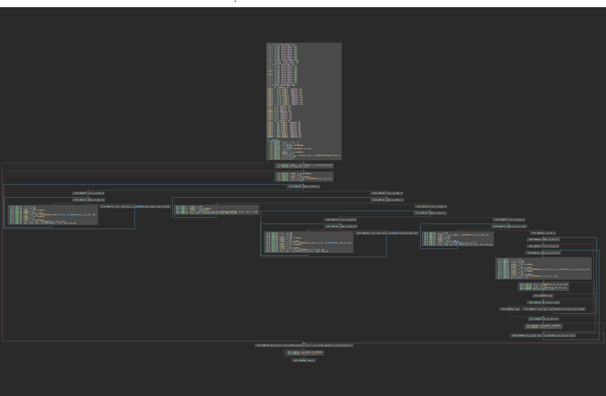

# 逆向工程不需要 F5

## 题目简述

附件是一个 Windows x86-64 PE 主程序和 16 个 DLL。程序的基本块被抽取成跨模块函数，反编译器无法一次还原出正常的伪代码；但主程序的大循环与各 DLL 中的简单算术仍可通过反汇编、控制流图或动态调试恢复。目标是逆出 32 字节输入，使程序通过比较。

决定性障碍是恢复被 LLVM IR 级拆分后的程序语义并逆运算，属于 reverse，而不是利用二进制漏洞。

## 解题过程

### 从控制流而非 F5 结果入手

主程序先检查输入总长和格式：前五字节为 `flag{`，第 38 字节为 `}`，中间正好有 32 字节参与运算。虽然基本块散落到 DLL，静态工具仍能显示外层循环结构：



跟踪每次 DLL 调用的输入、输出和操作数，可把中间 32 字节视为同一块内存，并依次按 128、64、32、16、8 位小端整数解释。正向逻辑为：

1. 每个 128 位分组依次乘以 `0x55AA00FF ^ (r << 4)`，`r=0..3`；
2. 每个 64 位分组异或 `0x7A026655FD263677`；
3. 每个 32 位分组依次乘以 `0xDEADBEEF ^ (r << 2)`，`r=0..3`；
4. 每个 16 位分组异或 `0xCDEC`；
5. 每个字节依次乘以 `0x21 ^ (r << 1)`，`r=0..3`，最后与内置的 32 字节常量比较。

所有乘数都是奇数，因此在模 `2^8`、`2^32` 或 `2^128` 下都有乘法逆元。异或则是自身的逆运算。

### 按相反顺序求逆

从程序比较用的常量出发，反向应用五层操作。以下脚本明确使用小端分组，与 Windows x86-64 上 union 的内存解释一致：

```python
def map_lanes(data, width, transform):
    bits = width * 8
    mask = (1 << bits) - 1
    out = bytearray()
    for off in range(0, len(data), width):
        value = int.from_bytes(data[off : off + width], "little")
        value = transform(value) & mask
        out += value.to_bytes(width, "little")
    return bytes(out)


data = bytes.fromhex(
    "7f0257cd9fd934921a1f2412aec5e742"
    "afab40cc36d5e905ab0ca8eb9641a7ac"
)

# 撤销 8 位乘法。
for r in reversed(range(4)):
    modulus = 1 << 8
    factor = 0x21 ^ (r << 1)
    inverse = pow(factor, -1, modulus)
    data = map_lanes(data, 1, lambda x, inv=inverse: x * inv)

# 撤销 16 位异或。
data = map_lanes(data, 2, lambda x: x ^ 0xCDEC)

# 撤销 32 位乘法。
for r in reversed(range(4)):
    modulus = 1 << 32
    factor = 0xDEADBEEF ^ (r << 2)
    inverse = pow(factor, -1, modulus)
    data = map_lanes(data, 4, lambda x, inv=inverse: x * inv)

# 撤销 64 位异或。
data = map_lanes(data, 8, lambda x: x ^ 0x7A026655FD263677)

# 撤销 128 位乘法。
for r in reversed(range(4)):
    modulus = 1 << 128
    factor = 0x55AA00FF ^ (r << 4)
    inverse = pow(factor, -1, modulus)
    data = map_lanes(data, 16, lambda x, inv=inverse: x * inv)

print((b"flag{" + data + b"}").decode())
```

脚本输出：

```text
flag{DECoMp!!ER_15_nOT_@Lways_Enough~}
```

另一条等价路线是对主程序做符号执行：在输入函数处注入 `flag{`、32 个符号字节和 `}\0`，屏蔽无关输出函数，然后以成功与失败基本块为 `find/avoid` 目标。但手工恢复运算更能说明混淆隐藏了什么。

## 方法总结

函数或基本块被拆散不等于语义不可恢复。先从调用约定和共享缓冲区跟踪数据流，再用循环边界、操作宽度和常量把零散块归并成阶段。这里每层都是固定宽度下的可逆运算，最终只需严格遵守小端分组并按相反顺序应用模逆与异或即可。
