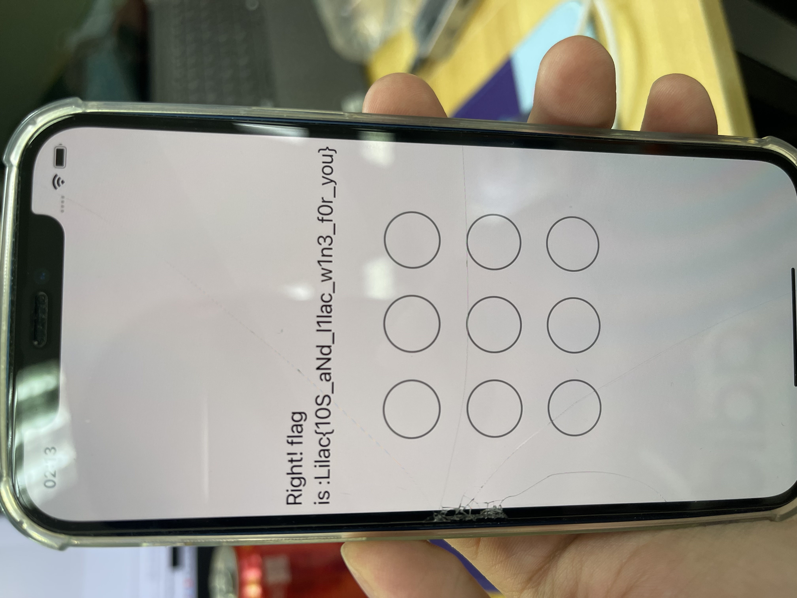

# NineApple

## 题目简述

题目是一个 iOS 九宫格手势锁。源码中 `LockViewModel.swift` 记录每次划过的节点，并把节点编号按固定权重累加成 `current_key`：

```swift
current_key += weight[weight_idx] * UInt64(index + 1)
weight_idx += 1
```

每完成一次手势，程序把 `current_key` 加入 `key_all`，并把手势字符串映射成一个字符。最终要求 33 次手势的 `key_all` 全部等于 `target_all`，同时拼出 flag。



## 解题过程

### 关键观察

源码同时给出了三类关键数据：

1. `weight`：每一笔手势位置的权重。
2. `target_all`：每个字符对应的目标加权和。
3. `map_list`：字符到手势路径的映射。

因此无需实际在手机上手动画 33 次，只需要对 `map_list` 中每个路径计算加权和，然后反查 `target_all`。

### 求解步骤

计算方式如下：

```python
weight = [10564859903, 880404991, 67723460, 4837390, 322492, 20155, 1185, 65, 3]

def calc(pattern):
    return sum(weight[i] * int(ch) for i, ch in enumerate(pattern))
```

对 `map_list` 建立反向字典：

```python
reverse = {calc(pattern): ch for ch, pattern in map_list.items()}
flag = "".join(reverse[x] for x in target_all)
```

恢复结果为：

```text
Lilac{10S_aNd_l1lac_w1n3_f0r_you}
```

如果要在原 App 中验证，则按恢复出的字符对应路径逐个绘制，最终提示会变为 `Right! flag is :...`。

## 方法总结

- 核心技巧：把手势识别逻辑转成加权和反查，避免动态操作 UI。
- 识别信号：移动端题目源码中同时出现 `weight`、`target` 和字符映射表，通常可以直接静态求解。
- 复用要点：手势锁/图案锁不一定要爆破路径；若校验函数是线性的，优先反推出每个目标值对应的路径和字符。
