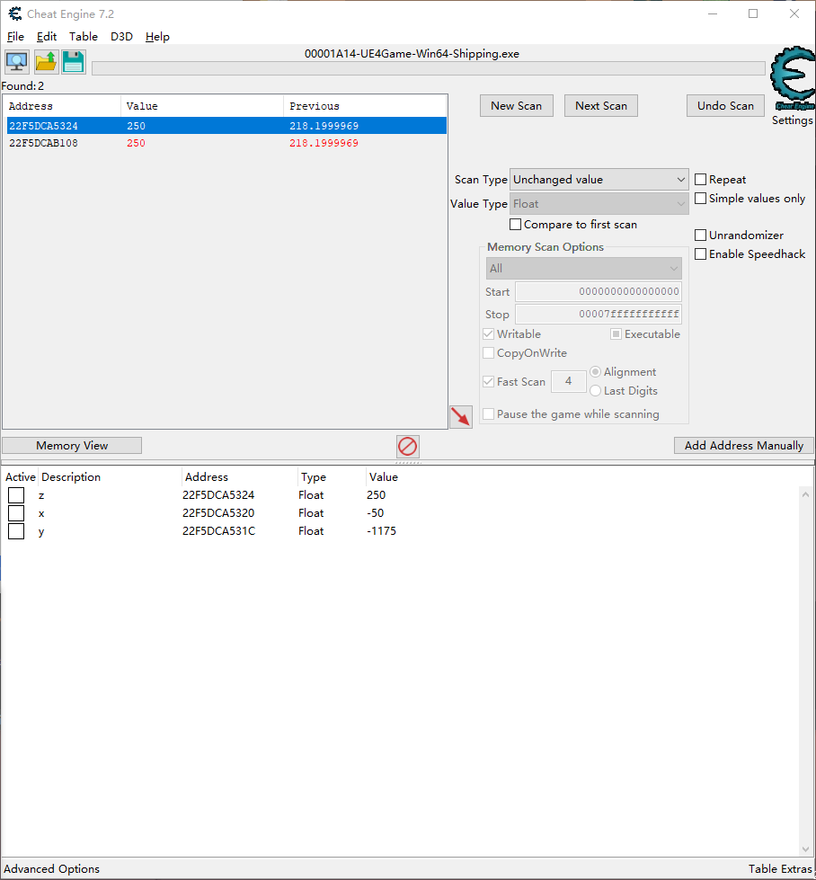
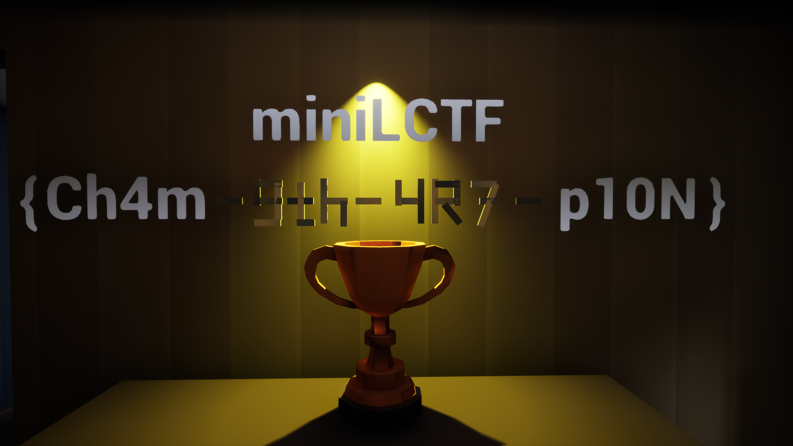

# MiniLCTF2022 Paralympics Writeup

## 题目简述

题目是一款 Unreal Engine 4 游戏，需要突破地图正常移动范围并到达奖杯位置。主要障碍是从运行中游戏定位玩家实体的三维坐标，并结合 UE 资源中的静态网格取得另一段 flag，因此归入逆向而非通用 Misc。

## 解题过程

用 Cheat Engine 以浮点数扫描高度坐标。角色上升时选择 `Increased value`，下降时选择 `Decreased value`，重复筛选后候选会收敛到数百项。低视角下相关值通常约为 184，高视角约为 218；删除明显无关值后逐个修改验证。



候选中既有 Camera 坐标，也有玩家实体坐标。修改后若只有视角短暂跳动、触发器没有响应，说明命中的是摄像机组件；必须找到实际 Pawn/Character 的位置。UE 中位置通常按连续的 `X,Y,Z` 浮点数存储，确定 Z 后检查相邻地址即可得到 X、Y。把玩家实体坐标改到奖杯处便能触发场景中的 flag 文本。



另一部分藏在 `/Game/Meshes/StaticMesh.uasset`。用 UE 资源查看器导出或预览静态网格，可读出中段 `-9th-4R7-`；与奖杯区域显示的前后段组合，得到：

```text
miniLCTF{Ch4m-9th-4R7-p10N}
```

部分赛后文本把末段抄成 `p01N`，但原始奖杯截图显示顺序为 `p10N`，这里以视觉证据为准。

## 方法总结

游戏内存扫描应通过玩家可控的状态变化缩小候选，并用“是否真正触发碰撞/事件”区分摄像机与实体坐标。坐标连续存储提供了从 Z 推到 XYZ 的结构线索。此题还要求把运行时场景与静态资源两类证据合并；保留坐标扫描和奖杯画面是必要的，因为它们分别证明地址识别过程和最终字符顺序。
