# NoMyBank!

## 题目简述

Godot 4.x 逆向题。游戏使用 PCK 加密和 C++ extension，同时改动 DLL 加载流程；解题先从 Godot 报错字符串附近提取 PCK AES 密钥完成资源解包，再定位 DLL 解密加载逻辑，复制临时目录中的解密 DLL，最后分析 TLS callback、hook 重定向和 SMC 得到真正校验/解密逻辑。

## 解题过程

Kruse几个月前入坑了BlueArchive，在了解泳装蒙面团的事迹之后，他灵机一动用开源引擎godot制作了一个迷宫小游戏”NoMyBank!“。游戏制作完成后，Kruse把demo发给了SydzI，让他帮忙测试测试。SydzI认为Kruse的游戏不安全，给它加上了一些保护措施，并声称在迷宫深处的宝箱中放入了一个神秘礼物，你能帮Kruse找到这个礼物吗？

注：迷宫出口在右侧。附件解压路径请勿包含中文。

godot逆向题，利用了godot 4.x支持的pck加密和cpp extension机制，同时改了godot引擎的dll加载机制，考察了hook重定向和smc。以下为预期解：

### 获取基础信息

附件解压出来是一个exe和一个dll。分析发现游戏本体和dll都被处理过，DIE提示游戏本体被打包，而dll会被识别为未知二进制文件，进一步用010editor打开dll会发现整个dll都被加密了（完全看不到 PE 文件格式特征）

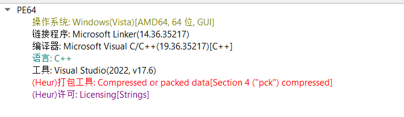

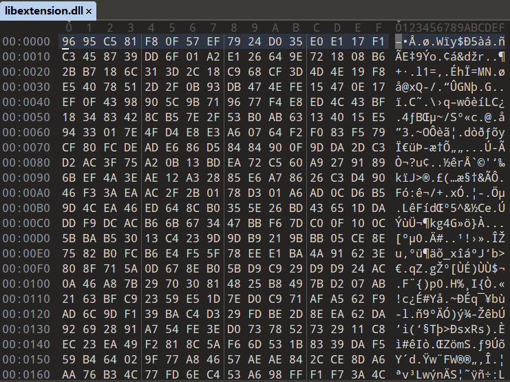

意味着如果要分析dll，首先要找到游戏本体加载dll时对dll进行了什么处理。

### 尝试解包

godot游戏实质上是由引擎和资源文件组合成的（即DIE提示的“打包”），解包游戏可以获得游戏开发时使用的代码和素材等资源文件，所以第一步可以先尝试解包游戏。用GDRETools解包exe会发现解包失败，提示需要设置密钥：

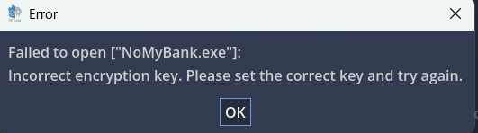

查找资料会发现godot4.x版本推出了PCK加密编译的机制，可以使用256位AES密钥加密PCK文件（即godot的资源文件）。对于查找PCK加密密钥的方法，网上已有现成的资料，可以参考BV14NtozWEFN

原理是godot内部有一个处理报错的宏定义，该宏会将报错的相关明文信息嵌入在程序中

用IDA打开游戏本体，待加载完毕后，打开字符串窗口，搜索can't open encrypted pack directory ，跟进到字符串出现的函数，如下图

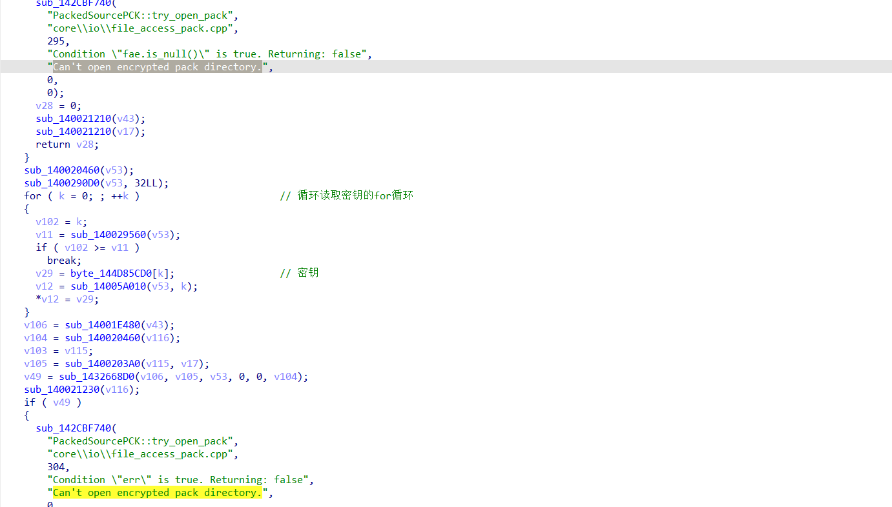

在两个匹配字符串中间可以看到一个for循环，其中循环读取的byte_144D85CD0[i]即为密钥：

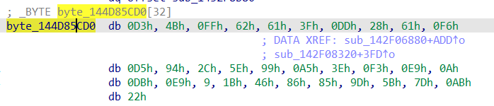

提取出这串数字D34BFF62613FDD2861F6D5942C5E99A53EF3E90ADBE9091B4686859D5B7DAB22，在 GDRETools 中选中菜单栏的“RETools”，选择“Set encryption key”输入密钥即可解包游戏

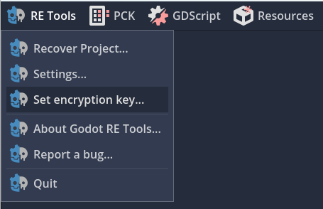

解包出来的文件夹结构如下：

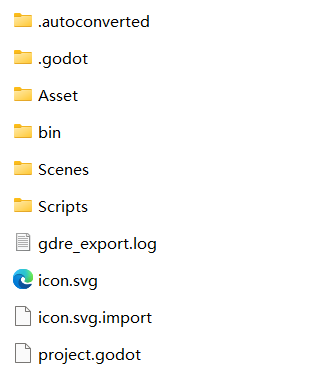

在Scripts文件夹内可以找到存放游戏逻辑的.gd文件，在WinPopupTreasury.gd 里可以找到一些提示：

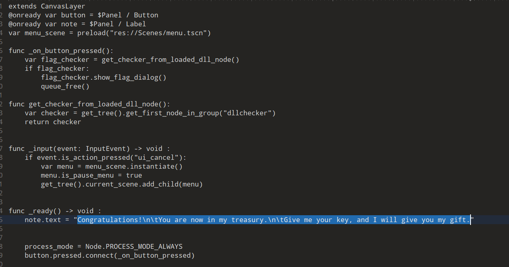

此处有一个叫做get_checker_from_loaded_dll_node 的函数，在_on_buttun_pressed 中这个函数被调用并返回了一个flag_checker，显而易见libextension.dll实现的应该就是类似flag检验的功能了。所以接下来转向分析dll

### 寻找 DLL 解密逻辑

试着修改dll的名字，运行游戏可以发现会触发报错（居然没人发现我的小巧思）：

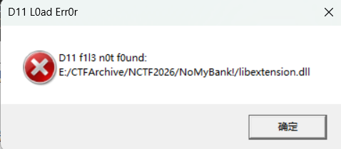

此处的报错信息显然经过特殊处理，可以尝试使用这个报错信息来定位游戏本体中的dll加载函数（前提是这段信息被硬编码在程序中，而非被实时解密）

在IDA字符串窗口，搜索D11 f1l3 n0t f0und ，可以发现报错信息确实是硬编码的，跟进就可以找到dll加载函数

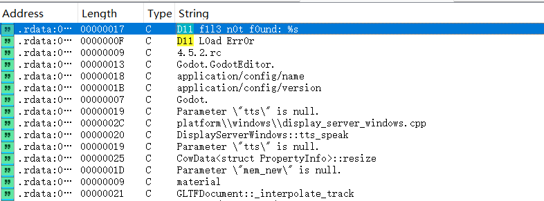

### 分析 DLL 加载函数

通过上述方法找到的dll加载函数如下：

```text
__int64 __fastcall sub_140013FA0(__int64 a1, __int64 a2, HMODULE *a3, __int64
a4)
{
  __int64 v4; // rax
  __int64 v5; // rax
  const char *v6; // rax
  __int64 v8; // rax
  __int64 v9; // rax
  __int64 v10; // rax
  __int64 v11; // rax
  __int64 v12; // rax
  __int64 v13; // rax
  __int64 v14; // rax
  const WCHAR *v15; // rax
  __int64 v16; // rax
  const WCHAR *v17; // rax
  __int64 v18; // rax
  int v19; // [rsp+20h] [rbp-478h]
  int v20; // [rsp+20h] [rbp-478h]
  CHAR v21; // [rsp+24h] [rbp-474h]
  CHAR v22; // [rsp+25h] [rbp-473h]
  char v23; // [rsp+27h] [rbp-471h]
  int j; // [rsp+28h] [rbp-470h]
  int v25; // [rsp+2Ch] [rbp-46Ch]
  _BYTE v26[8]; // [rsp+30h] [rbp-468h] BYREF
  int i; // [rsp+38h] [rbp-460h]
  int k; // [rsp+3Ch] [rbp-45Ch]
  int v29; // [rsp+40h] [rbp-458h]
  _BYTE v30[8]; // [rsp+48h] [rbp-450h] BYREF
  DWORD dwFlags; // [rsp+50h] [rbp-448h]
  __int64 v32; // [rsp+58h] [rbp-440h]
  unsigned int v33; // [rsp+60h] [rbp-438h]
  unsigned int v34; // [rsp+64h] [rbp-434h]
  int v35; // [rsp+68h] [rbp-430h]
  int v36; // [rsp+6Ch] [rbp-42Ch]
  unsigned int v37; // [rsp+70h] [rbp-428h]
  unsigned int v38; // [rsp+74h] [rbp-424h]
  LPVOID lpMem; // [rsp+78h] [rbp-420h]
  LPVOID v40; // [rsp+80h] [rbp-418h]
  DLL_DIRECTORY_COOKIE Cookie; // [rsp+88h] [rbp-410h]
  _BYTE v42[8]; // [rsp+90h] [rbp-408h] BYREF
  _BYTE v43[8]; // [rsp+98h] [rbp-400h] BYREF
  const char *v44; // [rsp+A0h] [rbp-3F8h]
  __int64 v45; // [rsp+A8h] [rbp-3F0h]
  _BYTE v46[8]; // [rsp+B0h] [rbp-3E8h] BYREF
  _BYTE v47[8]; // [rsp+B8h] [rbp-3E0h] BYREF
  __int64 (__fastcall *v48)(__int64, _BYTE *); // [rsp+C0h] [rbp-3D8h]
  __int64 v49; // [rsp+C8h] [rbp-3D0h]
  __int64 v50; // [rsp+D0h] [rbp-3C8h]
  __int64 v51; // [rsp+D8h] [rbp-3C0h]
  _BYTE v52[8]; // [rsp+E0h] [rbp-3B8h] BYREF
  _BYTE v53[8]; // [rsp+E8h] [rbp-3B0h] BYREF
  _BYTE v54[8]; // [rsp+F0h] [rbp-3A8h] BYREF
  _BYTE v55[8]; // [rsp+F8h] [rbp-3A0h] BYREF
  _BYTE v56[8]; // [rsp+100h] [rbp-398h] BYREF
  _BYTE v57[8]; // [rsp+108h] [rbp-390h] BYREF
  __int64 v58; // [rsp+110h] [rbp-388h]
  _BYTE v59[8]; // [rsp+118h] [rbp-380h] BYREF
  _BYTE v60[8]; // [rsp+120h] [rbp-378h] BYREF
  _BYTE v61[8]; // [rsp+128h] [rbp-370h] BYREF
  __int64 v62; // [rsp+130h] [rbp-368h]
  __int64 v63; // [rsp+138h] [rbp-360h]
  _BYTE v64[8]; // [rsp+140h] [rbp-358h] BYREF
  _BYTE v65[8]; // [rsp+148h] [rbp-350h] BYREF
  _BYTE v66[8]; // [rsp+150h] [rbp-348h] BYREF
  _BYTE v67[8]; // [rsp+158h] [rbp-340h] BYREF
  __int64 v68; // [rsp+160h] [rbp-338h]
  CHAR v69[256]; // [rsp+170h] [rbp-328h]
  CHAR Buffer[272]; // [rsp+270h] [rbp-228h] BYREF
  CHAR Text[256]; // [rsp+380h] [rbp-118h] BYREF
  sub_140020BB0(v26, a2);
  *(_BYTE *)(a4 + 16) = 1;
  if ( !(unsigned __int8)sub_142D29AF0(v26) )
  {
    v48 = *(__int64 (__fastcall **)(__int64, _BYTE *))(*(_QWORD *)a1 + 256LL);
    v49 = v48(a1, v55);
    v51 = sub_142CB2A10(v49, v54);
    v50 = sub_142CB2D10(a2, v53);
    v4 = sub_142CAEF80(v51, v52, v50);
    sub_140021720(v26, v4);
    sub_14000E310(v52);
    sub_14000E310(v53);
    sub_14000E310(v54);
    sub_14000E310(v55);
  }
  if ( (unsigned __int8)sub_142D29AF0(v26) )
  {
    sub_140020BB0(v30, v26);
    if ( (unsigned __int8)sub_142D29AF0(v26) )
    {
      v8 = sub_142CAF5C0(v26, v57, 0LL);
      v9 = sub_140027A40(v8);
      v32 = sub_143760A24(v9, "rb");
      sub_14000E310(v57);
      sub_143761080(v32, 0LL, 2LL);
      v29 = sub_143761748(v32);
      sub_143761080(v32, 0LL, 0LL);
      lpMem = (LPVOID)sub_1437604A0(v29);
      sub_143760C9C(lpMem, 1LL, v29, v32);
      sub_143760774(v32);
      v44 = "G00dLuck2U";
      v35 = sub_143799640("G00dLuck2U");
      for ( i = 0; i < 256; ++i )
        v69[i] = i;
      v19 = 0;
      for ( j = 0; j < 256; ++j )
      {
        v36 = (unsigned __int8)v69[j] + v19;
        v19 = (v44[j % v35] + v36) % 256;
        v21 = v69[j];
        v69[j] = v69[v19];
        v69[v19] = v21;
      }
      v40 = (LPVOID)sub_1437604A0(v29);
      v25 = 0;
      v20 = 0;
      for ( k = 0; k < v29; ++k )
      {
        v25 = (v25 + 1) % 256;
        v20 = ((unsigned __int8)v69[v25] + v20) % 256;
        v22 = v69[v25];
        v69[v25] = v69[v20];
        v69[v20] = v22;
        *((_BYTE *)v40 + k) = v69[((unsigned __int8)v69[v20] + (unsigned
__int8)v69[v25]) % 256] ^ *((_BYTE *)lpMem + k);
      }
      sub_143760490(lpMem);
      GetTempPathA(0x104u, Buffer);
      sub_143799700(Buffer, "_");
      v58 = sub_142CB2D10(v26, v60);
      v10 = sub_142CAF5C0(v58, v59, 0LL);
      v11 = sub_140027A40(v10);
      sub_143799700(Buffer, v11);
      sub_14000E310(v59);
      sub_14000E310(v60);
      DeleteFileA(Buffer);
      v45 = sub_143760A24(Buffer, "wb");
      sub_143761B50(v40, 1LL, v29, v45);
      sub_143760774(v45);
      SetFileAttributesA(Buffer, 2u);
      sub_143760490(v40);
      v12 = sub_14000E2B0(v61, Buffer);
      sub_140021720(v30, v12);
      sub_14000E310(v61);
      Cookie = 0LL;
      sub_14001D560(v43, v30);
      v63 = sub_142D0D680();
      v62 = sub_142CB2A10(v30, v65);
      v13 = sub_142D0C8C0(v63, v64, v62);
      sub_14001D560(v42, v13);
      sub_14000E310(v64);
      sub_14000E310(v65);
      if ( a4 && *(_BYTE *)a4 )
      {
        v14 = sub_142CB0D30(v42, v66);
        v15 = (const WCHAR *)sub_140027A80(v14);
        Cookie = AddDllDirectory(v15);
        sub_14000E310(v66);
      }
      if ( a4 && *(_BYTE *)a4 )
        dwFlags = 4096;
      else
        dwFlags = 0;
      v16 = sub_142CB0D30(v43, v67);
      v17 = (const WCHAR *)sub_140027A80(v16);
      *a3 = LoadLibraryExW(v17, 0LL, dwFlags);
      sub_14000E310(v67);
      if ( !*a3 )
      {
        sub_14000E2B0(v46, Buffer);
        v23 = sub_142D29AF0(v46);
        sub_14000E310(v46);
        if ( v23 )
        {
          sub_14000E2B0(v47, Buffer);
          sub_142D42050(v47);
          sub_14000E310(v47);
        }
      }
      if ( *a3 )
      {
        if ( Cookie )
          RemoveDllDirectory(Cookie);
        if ( a4 && *(_QWORD *)(a4 + 8) )
          sub_1400214F0(*(_QWORD *)(a4 + 8), v26);
        if ( a4 )
        {
          if ( *(_BYTE *)(a4 + 16) )
          {
            v68 = a1 + 736;
            v18 = sub_140021910(a1 + 736, a3);
            sub_140021750(v18, Buffer);
          }
        }
        v38 = 0;
        sub_14000E310(v42);
        sub_14000E310(v43);
        sub_14000E310(v30);
        sub_14000E310(v26);
        return v38;
      }
      else
      {
        v37 = 19;
        sub_14000E310(v42);
        sub_14000E310(v43);
        sub_14000E310(v30);
        sub_14000E310(v26);
        return v37;
      }
    }
    else
    {
      v34 = 7;
      sub_14000E310(v30);
      sub_14000E310(v26);
      return v34;
    }
  }
  else
  {
    v5 = sub_142CAF5C0(v26, v56, 0LL);
    v6 = (const char *)sub_140027A40(v5);
    sub_1400298D0(Text, "D11 f1l3 n0t f0und: %s", v6);
    sub_14000E310(v56);
    MessageBoxA(0LL, Text, "D11 L0ad Err0r", 0x10u);
    v33 = 7;
    sub_14000E310(v26);
    return v33;
  }
}
```

可以看到该函数前半部分出现了rb 、wb 字样，且中间是类似RC4的算法，密钥为G00dLuck2U 。

此处出现wb ，说明游戏在加载dll的时候会先将其解密到某个路径再加载，在此处下断点查看Buffer：

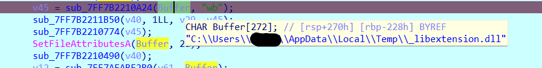

由此可知解密后的dll会被放置在系统的临时目录下。让游戏继续运行，就可以在系统临时目录下找到解密后的_libextension.dll 。但是如果此时终止调试，会发现_libextension.dll从系统临时目录消失了，因此推测程序为了避免解密后的dll被发现，还做了用完即删的处理，但这不妨碍我们得到解密后的dll，复制一份即可。

用010editor打开解密后的dll，发现PE文件格式特征出现了，解密成功。

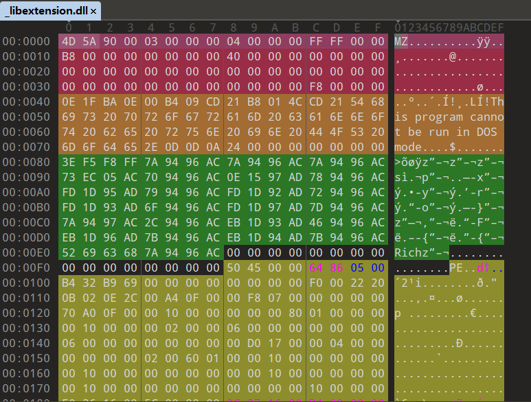

分析libextension.dllIDA打开解密后的dll，在字符串窗口可以发现可疑字样

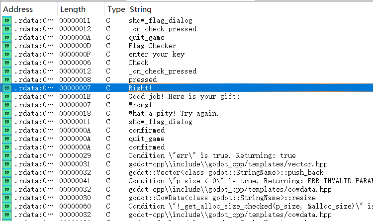

跟进可以找到如下函数

```text
__int64 __fastcall sub_180001850(__int64 a1, char a2)
{
  __int64 v2; // rax
  __int64 v3; // rax
  __int64 v5; // [rsp+20h] [rbp-E8h]
  __int64 v6; // [rsp+28h] [rbp-E0h]
  __int64 v7; // [rsp+30h] [rbp-D8h]
  __int64 v8; // [rsp+38h] [rbp-D0h]
  __int64 v9; // [rsp+40h] [rbp-C8h]
  __int64 v10; // [rsp+48h] [rbp-C0h]
  __int64 v11; // [rsp+50h] [rbp-B8h]
  __int64 v12; // [rsp+58h] [rbp-B0h]
  __int64 v13; // [rsp+60h] [rbp-A8h]
  __int64 v14; // [rsp+68h] [rbp-A0h]
  __int64 v15; // [rsp+70h] [rbp-98h]
  __int64 v16; // [rsp+78h] [rbp-90h]
  __int64 v17; // [rsp+80h] [rbp-88h]
  _BYTE v18[8]; // [rsp+88h] [rbp-80h] BYREF
  _BYTE v19[8]; // [rsp+90h] [rbp-78h] BYREF
  _BYTE v20[8]; // [rsp+98h] [rbp-70h] BYREF
  _BYTE v21[8]; // [rsp+A0h] [rbp-68h] BYREF
  _BYTE v22[8]; // [rsp+A8h] [rbp-60h] BYREF
  _BYTE v23[8]; // [rsp+B0h] [rbp-58h] BYREF
  _BYTE v24[8]; // [rsp+B8h] [rbp-50h] BYREF
  _BYTE v25[8]; // [rsp+C0h] [rbp-48h] BYREF
  _BYTE v26[8]; // [rsp+C8h] [rbp-40h] BYREF
  _BYTE v27[8]; // [rsp+D0h] [rbp-38h] BYREF
  _BYTE v28[16]; // [rsp+D8h] [rbp-30h] BYREF
  _BYTE v29[16]; // [rsp+E8h] [rbp-20h] BYREF
  sub_18006AB40(*(_QWORD *)(a1 + 24));
  sub_1800030A0();
  v5 = sub_18000C8D0(24LL, &unk_1800EA585, &unk_1800EA584);
  if ( v5 )
  {
    v6 = sub_180003EA0(v5);
    v2 = sub_180003070(v6);
  }
  else
  {
    v2 = sub_180003070(0LL);
  }
  *(_QWORD *)(a1 + 32) = v2;
  if ( a2 )
  {
    v7 = *(_QWORD *)(a1 + 32);
    sub_180014E80(v19, "Right!");
    sub_180068540(v7, v19);
    sub_180010BE0(v19);
    v3 = sub_180006790(&unk_180150598);
    sub_180014E80(v20, v3);
    v9 = *(_QWORD *)(a1 + 32);
    v8 = sub_1800164A0(v27, "Good job! Here is your gift: ", v20);
    sub_180074F30(v9, v8);
    sub_180010BE0(v27);
    sub_180010BE0(v20);
  }
  else
  {
    v10 = *(_QWORD *)(a1 + 32);
    sub_180014E80(v21, "Wrong!");
    sub_180068540(v10, v21);
    sub_180010BE0(v21);
    v11 = *(_QWORD *)(a1 + 32);
    sub_180014E80(v22, "What a pity! Try again.");
    sub_180074F30(v11, v22);
    sub_180010BE0(v22);
  }
  sub_180040AA0(a1, *(_QWORD *)(a1 + 32), 0LL, 0LL);
  v13 = *(_QWORD *)(a1 + 32);
  v12 = sub_180004980(v18, 0LL, 0LL);
  sub_180072E40(v13, v12);
  if ( a2 )
  {
    v17 = *(_QWORD *)(a1 + 32);
    sub_180016810(v26, "quit_game", 0LL);
    v16 = sub_180020780(v29, a1, v26);
    sub_180016810(v25, "confirmed", 0LL);
    sub_18002B1E0(v17, v25, v16, 0LL);
    sub_18001CAC0(v25);
    sub_180020860(v29);
    return sub_18001CAC0(v26);
  }
  else
  {
    v15 = *(_QWORD *)(a1 + 32);
    sub_180016810(v24, "show_flag_dialog", 0LL);
    v14 = sub_180020780(v28, a1, v24);
    sub_180016810(v23, "confirmed", 0LL);
    sub_18002B1E0(v15, v23, v14, 0LL);
    sub_18001CAC0(v23);
    sub_180020860(v28);
    return sub_18001CAC0(v24);
  }
}
```

其中Right和Wrong的情况由变量a2 决定，而a2是作为该函数的第二个参数传入的，因此回溯到上级函数：

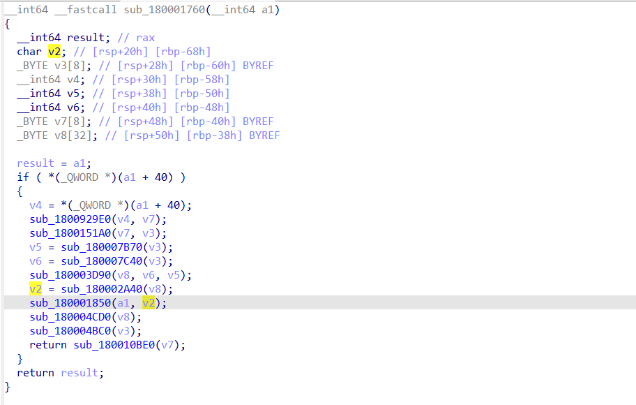

可以看到该参数是前一个函数sub_180002A40 的返回值，跟进sub_180002A40 ：

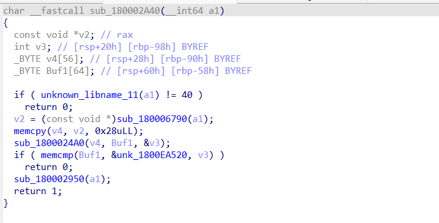

函数开头对参数a1 进行了疑似长度检验的操作，推测a1即为要求输入的数据（即提示中说的“key”）。随后的sub_180006790是堆栈检查函数，然后输入的数据被复制到v4中，作为另一个函数sub_1800024A0 的参数，跟进sub_1800024A0 ：

```text
_DWORD *__fastcall sub_1800024A0(__int64 a1, __int64 a2, _DWORD *a3)
{
  _DWORD *result; // rax
  int i; // [rsp+20h] [rbp-58h]
  int j; // [rsp+24h] [rbp-54h]
  unsigned int v6; // [rsp+28h] [rbp-50h]
  unsigned int v7; // [rsp+2Ch] [rbp-4Ch]
  int m; // [rsp+30h] [rbp-48h]
  int v9; // [rsp+34h] [rbp-44h]
  int k; // [rsp+38h] [rbp-40h]
  _DWORD v11[10]; // [rsp+40h] [rbp-38h] BYREF
  memset(v11, 0, sizeof(v11));
  for ( i = 0; i < 5; ++i )
  {
    v11[2 * i] = sub_1800023A0(8 * i + a1);
    v11[2 * i + 1] = sub_1800023A0(8 * i + 4 + a1);
  }
  for ( j = 0; j < 10; j += 2 )
  {
    v9 = 0;
    v6 = v11[j];
    v7 = v11[j + 1];
    for ( k = 0; k < 32; ++k )
    {
      v9 += 1131796;
      v6 += (dword_18014F498[1] + (v7 >> 5)) ^ (v9 + v7) ^ (dword_18014F498[0]
+ 16 * v7);
      v7 += (dword_18014F498[3] + (v6 >> 5)) ^ (v9 + v6) ^ (dword_18014F498[2]
+ 16 * v6);
    }
    v11[j] = v6;
    v11[j + 1] = v7;
  }
  for ( m = 0; m < 10; ++m )
    sub_180002410((unsigned int)v11[m], 4 * m + a2);
  result = a3;
  *a3 = 40;
  return result;
}
```

这是一个魔改了delta的TEA加密。回到上级函数继续分析，函数的最后使用memcpy比较了Buf1

和预设的数据值，若两个数据相同，随后的sub_180002950 会对输入的数据进行一些字符变换：

```text
__int64 __fastcall sub_180002950(__int64 a1)
{
  const void *v1; // rax
  __int64 v2; // rax
  int i; // [rsp+20h] [rbp-68h]
  _BYTE v5[32]; // [rsp+28h] [rbp-60h] BYREF
  _BYTE v6[48]; // [rsp+48h] [rbp-40h] BYREF
  v1 = (const void *)sub_180006790(a1);
  memcpy(v6, v1, 0x28uLL);
  for ( i = 0; i < 40; ++i )
  {
    if ( v6[i] == 111 )// 'o'
      v6[i] = 48;// '0'
    if ( v6[i] == 101 )// 'e'
      v6[i] = 51;// '3'
    if ( v6[i] == 105 )// 'i'
      v6[i] = 49;// '1'
  }
  v2 = sub_180003D90(v5, v6, 40LL);
  sub_180004F50(&unk_180150598, v2);
  return sub_180004CD0(v5);
}
```

这样分析下来，输入数据的检验逻辑应该只经过了一层TEA加密。至于最后的变换函数，仔细观察可以发现，最开始输出Right/Wrong的函数里，Right的情况也出现了unk_180150598

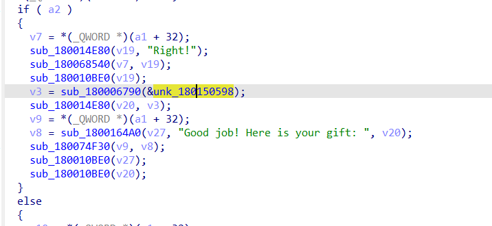

而这个数据最终流向了v20 ，作为gift 。所以推测提示中的gift 是由key 变换而来的。

但是，尝试使用TEA解密预设数据会发现根本得不到有意义的明文，因此，程序中可能有隐藏的逻辑。

寻找隐藏的逻辑这里提供静态分析和动态分析两种方法：

静态分析遇到这种莫名其妙的情况，先考虑有没有hook 在背地里修改程序。

在IDA的Exports窗口可以看到有两个TlsCallback ，Function name窗口也可以搜索到

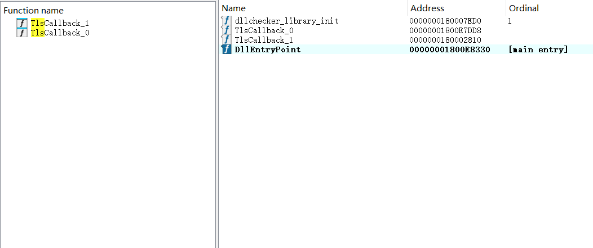

跟进TlsCallback_1 就可以看到如下内容

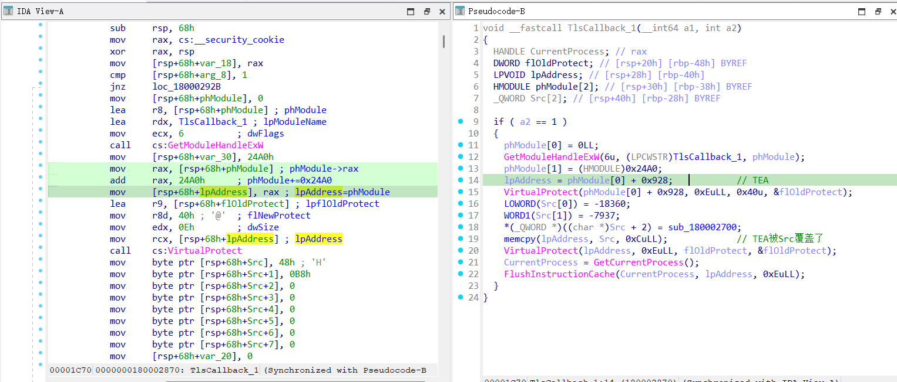

此处反编译可能有些问题，但是从汇编代码可以直观看出TlsCallback_1 先获取了dll基址，随后加上0x24A0 计算出TEA的实际地址（和函数名sub_1800024A0 对上了），TEA的地址传给lpAddress作为后续memcpy的参数。也就是说这个回调函数hook了TEA，并将其修改成了Src，而这里的Src构成了一个mov rax,[目标函数地址] jump rax 的重定向。跟进sub_180002700 可以发现这是一个smc函数

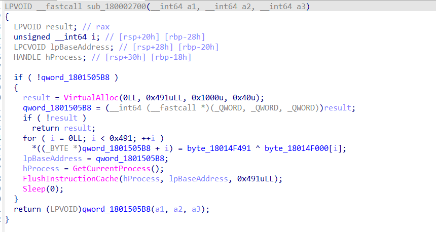

综上，程序执行TlsCallback_1时会将TEA重定向到这个smc函数，随后smc函数从byte_18014F000 获取数据进行解密，解密结果qword_1801505B8 最终被当作一个函数执行。

因此，TEA并非真正的加密函数，真正的加密函数要通过smc得到。写一个IDAPython脚本解密byte_18014F000 处的数据：

```python
import idc
start_addr = 0x18014F000
len = 0x491
for i in range(len):
    code = idc.get_wide_byte(start_addr + i)
    code = code ^ 0xba
    idc.patch_byte(start_addr+i,code)
```

解密后选中byte_180165000 ，将这段数据建立成函数，反编译得到如下：

```text
_DWORD *__fastcall sub_18014F000(__int64 a1, __int64 a2, _DWORD *a3)
{
  _DWORD *result; // rax
  int j; // [rsp+0h] [rbp-108h]
  int k; // [rsp+0h] [rbp-108h]
  int m; // [rsp+0h] [rbp-108h]
  int v7; // [rsp+4h] [rbp-104h]
  int v8; // [rsp+4h] [rbp-104h]
  int v9; // [rsp+4h] [rbp-104h]
  int v10; // [rsp+4h] [rbp-104h]
  unsigned __int8 v11; // [rsp+Dh] [rbp-FBh]
  int i; // [rsp+10h] [rbp-F8h]
  unsigned int v13; // [rsp+18h] [rbp-F0h]
  unsigned __int8 v14; // [rsp+1Ch] [rbp-ECh]
  unsigned __int8 v15; // [rsp+20h] [rbp-E8h]
  _BYTE v16[216]; // [rsp+30h] [rbp-D8h]
  v16[0] = -91;
  v16[1] = -90;
  v16[2] = -89;
  v16[3] = -88;
  v16[4] = -87;
  v16[5] = -86;
  v16[6] = -85;
  v16[7] = -84;
  v16[8] = -83;
  v16[9] = -82;
  v16[10] = -81;
  v16[11] = -80;
  v16[12] = -79;
  v16[13] = -78;
  v16[14] = -77;
  v16[15] = -76;
  v16[16] = -75;
  v16[17] = -74;
  v16[18] = -73;
  v16[19] = -72;
  v16[20] = -71;
  v16[21] = -70;
  v16[22] = -69;
  v16[23] = -68;
  v16[24] = -67;
  v16[25] = -66;
  v16[26] = -123;
  v16[27] = -122;
  v16[28] = -121;
  v16[29] = -120;
  v16[30] = -119;
  v16[31] = -118;
  v16[32] = -117;
  v16[33] = -116;
  v16[34] = -115;
  v16[35] = -114;
  v16[36] = -113;
  v16[37] = -112;
  v16[38] = -111;
  v16[39] = -110;
  v16[40] = -109;
  v16[41] = -108;
  v16[42] = -107;
  v16[43] = -106;
  v16[44] = -105;
  v16[45] = -104;
  v16[46] = -103;
  v16[47] = -102;
  v16[48] = -101;
  v16[49] = -100;
  v16[50] = -99;
  v16[51] = -98;
  v16[52] = -58;
  v16[53] = -57;
  v16[54] = -56;
  v16[55] = -55;
  v16[56] = -54;
  v16[57] = -53;
  v16[58] = -52;
  v16[59] = -51;
  v16[60] = -50;
  v16[61] = -49;
  v16[62] = -44;
  v16[63] = -48;
  for ( i = 0; i < 64; ++i )
    v16[i + 128] = ~v16[i];
  v7 = 0;
  for ( j = 0; j < 40; j += 3 )
  {
    v11 = *(_BYTE *)(a1 + j);
    if ( j + 1 >= 40 )
      v14 = 0;
    else
      v14 = *(_BYTE *)(a1 + j + 1);
    if ( j + 2 >= 40 )
      v15 = 0;
    else
      v15 = *(_BYTE *)(a1 + j + 2);
    v16[v7 + 64] = v16[(((int)v14 >> 4) & 0xF | (unsigned __int8)(16 * (v11 &
3))) + 128];
    v8 = v7 + 1;
    v16[v8 + 64] = v16[(((int)v11 >> 2) & 0x3F) + 128];
    v9 = v8 + 1;
    if ( j + 1 >= 40 )
      v16[v9 + 64] = 61;
    else
      v16[v9 + 64] = v16[(v15 & 0x3F) + 128];
    v10 = v9 + 1;
    if ( j + 2 >= 40 )
      v16[v10 + 64] = 61;
    else
      v16[v10 + 64] = v16[(((int)v15 >> 6) & 3 | (unsigned __int8)(4 * (v14 &
0xF))) + 128];
    v7 = v10 + 1;
  }
  for ( k = 0; k < v7; ++k )
    *(_BYTE *)(a2 + k) = v16[k + 64];
  v13 = 1131796;
  for ( m = 0; m < v7; ++m )
  {
    *(_BYTE *)(a2 + m) ^= v13 >> (8 * m % 24);
    *(_BYTE *)(a2 + m) = (((int)*(unsigned __int8 *)(a2 + m) >> 6) | (4 * *
(_BYTE *)(a2 + m))) ^ 0xBA;
    v13 = 16843155 * v13 + 305419896;
  }
  result = a3;
  *a3 = v7;
  return result;
}
```

动态分析除了静态分析寻找可能的hook操作外，还可以写一个简单的加载器来加载dll并调用其中的函数。

根据上文分析可以知道，对输入数据的检验和处理主要是在函数sub_1800024A0 中，根据.text段开头的注释信息可以计算出函数偏移为0x24A0

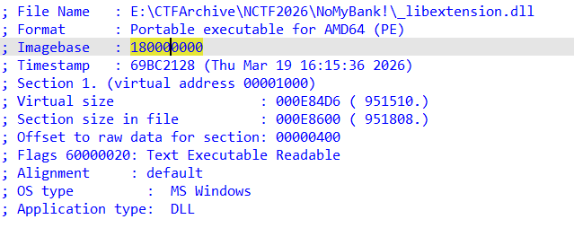

而对于参数a1的类型，前文提及函数开头进行了检验长度，计算长度的函数unknown_libname_11 如下：

```text
// Microsoft VisualC v7/14 64bit runtime
__int64 __fastcall unknown_libname_11(__int64 a1)
{
  return *(_QWORD *)(a1 + 16);
}
```

而std::string 在“短字符优化（SSO）”下的结构如下：

```python
class string {
    union Buffer{
        char * _pointer;
        char _local[16];
    };
    size_t _size;
    size_t _capacity;
    Buffer _buffer;
};
```

unknown_libname_11访问a1+16 计算长度的行为和std::string的结构刚好对上，因此推测a1的类型为std::string。有了函数偏移和参数类型，就可以写出加载器：

```c
#include<windows.h>
#include<string>
#include<iostream>
int main(){
    HMODULE hDll = LoadLibraryA("..//_libextension.dll");
    if(!hDll){
        std::cout << "failed to load dll" << std::endl;
        return 1;
    }
    BYTE* addr = (BYTE*)hDll + 0x2A40;
    int (*check)(std::string) = (int(*)(std::string))addr;
    std::string key;
    std::cout << "input \"key\" :" << std::endl;
    std::cin>>key;
    check(key);
    return 0;
}
```

编译出程序后，就可以在TEA 处下断点，将dll附加到加载器进程进行调试。可以发现构造的参数成功通过了长度校验，接下来F7步入TEA 函数得到：

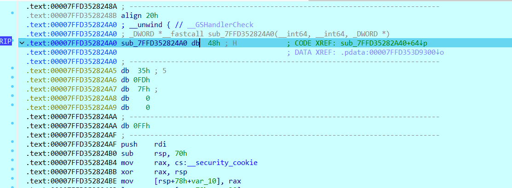

将24A0 处的数据重新定义为代码得到：

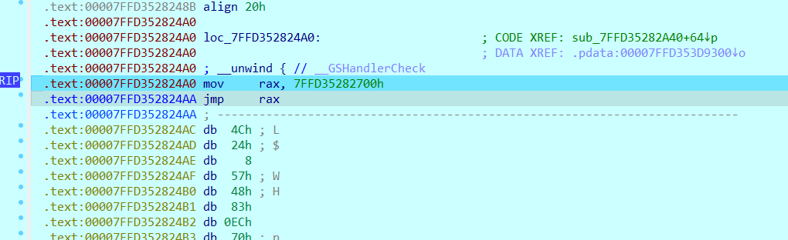

可以看到TEA函数开头被修改并重定向到了0x7FFD35282700h 处，跟进得到：

```text
LPVOID __fastcall sub_7FFD35282700(__int64 a1, __int64 a2, __int64 a3)
{
  LPVOID result; // rax
  unsigned __int64 i; // [rsp+20h] [rbp-28h]
  LPCVOID lpBaseAddress; // [rsp+28h] [rbp-20h]
  HANDLE hProcess; // [rsp+30h] [rbp-18h]
  if ( !qword_7FFD353D05B8 )
  {
    result = VirtualAlloc(0LL, 0x491uLL, 0x1000u, 0x40u);
    qword_7FFD353D05B8 = (__int64 (__fastcall *)(_QWORD, _QWORD,
_QWORD))result;
    if ( !result )
      return result;
    for ( i = 0LL; i < 0x491; ++i )
      *((_BYTE *)qword_7FFD353D05B8 + i) = byte_7FFD353CF491 ^
byte_7FFD353CF000[i];
    lpBaseAddress = qword_7FFD353D05B8;
    hProcess = GetCurrentProcess();
    FlushInstructionCache(hProcess, lpBaseAddress, 0x491uLL);
    Sleep(0);
  }
  return (LPVOID)qword_7FFD353D05B8(a1, a2, a3);
}
```

分析可知，这是一个smc函数，函数解密了byte_7FFD353CF000 处的数据并将其作为函数调

用，运行至return处步入，建立函数即可看到真正的加密处理解密flag

### 解密 flag

分析真正的加密函数，发现输入的数据先经过了一个魔改的 base64 编码，然后被逐字符加密，而base64的魔改点在于换表和字符换位（每段编码结果的第1和2、3和4位互换了），因此可以写出最终的exp：

```python
import base64
# 解密
def decrypt(data):
    v3 = 1131796
    for i in range(len(data)):
        data[i] ^= 0xba
        data[i] = ((data[i] << 6) | (data[i] >> 2)) & 0xff
        data[i] ^= (v3 >> (8 * i % 24)) & 0xff
        v3 = (16843155 * v3 + 305419896) & 0xffffffff
    return data
# 解码
def b64_decode(data):
    # 字符换位还原
    for i in range(len(data)//4):
        data[i*4], data[i*4 + 1] = data[i*4 + 1], data[i*4]
        data[i*4 + 2], data[i*4 + 3] = data[i*4 + 3], data[i*4 + 2]
    encrypted_table = [
        -91, -90, -89, -88, -87, -86, -85, -84, -83, -82, -81, -80,
        -79, -78, -77, -76, -75, -74, -73, -72, -71, -70, -69, -68,
        -67, -66, -123, -122, -121, -120, -119, -118, -117, -116, -115,
        -114, -113, -112, -111, -110, -109, -108, -107, -106, -105, -104,
        -103, -102, -101, -100, -99, -98, -58, -57, -56, -55, -54, -53,
        -52, -51, -50, -49, -44, -48
    ]
    # 解密base表
    modified_table = ''.join(chr((~i) & 0xff) for i in encrypted_table)
    # 构建魔改表和标准表的映射
    std_table =
"ABCDEFGHIJKLMNOPQRSTUVWXYZabcdefghijklmnopqrstuvwxyz0123456789+/"
    char_map = str.maketrans(modified_table,std_table)
    # 解码
    data_modifiedb64 = bytes(data).decode('ascii')
    data_stdb64 = data_modifiedb64.translate(char_map)
    data_decrypted = base64.b64decode(data_stdb64)
    return data_decrypted
# 字符变换
def change_str(data):
    chars = data.decode('ascii')
    chars = chars.replace('o','0').replace('e','3').replace('i','1')
    return chars
enc = [
        0x2B, 0xF7, 0x67, 0x5E, 0x7C, 0x98, 0xED, 0x6D,
        0xD1, 0x8C, 0xEF, 0x57, 0xBB, 0x33, 0x22, 0x7E,
        0xB2, 0x1F, 0x34, 0x5B, 0x36, 0x6C, 0x2B, 0xAF,
        0xBB, 0x5B, 0x12, 0xD6, 0x3C, 0x0A, 0x45, 0x27,
        0x84, 0x6C, 0x47, 0xAB, 0x2F, 0x75, 0x78, 0x3E,
        0x88, 0x89, 0x2D, 0x7A, 0xCD, 0x5C, 0xF6, 0xFA,
        0x36, 0x73, 0xFF, 0x6E, 0xD3, 0x4C, 0x1C, 0x75
    ]
temp = decrypt(enc)
key = b64_decode(temp)
gift = change_str(key)
print(gift)
#NCTF{Y0u_d3s3rv3_th1s_g1ft_b1bd7c719cfc}
```

## 方法总结

- 核心技巧：Godot PCK 密钥提取、DLL 运行时解密、TLS callback hook 与 SMC 还原。
- 识别信号：Godot 游戏解包提示需要密钥、扩展 DLL 不是 PE、且运行时报错信息被特殊处理时，要沿加载链查资源密钥和 DLL 解密流程。
- 复用要点：先解决资源包解密，再抓取运行时还原的 DLL；遇到 TEA 等假逻辑时检查 TLS callback 和内存 patch。
