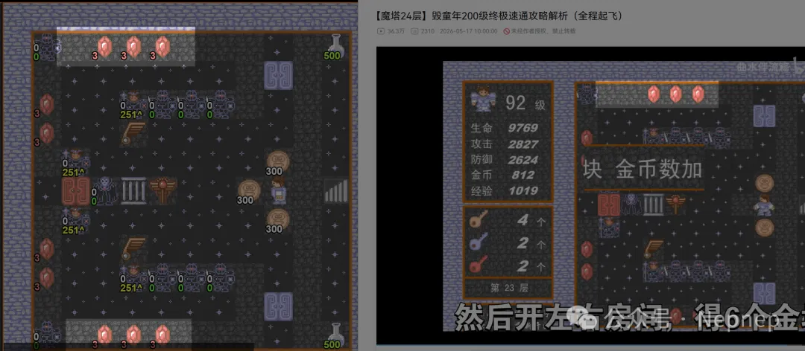

# NepCTF2026 ZhiE Writeup

## 题目简述

题目给出一个经过字符编码错乱和自定义操作编码处理的魔塔游戏。“ZhiE”对应乱码标题“臸娥”：将其按 Big5 解码得到原始字节，再按 GBK 解释即可得到“魔塔”，这也提示了程序的真实类型。

程序要求完成 24 层流程并提交一串操作字节。关键不是人工完整通关，而是还原坐标、方向和菜单操作的编码，再利用已有魔塔路线生成合法 replay。

## 解题过程

静态分析输入处理函数可见，每个操作主要压缩在一个字节中：

- 普通坐标操作：高 4 位与低 4 位分别表示横纵坐标，实际编码为 `(x - 1) << 4 | (y - 1)`；
- `x = 13`、`y = 1..4` 表示四个移动方向；
- `x = 12`、`y = 1..7` 表示子菜单、商店、楼层传送等特殊动作；
- 坐标范围主要为 `0..11`，因此一个字节足以表达地图格点。

游戏界面和关卡布局如下，图中空间关系有助于核对路线与交互点：



无需重新从零搜索最优路线。可将公开的 h5mota replay 转换成题目格式：

```python
def pos(x, y):
    return ((x - 1) << 4) | (y - 1)

def direction(code):
    # 按反编译得到的方向编号映射到 x=13 的保留区
    return ((13 - 1) << 4) | code

def special(code):
    # 商店、楼传器等映射到 x=12 的保留区
    return ((12 - 1) << 4) | code
```

转换时要逐项处理移动、开门、战斗后的落点以及商店选择，不能只拼接坐标。把生成的操作流交给本地程序回放；若某层开始出现坐标偏移，优先检查上一个特殊操作的编号和坐标是否做了减一。

最终用完整 replay 通过 24 层校验，程序输出 flag。

## 方法总结

本题将“识别经典魔塔”和“恢复紧凑输入协议”组合在一起。编码乱码是题材提示，但真正的逆向工作是确定一个字节中各字段的含义。已知游戏路线可以复用，前提是先建立严谨的动作映射，并用本地回放逐层校验；仅凭界面手工点击既慢，也很难生成服务端要求的确定性操作流。
