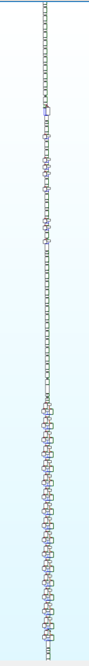
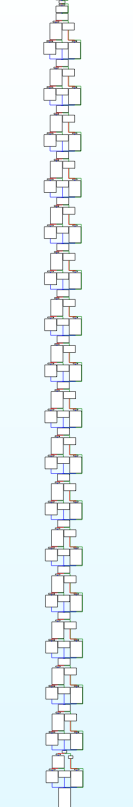

# Secure Computing

## 题目简述

程序把 Windows 系统调用当作虚拟机指令：用户态代码几乎只有 `mov` 和 `syscall`，真正的算术、比较、读写和控制流都借内核行为完成。由于系统调用号随 Windows 版本变化，官方附件按内核 build 分为 19041、19045、20348、22000、22621/22631 和 26120/27686 六组；这些原始可执行文件集中保存在 [SekaiCTF 2024 Secure Computing 附件归档](https://archive.org/download/sekaictf-2024-secure-computing-downloads)。正文分析的是共同算法，实际调试时必须选择与本机 build 对应的文件。

目标是识别这台“syscall VM”实现的加密算法，提取六组字符映射、密钥和目标密文，再反向恢复 24 个字符。

## 解题过程

### 1. 把系统调用还原成 VM 指令

每个调用前，程序通过一串 `mov` 准备 `rax/r10/rdx/r8/r9/rsp`。`rax` 的高位用于混淆，真正的系统调用号是：

```text
syscall_id = rax & 0x1ff
```

整个程序只使用 12 类系统调用，其语义可归纳为：

| 系统调用 | 在题目中的作用 |
| --- | --- |
| `ZwContinue` | 从伪造 Context 恢复 RIP，实现无条件跳转 |
| `ZwContinueEx` | 利用保留字段是否合法实现条件跳转 |
| `ZwCreateSemaphore` | 比较 initial 与 maximum，返回成功或错误 |
| `ZwCreateIoCompletion`、`ZwCreateWorkerFactory` | 创建后续加法 gadget 所需对象 |
| `ZwSetInformationWorkerFactory`、`ZwQueryInformationWorkerFactory` | 组合成 32 位加法及结果回读 |
| `ZwReadVirtualMemory`、`ZwWriteVirtualMemory` | 通过内核读写输入缓冲区 |
| `ZwReadFile`、`ZwWriteFile` | 标准输入与输出 |
| `ZwTerminateProcess` | 退出 |

可以用 Unicorn/Qiling 为这些调用实现最小语义后记录动态轨迹，也可以像官方示例那样静态提升。静态方案先反汇编并收集每个 `syscall` 前的寄存器常量，再做如下替换：

- `ZwContinue` 改成普通 `jmp`；
- `ZwContinueEx` 改成 `test` 加条件跳转；
- `ZwCreateSemaphore` 改成比较并产生布尔值；
- WorkerFactory 查询和设置改成普通 `add`/内存写；
- 与计算无关的资源创建直接 NOP。

这样能让 IDA 或其他分析器重新构建可读 CFG，而不用真实执行所有内核对象操作。

### 2. 从整体 CFG 找到六个加密块

跟踪只用于输入字符访问的 `ZwReadVirtualMemory`，可见相似的大块控制流重复六次；每块内部又重复 22 轮。整体形状呈现“长直线—半分支—直线—密集分支”的固定模式：



因此先得到框架：

```python
for block in range(6):
    for round_index in range(22):
        # 处理两个 16 位字
        ...
```

### 3. 识别按位运算与 Speck32/64

VM 没有原生位运算，只能用比较与加法模拟。例如某段代码从高位到低位检查 16 位值：若值大于 $2^n-1$，就减去 $2^n$，并把对应的另一位置入输出。按全部阈值整理后，该段等价于 16 位右旋 7 位。

另一类高度对称的双输入分支同时检查两个值的同一位，并仅在两位不同的分支设置输出，等价于 XOR：



每一轮最终可化简为：

```python
x = (ror16(x, 7) + y) & 0xffff
x ^= round_key
y = rol16(y, 2) ^ x
```

特征是两个 16 位字、22 轮、右旋 7、左旋 2、加法和 XOR，正是 Speck32/64。

### 4. 提取字符顺序、密钥与目标密文

三类常量可分别从不同 syscall gadget 中提取：

- 输入字符顺序：把位于 `0xA00000` 的输入缓冲区填成递增字节，记录每次 `ZwReadVirtualMemory` 读到的偏移；
- 目标密文：每块结尾用两次 `ZwCreateSemaphore` 检查 `a <= target` 与 `target <= a`，记录比较常量；
- 轮密钥：XOR 的右操作数被硬编码进分支；静态恢复每一位，或动态记录 XOR 前后值并计算 `before ^ after`。恢复 22 个轮密钥后也可反推四个初始 16 位密钥字。

最终六组常量如下：

| 字符下标 | 64 位密钥的四个 16 位字 | 目标密文 |
| --- | --- | --- |
| `[5, 9, 6, 15]` | `[eb10, c518, f25d, 7d26]` | `[4b13, cf76]` |
| `[3, 10, 12, 7]` | `[299c, 5008, 0f7d, d59a]` | `[dca7, c558]` |
| `[4, 16, 22, 11]` | `[f32f, 6aef, 4905, 5fe6]` | `[9f86, 1482]` |
| `[23, 21, 20, 8]` | `[bd1f, 9cda, 68fc, d0a3]` | `[89e4, fa2a]` |
| `[13, 1, 2, 17]` | `[c7f3, 3cb2, 1cfd, c69a]` | `[47bb, ab57]` |
| `[14, 0, 18, 19]` | `[7645, 7048, 6bbf, 562a]` | `[a400, 5f70]` |

### 5. 解密并按下标回填

下面的精简代码包含 Speck32/64 密钥扩展和逆轮。题目表中的密文按显示顺序存放，但进入轮函数时要交换两个字；解密出的两个字也按 `y || x` 的顺序各自小端转成四个字符：

```python
MASK = 0xffff

def ror(x, n):
    return ((x >> n) | (x << (16 - n))) & MASK

def rol(x, n):
    return ((x << n) | (x >> (16 - n))) & MASK

def enc_round(x, y, k):
    x = ((ror(x, 7) + y) & MASK) ^ k
    y = rol(y, 2) ^ x
    return x, y

def dec_round(x, y, k):
    y = ror(y ^ x, 2)
    x = rol(((x ^ k) - y) & MASK, 7)
    return x, y

def expand_key(key):
    b = key[0]
    l = list(key[1:])
    round_keys = [b]
    for i in range(21):
        l[i % 3], b = enc_round(l[i % 3], b, i)
        round_keys.append(b)
    return round_keys

blocks = [
    ([5,9,6,15],   [0xeb10,0xc518,0xf25d,0x7d26], [0x4b13,0xcf76]),
    ([3,10,12,7],  [0x299c,0x5008,0x0f7d,0xd59a], [0xdca7,0xc558]),
    ([4,16,22,11], [0xf32f,0x6aef,0x4905,0x5fe6], [0x9f86,0x1482]),
    ([23,21,20,8], [0xbd1f,0x9cda,0x68fc,0xd0a3], [0x89e4,0xfa2a]),
    ([13,1,2,17],  [0xc7f3,0x3cb2,0x1cfd,0xc69a], [0x47bb,0xab57]),
    ([14,0,18,19], [0x7645,0x7048,0x6bbf,0x562a], [0xa400,0x5f70]),
]

answer = ['?'] * 24
for indices, key, ciphertext in blocks:
    x, y = ciphertext[1], ciphertext[0]
    for round_key in reversed(expand_key(key)):
        x, y = dec_round(x, y, round_key)
    raw = y.to_bytes(2, 'little') + x.to_bytes(2, 'little')
    for index, byte in zip(indices, raw):
        answer[index] = chr(byte)

print(''.join(answer))
```

输出的 24 字符内容为：

```text
sy5c4ll_m3_m4yb3_2c94234
```

按赛事 flag 格式提交：

```text
SEKAI{sy5c4ll_m3_m4yb3_2c94234}
```

## 方法总结

这道题的本质是以 Windows 内核系统调用充当 VM gadget。先把 syscall ID 和参数提取出来，再把 Continue、Semaphore 和 WorkerFactory 等行为提升成普通跳转、比较与加法，就能从巨大的 `mov/syscall` 序列中恢复结构。六块、每块 22 轮、`ROR 7`、`ROL 2` 和 ARX 轮函数共同锁定 Speck32/64。

图片只保留了代码文本无法替代的 CFG 空间结构；原 writeup 中的反编译代码截图已改写为伪代码。附件归档链接仍保留，因为仓库本身没有提交各 Windows build 的二进制，且正文已列出其版本用途，不需要依赖链接理解解法。
