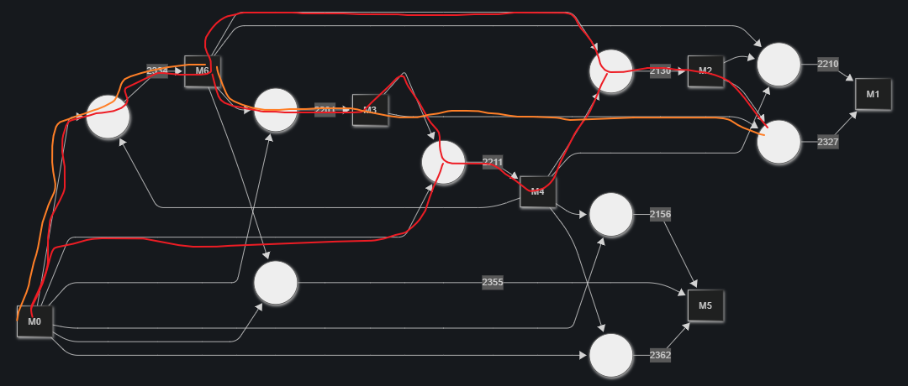
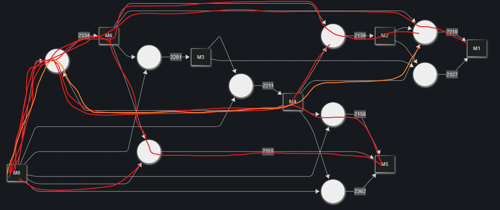
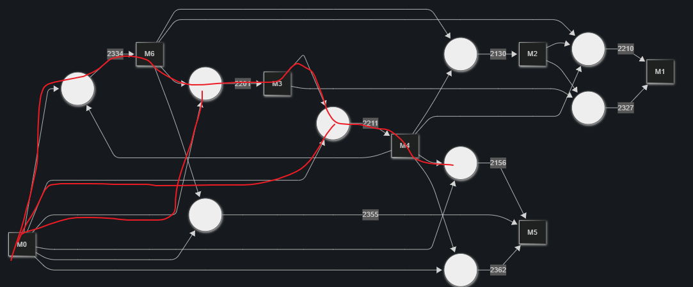
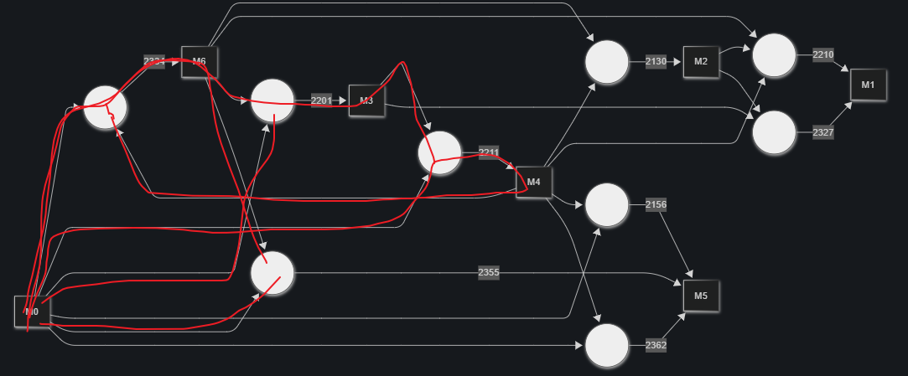
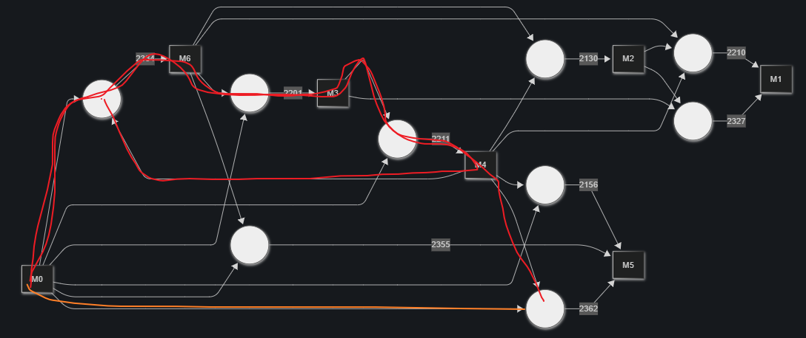

# Alchemy Master

## 题目简述

题目提供一套被插件 hook 的 MSVC 编译环境。插件拦截编译器的 `ReadFunction`，遍历内部 AST tuple，并把不同 tuple kind 当作炼金反应。玩家要提交一段 C++，让编译过程中出现的节点把初始材料：

```text
[1844, 0, 0, 0, 3004, 0, 2915]
```

恰好转换为：

```text
[333, 727, 353, 746, 433, 765, 361]
```

核心不是让程序运行出结果，而是反向控制编译器内部 AST 节点计数。

## 解题过程

### 1. 恢复 tuple kind 与材料反应

加载带 PDB 的 MSVC 模块后，可以识别插件 hook 的函数和 tuple 类型。官方 WP 得到的生产关系为：

| 目标材料 | 可用 tuple kind |
|---|---|
| M0 | 无法生产，只能消耗初始库存 |
| M1 | 2210、2327 |
| M2 | 2130 |
| M3 | 2201 |
| M4 | 2211 |
| M5 | 2156、2355、2362 |
| M6 | 2334 |

完整依赖关系中，M0、M4、M6 是初始资源。官方分析对不同候选反应分别画出了材料流：











由于 M0 不能再生，不能只比较单个反应是否产出目标材料，还要检查整条反应链的资源消耗。

### 2. 把 tuple kind 映射回 C++ 语句

用同一 hook 编译最小 C++ 样例，记录每一行产生的 tuple 序列。官方最终使用：

| C++ 代码 | 主要节点序列 |
|---|---|
| `int a = 1;` | `SimpleStmt`，kind 2130 |
| `throw;` | `FunctionCallStmt, ThrowStmt, FunctionCallStmt`，包含 kind 2201、2210 |
| `return 0;` | `ReturnStmt`，kind 2156 |
| `reinterpret_cast<void(*)()>(nullptr)();` | `FunctionCallStmt`，kind 2201 |
| `{}` | `FunctionPrologue, BeginEpilogue`，包含 kind 2362 |

虽然 2327（`DestructorEHBlock`）看似可以直接生产 M1，但很难稳定地用短源码生成。官方解法因此选择更容易控制的 2210（`ThrowStmt`）。

### 3. 解整数计数，再人工修正

把每种语句出现次数设为整数变量，根据材料消耗和产出建立线性约束，先求一个接近目标的组合。官方 `playground/solve.py` 存在简化：

- 把 Throw 数量与 Call 数量错误地视为相等；
- 对部分目标材料附加了不必要的相等关系。

因此求解器只用于给出接近答案，不能直接把输出当最终 payload。随后根据实际编译器节点计数手工增删语句。

### 4. 用 `BeginEpilogue` 补足 M5

初版组合仍缺 M5，但继续用 `return 0;` 会消耗当前需要保留的材料。官方改用空块：

```cpp
{}
```

它生成 `FunctionPrologue` 和 `BeginEpilogue`，通过 kind 2362 补充 M5。配合若干只产生 `FunctionCallStmt` 的空函数指针调用，最终把七种材料精确调整到目标值。完整构造保存在仓库官方 `solution_final.cpp`。

## 方法总结

本题的逆向对象是编译器内部表示，而非生成的机器码。有效流程是：

```text
带 PDB 恢复 hook 语义
→ 最小源码探测 AST 节点
→ 建立材料反应方程
→ 整数求解得到近似组合
→ 以真实编译输出人工校正
```

同一行 C++ 往往产生多个节点，所以“一个语句等于一个反应”的假设不成立。自动求解必须以实测节点序列为原子；否则只能用于缩小搜索范围，最后仍需回到编译器输出验证。
