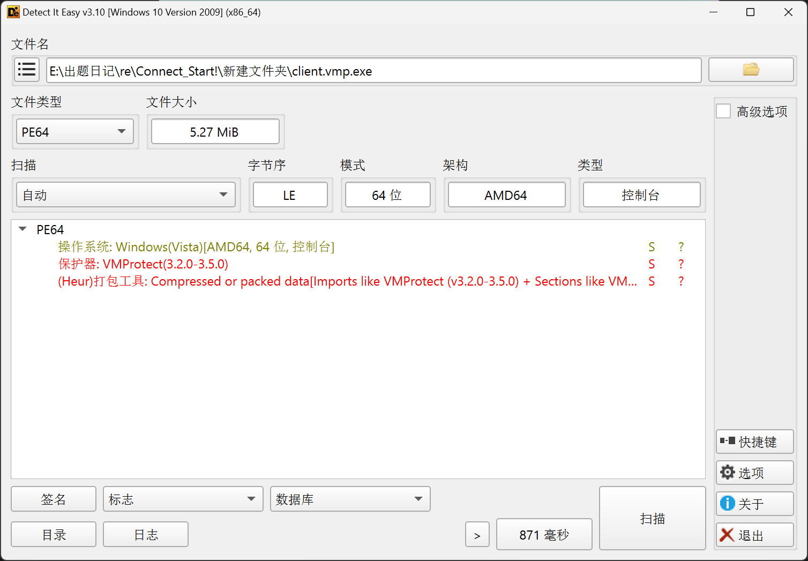
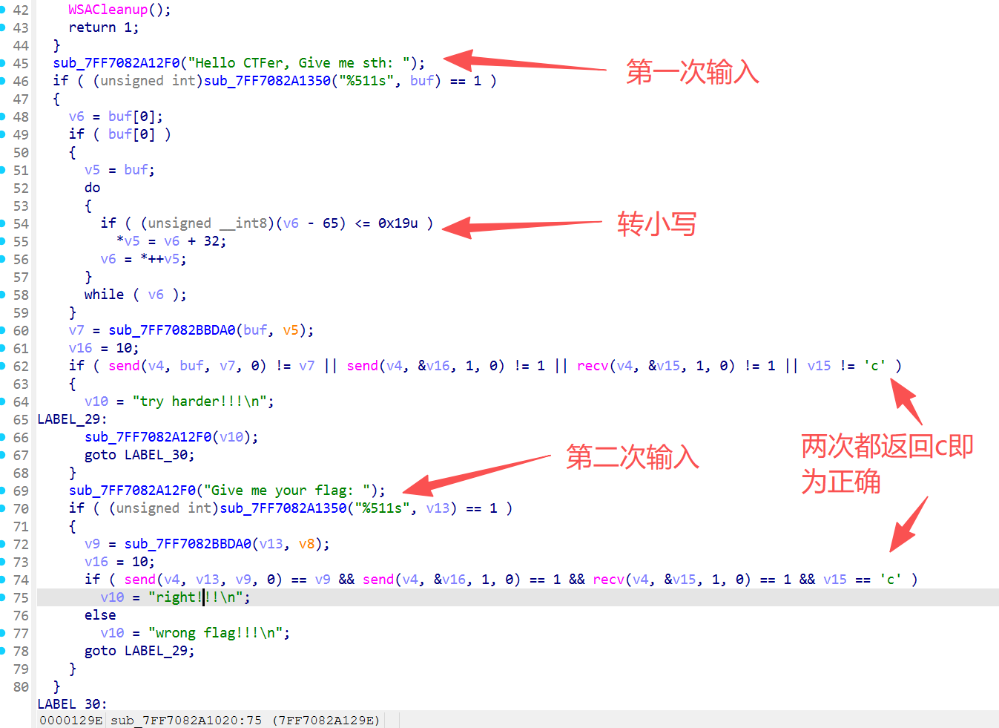
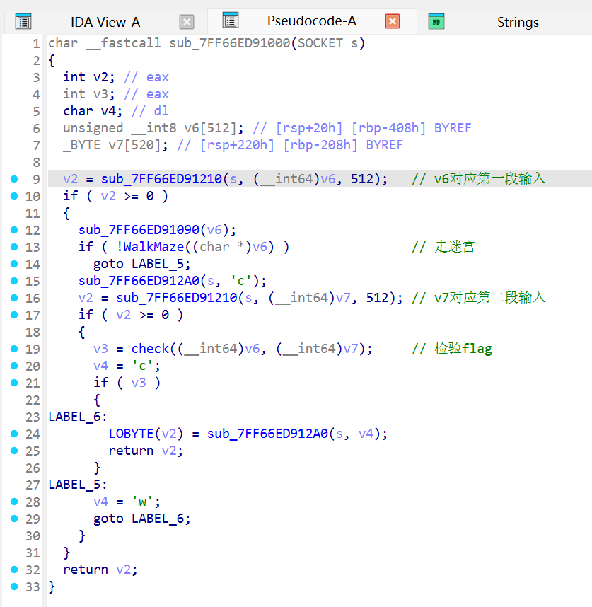
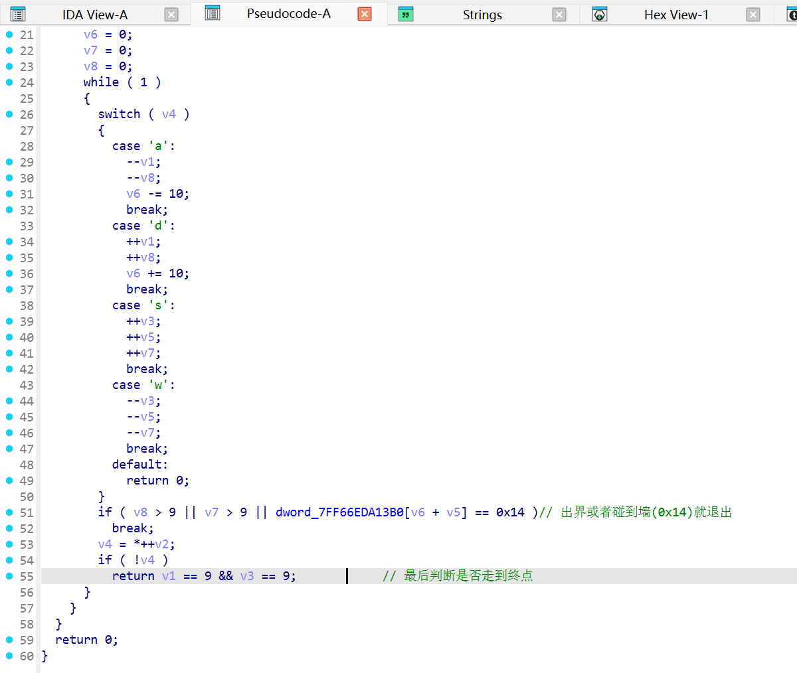
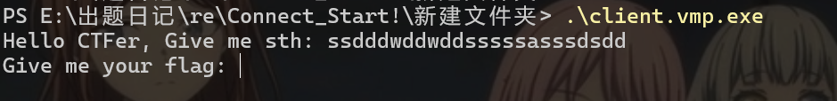
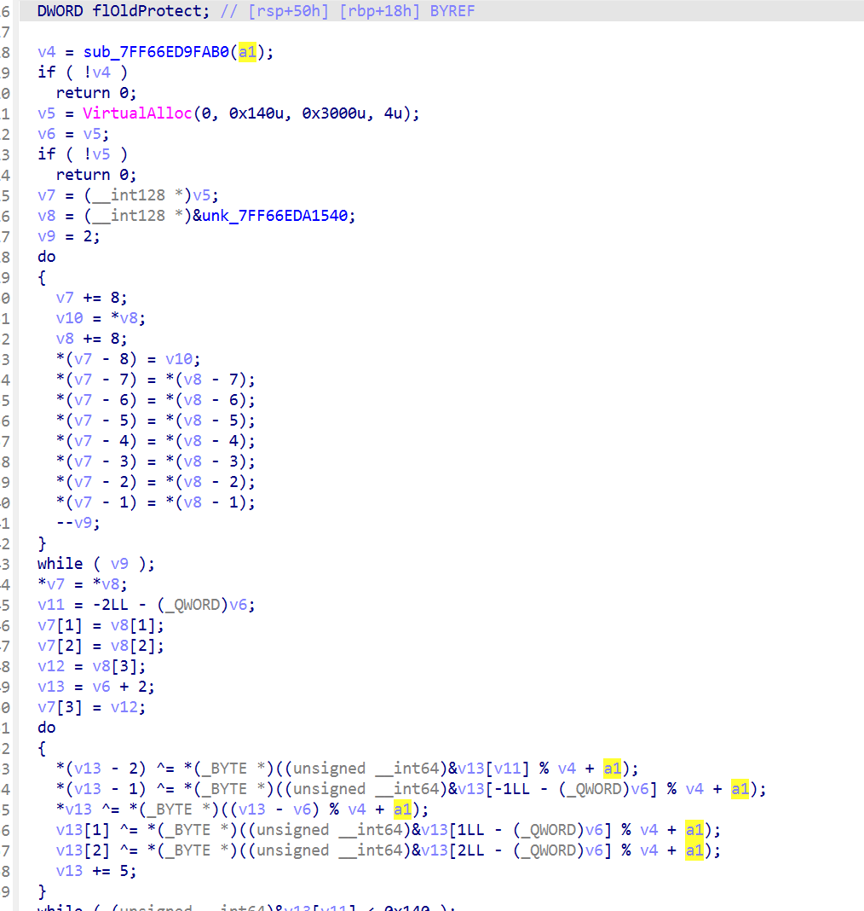
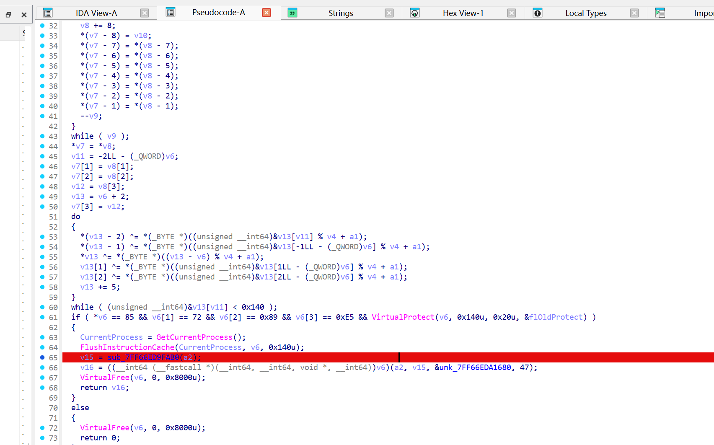

# Link Start!

## 题目简述

题目给出 `client.exe` 和 `server.exe`，两者都加了旧版本 VMP 壳。脱壳后仍有少量混淆，但服务端协议可以拆成两段输入：第一段用于走二维迷宫，服务端返回 `c/w` 表示是否通过；第二段作为 flag 候选进入真正校验。

关键机制是第一段输入不只决定迷宫结果，还会作为 XOR key 解密一段 SMC 代码。解密后的函数生成 16 字节 RC4 key，并用标准 RC4 KSA/PRGA 校验第二段输入与内置密文。因此解题目标是先恢复迷宫路径，再在 SMC 解密后提取 RC4 逻辑和密文，反推出第二段 flag。

## 解题过程

先用 VMPUnpacker 脱壳，脱完后看客户端和服务端交互。服务端对第一段输入返回 `c/w` 表示迷宫是否通过；第二段输入进入真正 flag 校验。

迷宫是普通二维迷宫，每一步按 `w/a/s/d` 更新坐标并检查是否撞墙，最终需要到达终点。根据 `dword_7FF66EDA13B0` 中的地图可得到路径：

```text
ssdddwddwddsssssasssdsdd
```

`check` 同时使用两段输入。第一段输入通过后，会作为 XOR key 解密出 SMC 函数。动态调试时在解密完成后下断点，可看到函数头已经变成正常 x64 函数序言：

```asm
push rbp
mov  rbp, rsp
push rbx
push rsi
push rdi
push r12
push r13
push r14
push r15
sub  rsp, 260h
```

继续分析 SMC 后的函数，可以看到它先用线性同余生成 16 字节 RC4 key，再按标准 RC4 KSA/PRGA 校验第二段输入。原程序中的 flag 密文位于 `unk_7FF66EDA1680`，关键逻辑如下：

```python
def generate_key() -> bytes:
    seed = 0x1BF52
    key = []
    for _ in range(16):
        seed = (seed * 0x41C64E6D + 0x3039) & 0xFFFFFFFF
        key.append((seed >> 16) & 0xFF)
    return bytes(key)


def rc4(data: bytes, key: bytes) -> bytes:
    s = list(range(256))
    j = 0
    for i in range(256):
        j = (j + s[i] + key[i % len(key)]) & 0xFF
        s[i], s[j] = s[j], s[i]

    out = bytearray()
    i = j = 0
    for b in data:
        i = (i + 1) & 0xFF
        j = (j + s[i]) & 0xFF
        s[i], s[j] = s[j], s[i]
        out.append(b ^ s[(s[i] + s[j]) & 0xFF])
    return bytes(out)


cipher = bytes.fromhex(
    "04 7D 4C FF 92 7B 80 0C 22 5F A6 97 71 86 5B 4C "
    "B7 C5 5B A8 25 AC 8C 47 83 12 63 B6 0D B1 1D 20 "
    "D8 26 2F D4 9D E7 5E 0B B0 80 C9 0C BE 45 3A 00"
)

print(rc4(cipher, generate_key()).decode())
```

最终输入顺序就是：先提交迷宫路径通过第一阶段，再提交 RC4 解密得到的 flag 字符串。

这些截图对应脱壳、客户端/服务端关键分支、迷宫逻辑、SMC 解密后的函数和 RC4 校验现场。图片中包含部分反编译视图和调试视图，正文已把可复现的迷宫路径、函数序言、RC4 key 生成和密文整理为文本，截图保留用于复核关键定位点。









## 方法总结

- 核心技巧：旧 VMP 脱壳后识别迷宫逻辑和 SMC 解密逻辑。
- 识别信号：服务端有两段输入，第一段既影响迷宫结果，又作为 key 参与后续代码解密。
- 复用要点：遇到 SMC 时可以动态跑到解密后再 dump/断点分析，不必完全静态还原壳内混淆。
