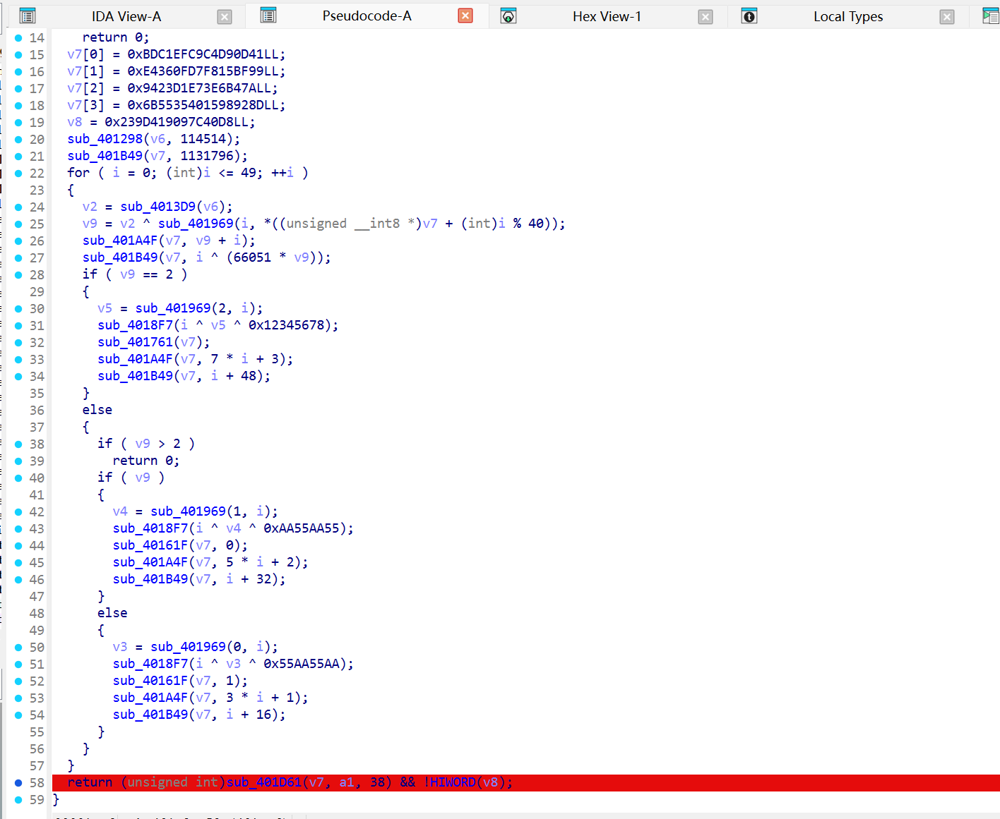
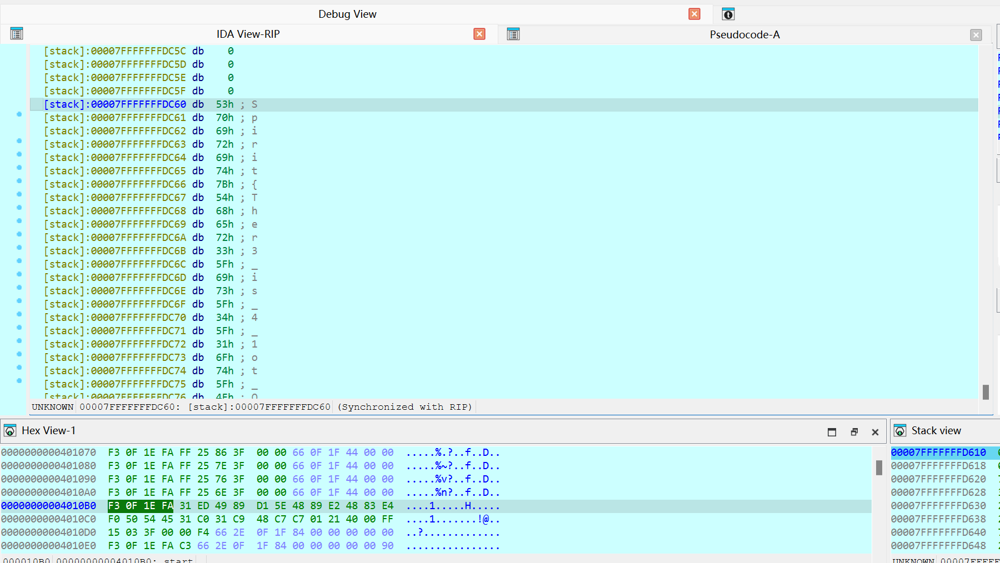

# xxxtea

## 题目简述

题目表面是复杂的 XXXTEA/混合加密校验，静态分析能看到多组常量、循环和条件分支。关键点在于程序最终会先解出明文 flag，再与用户输入比较；输入只需要满足长度检查即可走到比较点。因此本题更适合在最终比较前动态调试读取明文，而不是完整重写所有加密流程。

## 解题过程

静态分析时能看到一长段混合变换，包含多组常量、循环调用和条件分支，看起来像是在对输入进行复杂加密。但继续追到最终比较处可以发现，程序实际上会先解出明文 flag，再和用户输入比较。

调试时先满足长度检查，输入长度为 38，然后在最终比较前下断点。断下后观察局部变量/栈内存，`v7` 指向的内容就是待比较的明文 flag：

```text
v7 -> "Spirit{...}"
```

因此不需要完整还原前面的 XXXTEA 变换，只要动态执行到比较点读取 `v7` 即可。

下面两张图分别对应静态反编译视图和最终比较处的调试现场。正文已经保留了原始要点：先满足长度 `38`，再在最终比较点观察 `v7`，其中内容就是待提交的明文 flag。




## 方法总结

- 核心技巧：在最终比较点动态读取已解出的明文。
- 识别信号：复杂加密前有明确长度检查，末尾存在直接明文比较或可疑局部变量。
- 复用要点：逆向题看到大段混合加密时，先确认最终比较的数据形态；如果程序会自行解出明文，动态读内存比重写算法更稳。
