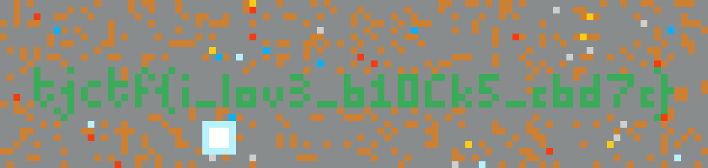

# TJCTF2022 block-game

## 题目简述

附件包含 Java 游戏 `chall.jar` 和无法直接加载的世界存档 `data.dat`。程序把三维方块世界序列化为自定义二进制格式，flag 被摆成第 0 层的一段绿色方块文字。目标是还原存档格式并渲染玩家附近的区域，而不是修复完整游戏客户端。

## 解题过程

从 Java 读写逻辑可还原文件头：依次为 `px:uint32`、`py:uint32`、`pz:uint8`、`w:uint32`、`h:uint32`，其中多字节整数均使用大端序。主体按 `(y, x, z)` 遍历，每个字节的低、高清半字节分别表示相邻两个高度层的方块编号：

```python
px = int.from_bytes(f.read(4), 'big')
py = int.from_bytes(f.read(4), 'big')
pz = f.read(1)[0]
w = int.from_bytes(f.read(4), 'big')
h = int.from_bytes(f.read(4), 'big')

for y in range(h):
    for x in range(w):
        for z in range(0, 8, 2):
            packed = next(data)
            game[z, y, x] = packed & 0xf
            game[z + 1, y, x] = packed >> 4
```

把 0 至 15 的编号映射回源码中的方块颜色，然后截取 `game[0, py-25:py, px-50:px+55]` 并用最近邻放大，即可读出文字 `tjctf{i_lov3_b10Ck5_cbd7c}`。



## 方法总结

本题适合从序列化端入手：字段宽度、字节序、循环顺序和位打包方式一旦确定，就无需逆完整的游戏渲染流程。玩家坐标还提供了天然的裁剪中心，可以避免绘制整个大地图。遇到自定义存档时，应先写一个最小解析器，并用尺寸、剩余字节数和颜色编号范围逐项验证格式假设。
