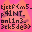

# TJCTF2022 sm-paint

## 题目简述

网页提供一个 $32\times 32$ 像素画板，每次绘制后由 WebAssembly 中的 `checkFlag` 检查整幅 RGBA 图像。目标图没有直接作为清晰位图交给客户端，而是拆成若干采样值与相邻行异或约束；需要从 WASM 线性内存提取常量并求解全部像素。

## 解题过程

先在浏览器控制台从 WASM 内存的固定区间导出 `data0` 至 `data4`。前三组 8 位数组和 `data3` 给出棋盘式采样点的 BGRA 值；对每个采样位置可直接写出：

```python
c0 = data0[i] ^ data1[i]
c1 = data0[i] ^ data2[i]
s.add(grid[idx]     == data3[i] - c0 - c1)  # B
s.add(grid[idx + 1] == c1)                  # G
s.add(grid[idx + 2] == c0)                  # R
s.add(grid[idx + 3] == 255)                 # A
```

`data4` 则约束同一列连续三行像素的逐通道异或。为 4096 个 8 位通道建立 Z3 变量，加入所有采样与三行异或方程，求得唯一模型后按 BGRA 转回 RGBA，即可还原目标图：



图中文字为 `tjctf{m5_p41Nt_onL1n3_3ck5de3}`。官方 `solve.js` 进一步把每个像素转换成 `_setColor` 与 `_draw` 调用，在页面中自动重画目标并触发成功提示。

## 方法总结

WebAssembly 只改变代码表示，并没有消除线性内存中的验证常量。面对图像校验，应把每个像素通道视为独立的有限位宽变量，将源码中的加减、异或和位置关系直接翻译成约束。恢复出的目标图既是答案，也是对方程索引、通道顺序和透明度处理是否正确的直观验收。
