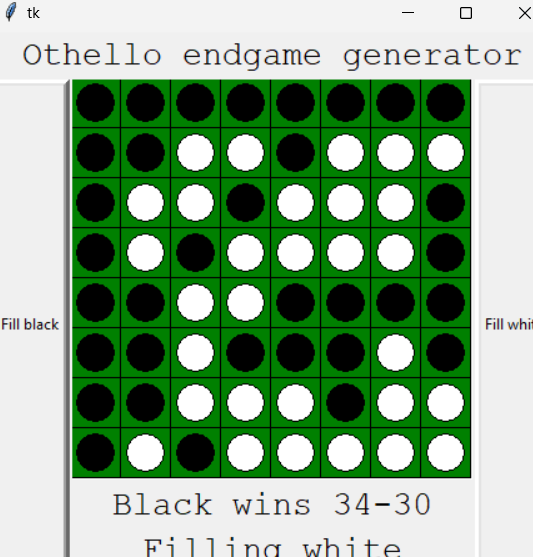

# cagnus-marlsen

## 题目简述

题目给出一个 8×8 奥赛罗终局编辑器。棋盘每格是 0/1，`verify()` 对行、列和两条对角线构造字节，并用 36 条算术、异或、计数和汉明距离约束检查棋局。满足全部约束后，程序按非顺序的行列字节拼出 flag。

## 解题过程

不用实际下棋，只需把 64 个格子视为取值 $\{0,1\}$ 的约束变量。将 `grid[i]` 声明为 Z3 整数并限制在 0、1，再逐条翻译 `verify()`；例如：

```python
from z3 import Int, Solver, Sum, Or

g = [Int(f"g{i}") for i in range(64)]
s = Solver()
for bit in g:
    s.add(Or(bit == 0, bit == 1))

s.add(g[1] + g[10] + g[62] == 2)
s.add(g[15] > g[23])
s.add(g[9] + g[10] + g[14] == 2)
s.add(g[26] * 8 == g[43] + g[44])
s.add(Sum(g[48:56]) == 5)
# 其余条件按 verify() 原式继续加入；0/1 异或可写成两位不相等。
```

一个满足全部条件的模型按行写成：

```text
00000000
00110111
01101110
01011110
00110000
00100010
00111011
01011111
```

对应棋盘如下，白子为 1、黑子为 0：



程序计算每行 `b0..b7`、每列 `b8..b15`、主对角线 `b16`，最后按

```python
bytes([b2, b9, b15, b16, b7, b4, b10, b12])
```

取值，依次得到 `n1C3_0n3`，所以：

```text
tjctf{n1C3_0n3}
```

## 方法总结

- GUI 只是输入方式，真正的验证逻辑是有限域上的 64 个布尔变量约束，适合直接交给 SMT。
- 行列转字节时，`int(bit_string, 2)` 把左上方向的格子当最高位；位序写反会得到不可读结果。
- 得到任意满足模型即可，不必证明棋局是合法奥赛罗对局，因为程序只检查 `verify()` 中列出的条件。
