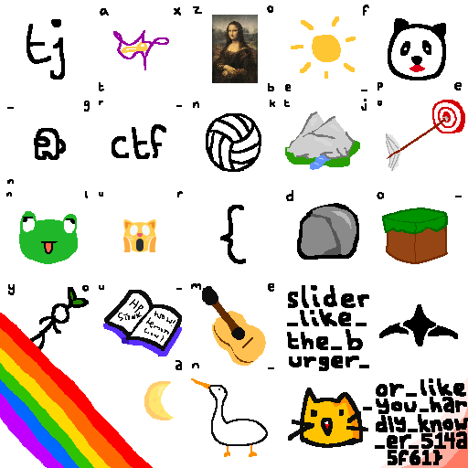

# slider

## 题目简述

题目提供 SDL 滑块拼图程序和 `save.dat`。程序启动时会打乱已经复原的拼图，手工移动并非必要；逆向存档格式可直接按每块记录的 `correctR, correctC` 恢复位置。右下角“空块”也不是真空白，其原始像素被与其余所有块逐字节异或后保存，必须再做一次 XOR 才能得到完整图像。

## 解题过程

存档前 16 字节是四个本机小端 `uint32`：块宽、块高、拼图宽、拼图高。之后每条记录包含：

```text
current_row, current_col, correct_row, correct_col,
block_width * block_height * 3 字节 RGB 数据
```

按 `correct_row, correct_col` 排列全部块。生成器令最后块依次与其他块异或，所以相同操作再做一次即可恢复它，因为 $x\oplus y\oplus y=x$。

```python
from struct import unpack, iter_unpack
from PIL import Image

data = open("save.dat", "rb").read()
bw, bh = unpack("II", data[:8])
pw, ph = unpack("II", data[8:16])
fmt = "IIII" + "B" * (bw * bh * 3)

tiles = [[None for _ in range(pw)] for _ in range(ph)]
for record in iter_unpack(fmt, data[16:]):
    _, _, correct_r, correct_c = record[:4]
    tiles[correct_r][correct_c] = bytearray(record[4:])

hidden = tiles[-1][-1]
for row in tiles:
    for tile in row:
        if tile is hidden:
            continue
        for i, value in enumerate(tile):
            hidden[i] ^= value

result = Image.new("RGB", (bw * pw, bh * ph))
for r in range(ph):
    for c in range(pw):
        tile = Image.frombytes("RGB", (bw, bh), bytes(tiles[r][c]))
        result.paste(tile, (c * bw, r * bh))
result.save("reconstructed.png")
```

恢复出的整图包含多组图形字谜和文字：



读出图中短语并按 flag 格式连接为：

```text
tjctf{do_you_mean_slider_like_the_burger_or_like_you_hardly_know_er_514a5f61}
```

## 方法总结

- 拼图存档已保存每块的目标坐标，逆向文件格式比求解滑块移动序列更直接。
- 右下角块是 XOR 聚合值，不是缺失数据；把其他块再异或一遍即可恢复原像素。
- 这题的图片是最终答案载体，具有不可替代的视觉字谜信息，因此保留语义命名的恢复图，并在正文完整转写结果。
