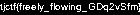

# stream-complimentary

## 题目简述

题目是 Rust 编译的 WebAssembly 版 Flow Free，共十关。前九关完成后，最后的 140×15 棋盘用白色端点直接排出 flag。关卡数据通过 `include_bytes!` 编入 `wasm_flow_free_bg.wasm`；第九关是 3×3 过渡关，可以直接补丁成易解棋盘，再正常完成关卡推进。

## 解题过程

棋盘序列化格式为：前 4 字节宽、后 4 字节高，均为大端；之后每格 4 字节，包含 flow 类型、颜色和连接方向。官方脚本从源码 `levels.txt` 取得原 3×3 棋盘，并用 `generator.html` 生成一个可立即连通的新 3×3 棋盘。

优化后的 WASM 没有连续保存整段棋盘：长零区被合并，非零的开头与结尾各在模块中唯一出现。因此保持 3 个前导零和中间 14 个零不变，只替换两段唯一的非零切片：

```python
import base64

old_board = base64.b64decode(
    "AAAAAwAAAAMAB9VAAAVXwAAAjsAAAAAAAAAAAAAAAAAAAI7AAAVXwAAH1UA="
)
new_board = base64.b64decode(
    "AAAAAwAAAAMAADfAAAR3wAAHycAAAAAAAAAAAAAAAAAAADfAAAR3wAAHycA="
)

wasm = bytearray(open("site/pkg/wasm_flow_free_bg.wasm", "rb").read())
for old, new in ((old_board[3:20], new_board[3:20]),
                 (old_board[34:], new_board[34:])):
    assert wasm.count(old) == 1
    offset = wasm.index(old)
    wasm[offset:offset + len(old)] = new
open("site/pkg/wasm_flow_free_bg.wasm", "wb").write(wasm)
```

重新启动本地站点，依次完成前八关和补丁后的 3×3 关。关卡状态在最高位保存奇偶校验，正常触发 `game_won()` 才会递增到第十关；直接调用自由编辑接口会把 `current_pzl` 清空，无法可靠跳关。

最后一关加载 140×15 位图，放大浏览器窗口即可读出由白点组成的文字：



```text
tjctf{freely_flowing_GDq2vSfm}
```

## 方法总结

- WebAssembly 逆向可从源码中的 `include_bytes!` 和序列化格式反推数据，而不必完整还原所有 Rust 控制流。
- 补丁必须保持字节长度和零区布局不变，并断言目标切片只出现一次，避免误改其他常量。
- 最终 flag 是关卡本身的视觉布局；WP 保留小尺寸原始位图并转写文字，图标和精灵表只服务 UI，不具备解题证据价值。
