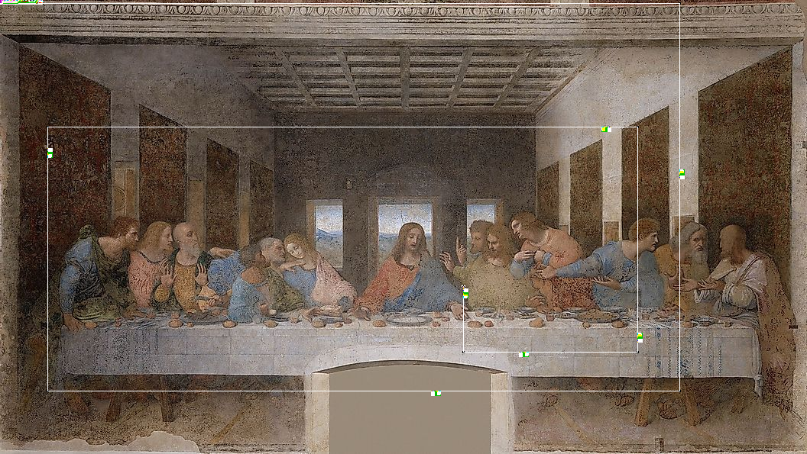

# Pierated Art

## 题目简述

服务连续生成 10 张 PNG，每张都以名画为背景，但叠加了一条细白色路径、黑色转角和若干彩色小块。整张图同时是 Piet 程序：执行从左上角开始，读入一个随机单词，沿顺时针螺旋逐字符校验。每轮只有 15 秒，必须自动从图片恢复单词并提交；十轮全对后才会给出 flag。



图中名画内容只是伪装。真正承载程序状态的是精确 RGB 颜色和空间布局：路径起点固定为 $(56,4)$，黑色像素表示转向障碍，粉色 `RGB(255,192,192)` 表示终点，黄色 `RGB(255,255,0)` 小块的面积编码待校验字符。

## 解题过程

### 跟随顺时针路径

从 $(56,4)$ 向右开始，每次检查前方一个像素：若前方为黑色，就按“右、下、左、上”顺时针转 90 度；若当前位置同时是粉色终点且前方为黑色，则结束。这样不需要实现完整 Piet 解释器，也不必分析背景名画，只需恢复生成器固定的路径协议。

每次进入黄色校验块时，官方 solver 以当前位置为锚点，在移动方向对应的 $6\times6$ 区域中统计黄色像素数 `count`。模板本身已有两个黄色像素，生成器再填入 `offset - 2` 个，所以最终计数正好等于该字符的 `offset`。

生成器按单词的逆序构造块，并令：

$$
\text{offset}=26-(\operatorname{ord}(c)\bmod26).
$$

对小写 ASCII，官方恢复式可写为：

```python
code = 130 - count
if code > ord("z"):
    code -= 26
character = chr(code)
```

沿路径读出的字符仍是逆序，遍历结束后需要整体反转。

### 自动解码每张 PNG

核心图像解码逻辑如下，数组坐标按 `image[y, x]` 使用：

```python
import io
import numpy as np
from PIL import Image

BLACK = np.array((0, 0, 0))
YELLOW = np.array((255, 255, 0))
END = np.array((255, 192, 192))

def same(pixel, color):
    return np.array_equal(pixel, color)

def solve_image(png_data):
    image = np.array(Image.open(io.BytesIO(png_data)).convert("RGB"))
    black = np.all(image == BLACK, axis=2)

    x, y = 56, 4
    dx, dy = 1, 0
    encoded = []

    while True:
        at_end = same(image[y, x], END)

        # 连续两个黄色路径像素标记一个校验块的计数位置。
        if (same(image[y, x], YELLOW)
                and same(image[y - dy, x - dx], YELLOW)):
            count = 0
            for i in range(6):
                for j in range(6):
                    yy = y - i if dy == 1 else y + i
                    xx = x - j if dx == 1 else x + j
                    count += same(image[yy, xx], YELLOW)

            code = 130 - count
            if code > ord("z"):
                code -= 26
            encoded.append(chr(code))

        elif black[y + dy, x + dx]:
            if at_end:
                break
            dx, dy = -dy, dx

        x += dx
        y += dy

    return "".join(encoded)[::-1]
```

网络部分只需逐轮读取 Base64 行、解码为 PNG、调用 `solve_image` 并立即回送答案：

```python
import base64

for _ in range(10):
    io.recvuntil(b"Torrented Picture Data (Base64):\n")
    png_data = base64.b64decode(io.recvline().strip())
    answer = solve_image(png_data)
    io.sendlineafter(b"(15s):", answer.encode())
    assert io.recvline().strip() == b"Correct!"
```

完成十轮后得到：

```text
uiuctf{m0ndr14n_b3st_pr0gr4mm3r_ngl}
```

## 方法总结

- 核心技巧：忽略作为载体的名画内容，按固定起点、黑色转角和终点标记跟踪 Piet 路径，再用黄色块面积反解字符偏移。
- 识别信号：自然图像上出现精确纯色像素、单像素路径、规律转角和重复小块；题目又提示 Piet，说明颜色与连通区域大小具有程序语义。
- 复用要点：图像解码必须使用原始 RGB，不能缩放、JPEG 重编码或做近似颜色匹配。还要明确数组的 $(y,x)$ 与几何坐标 $(x,y)$ 区别，并用已知样本验证转向方向、计数窗口和最终是否需要反转。
