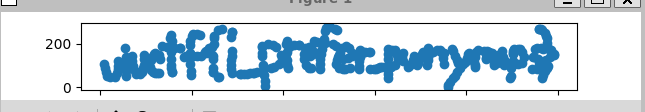

# UIUCTF 2024 Pwnymaps

## 题目简述

程序要求先输入“坐标复杂度”，再输入若干组 32 位 `x` 与不超过 28 位的 `y`。每组坐标会经过多轮 Morton 编码，也就是把多个整数的各位交错放进一个更大的整数，随后与二进制内置的 `correct[]` 和 `correct_checksums[]` 比较。通过全部校验后，题面要求按顺序绘制恢复出的二维坐标，图形才是 flag。

发布二进制没有剥离符号，核心障碍是还原位交错、字节换位和截断操作，因此按 Reverse 归档。`correct[]` 与校验数组各有 335 项，所以需要恢复 335 组坐标。

## 解题过程

把主函数的数据流整理后，每组输入的前半段变换为：

```c
zeta = x >> 8;
phi  = ((x & 0xff) << 4) | (y >> 28);
beta = (y >> 16) & 0xfff;
rho  = (y >> 10) & 0x3f;
kappa = (y >> 4) & 0x3f;

a = EncodeMorton_12bit(rho, kappa);
b = EncodeMorton_24bit(a, beta);
c = EncodeMorton_48bit(zeta, beta);
d = (c << 12) | phi;
```

这里 `a`、`b` 计算完后再也没有参与校验，因此 `y` 的低 16 位实际上完全无效；恢复时直接设为 `0` 就能通过，无须真正执行 $2^{16}$ 次枚举。`y <= 0x0fffffff` 又保证 `y >> 28 == 0`，所以 `phi` 的低 4 位也应为零。

程序接着从 `d` 中解交错得到八个字节 `counts[0..7]`，交换下标 `1` 和 `5`，然后计算一次 popcount 校验。后面看似还有跨坐标混合：

```c
counts[iter][j] ^=
    (numberOfSetBits(counts[iter - 1][j]) << 8) & 0xff;
```

但 popcount 结果先左移 8 位，再与 `0xff` 相与，结果恒为零，所以这一步也是空操作。最终值由每个 `counts` 字节的低 7 位、七个高位组成的 `upper_bits`，以及 `counts[0]` 的最高位重新进行九路 Morton 编码。

Morton 变换本质上只是位位置置换。下面的通用函数可以读取某一路，也可以把多路重新交错：

```python
def deinterleave(value, lane, stride, bits):
    out = 0
    for bit in range(bits):
        out |= ((value >> (stride * bit + lane)) & 1) << bit
    return out


def interleave(values, bits):
    out = 0
    stride = len(values)
    for lane, value in enumerate(values):
        for bit in range(bits):
            out |= ((value >> bit) & 1) << (stride * bit + lane)
    return out
```

对 `correct[i]` 逐项逆变换。先拆出九路 7 位值，再按程序的打包方式补回八个字节的最高位：

```python
final = correct[i]
lanes = [deinterleave(final, lane, 9, 7) for lane in range(9)]

counts = lanes[:8]
counts[0] |= ((final >> 63) & 1) << 7
upper_bits = lanes[8]
for lane in range(1, 8):
    counts[lane] |= ((upper_bits >> (7 - lane)) & 1) << 7
```

此时的 `counts` 是交换下标 `1`、`5` 之后的状态，可先重算 `correct_checksums[i]` 验证逆向没有错，再撤销交换并重建 `d`：

```python
counts[1], counts[5] = counts[5], counts[1]
d = interleave(counts, 8)

phi = d & 0xfff
c = d >> 12
zeta = deinterleave(c, 0, 2, 24)
beta = deinterleave(c, 1, 2, 24)

assert phi & 0xf == 0
assert beta < (1 << 12)

x = (zeta << 8) | (phi >> 4)
y = beta << 16
```

将 `iters` 设为 `335`，依次提交这些 `(x, y)`。本地对发布二进制验证时，即使统一把所有 `y` 的低 16 位设为零，程序仍返回：

```text
You have reached your destination. PWNYMAPS does not support route plotting yet.
```

生成数据时，原始绘图坐标又被放大并左移：横坐标主要位于 `x >> 17`，纵坐标位于 `y >> 16`。按原顺序连线即可读出三段小写单词：



因此 flag 为：

```text
uiuctf{i_prefer_pwnymaps}
```

## 方法总结

本题的复杂感主要来自大量掩码和多个 Morton 函数，但这些操作并没有丢失已参与编码的位，只是在固定位置之间搬运。先把每个函数改写为“第几路、第几位落到哪里”，就可以用通用的交错与解交错函数逐层反演。

同时要以实际数据流判断哪些代码有效：`a`、`b` 是死值，`y` 的低 16 位没有进入最终结果，跨轮 popcount 又因移位后掩码而恒为零。识别这些实现缺陷后，问题从高维爆破缩减为 335 次确定性的位排列逆运算。
