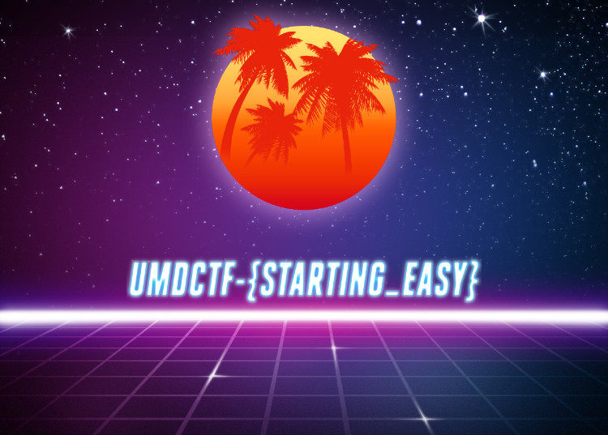

# UMDCTF 2019 - RevWarmup

## 题目简述

附件是一个使用 SDL 的 64 位 Linux 程序。它把约 1.2 MiB 的加密数据复制到栈上，逐字节变换后交给 `SDL_LoadBMP_RW`，因此目标是还原内嵌 BMP，而不是猜测输入。

## 解题过程

主函数从文件偏移对应的 `.rodata` 地址 `0x14e0` 复制 `0x127476` 字节。循环中当前字节与下标 `i` 多次做减法、异或、取反和取负，最后循环左移 3 位。按 8 位无符号语义复写即可：

```python
from pathlib import Path

binary = Path("challenge").read_bytes()
blob = bytearray(binary[0x14e0:0x14e0 + 0x127476])

for index, encrypted in enumerate(blob):
    value = encrypted
    value = (value - index) & 0xff
    value ^= index & 0xff
    value = (value - 3) & 0xff
    value = (-value) & 0xff
    value = (value - index) & 0xff
    value = (-value) & 0xff
    value ^= index & 0xff
    value = (value - 1) & 0xff
    value ^= index & 0xff
    value = (~value) & 0xff
    value = (-value) & 0xff
    value = (~value) & 0xff
    value ^= index & 0xff
    value = (value - 0x56) & 0xff
    blob[index] = ((value << 3) | (value >> 5)) & 0xff

Path("decoded.bmp").write_bytes(blob)
```

输出以 `BM` 开头，可正常解析。为便于网页显示，将 BMP 无损转换为 PNG 后保留关键视觉结果：



图中 flag 为：

```text
UMDCTF-{STARTING_EASY}
```

其 SHA-256 与官方摘要一致。

## 方法总结

还原这类循环时必须模拟固定宽度整数的截断，尤其是减法、取负和移位之后的 `& 0xff`。导入函数 `SDL_LoadBMP_RW` 同时给出了输出格式线索，恢复后的 `BM` 文件头、可视图像和摘要共同证明算法无误。
