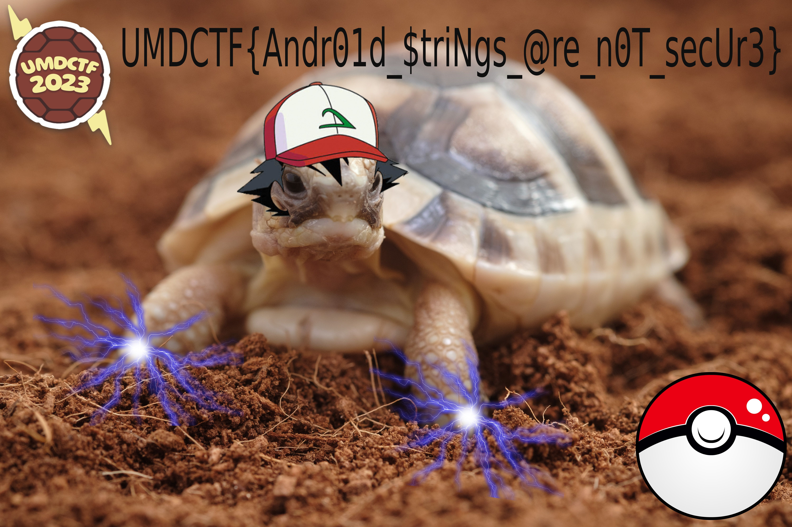

# Who's That Pokémon?

## 题目简述

题目给出一个猜宝可梦名称的 Android APK。输入正确名称后，程序会解密内置资源并显示图片。这里没有可攻击的密码算法：AES 的密钥、IV 布局和解密流程都随 APK 一起交付，核心是从 Android 资源与 Smali 中还原这些参数。

程序引用的关键资源为：

```text
R.string.pokemon = Terrapulseonic
R.raw.encrypted  = 加密图片
```

## 解题过程

### 找到正确答案和 AES 参数

`MainActivity.guess()` 先读取 `R.string.pokemon`，再与输入框内容做严格字符串比较。可用下面的命令直接让 Android 资源工具显示值：

```bash
aapt dump --values resources whos_that_pokemon.apk
```

资源 `0x7f100096` 对应：

```text
com.example.whosthatpokemon:string/pokemon
(string8) "Terrapulseonic"
```

继续阅读 `Decrypt.smali`，可还原出完整文件格式：

1. `encrypted` 的前 16 字节是 CBC 的 IV；
2. 从偏移 16 开始是 AES 密文；
3. 密钥是 `R.string.pokemon` 后面追加两个空格并按 UTF-8 编码；
4. 算法为 `AES/CBC/PKCS5Padding`。

`Terrapulseonic` 有 14 个 ASCII 字符，加两个空格正好得到 16 字节 AES-128 密钥：

```text
Terrapulseonic··
```

上面的 `·` 只用于显示空格，实际密钥字节仍是普通 `0x20`。

### 离线解密内置图片

下面的脚本与应用逻辑等价：

```python
from pathlib import Path

from Crypto.Cipher import AES
from Crypto.Util.Padding import unpad

data = Path("encrypted").read_bytes()
iv = data[:16]
ciphertext = data[16:]
key = b"Terrapulseonic  "

plain = AES.new(key, AES.MODE_CBC, iv).decrypt(ciphertext)
Path("decrypted-flag-image.jpg").write_bytes(
    unpad(plain, AES.block_size)
)
```

输出以 JPEG 的 `ff d8 ff e0` 文件头开头。解密图片保留了题目的视觉结果：



图中给出：

```text
UMDCTF{Andr01d_$triNgs_@re_n0T_secUr3}
```

## 方法总结

- 核心技巧：沿 `R.string` 和 `R.raw` 的资源 ID 追踪真实值，再严格复现 Smali 中的字节切片和 AES 参数。
- 易错点：密钥末尾有两个空格；遗漏空格会导致密钥长度错误或 PKCS#7 去填充失败。
- 安全结论：Android 资源表、DEX/Smali 和随包分发的密钥都可被离线提取；客户端内置字符串不能承担秘密存储职责。
