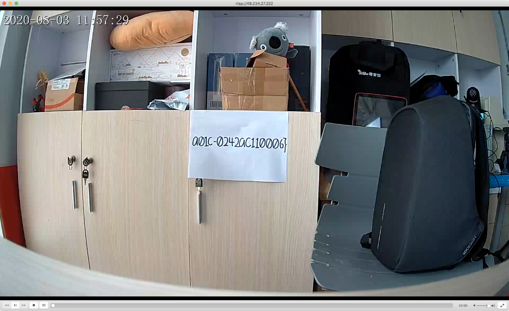

# IPcam

## 题目简述

本题给出摄像头固件，常规 `binwalk -e` 无法直接解包。关键观察是固件第三块文件以大端序存储，需要先单独提取并转成小端序，才能得到摄像头核心程序 `p2pcam`。后续对 `p2pcam` 逆向可发现多个可利用点，包括栈溢出、文件读取和命令注入；官方 WP 选择命令注入作为预期解，并通过 554 端口补齐另一段 flag。

## 解题过程

题目给了摄像头固件，通过 `binwalk -e` 会发现无法解包。这里仔细看会发现第三块文件存储为大端序，因此普通自动解包会把关键块识别失败。

`binwalk` 的关键输出是第三块被识别为大端序 ARM Linux kernel：

```text
Linux kernel ARM boot executable zImage (big-endian)
```

可以通过 `dd` 命令将第三块提取出来，再使用 `objcopy` 工具将其转换为小端序。转换后的文件才能被正常分析，进而提取出摄像头关键程序 `p2pcam`。

核心操作如下：

```bash
dd if=<firmware> of=<third-block> bs=1 skip=<third-block-offset>
objcopy -I binary -O binary --reverse-bytes=4 <third-block> <third-block-swapped>
binwalk -e <third-block-swapped>
```

到这里我们便能得到摄像头关键程序 `p2pcam`，丢进 IDA 进行逆向。这里漏洞较多，可以用来拿flag的一共有三个，分别是栈溢出、文件读取和命令注入。这里栈溢出打的话会比较麻烦，不少师傅便是卡在了这里。命令注入则会相对较为简单，同时这也是咱们的预期解。另外由于该漏洞属于某摄像头 0day，厂商暂未修复，官方材料没有公开具体请求字段和 payload 细节；长期保存时只能记录“固件解包、逆向 `p2pcam`、选择命令注入拿第一段 flag”这条可确认主线。

命令注入验证时可读取 `/home/flag*`，回显中能看到第一段 flag，开头为 `WMCTF{79193cbc-d16b-17ba-...`。

这里只能看到一半的flag，接下来便是第二个flag。这个flag比较简单，通过扫描可以发现摄像头开了 554 端口。554 通常对应 RTSP 服务，因此第二段 flag 的入口不在前面的命令注入点，而在该服务暴露的信息或交互结果中。

扫描结果中关键端口为：

```text
554/tcp open rtsp
```



## 方法总结

固件题不要只依赖 `binwalk -e`，自动解包失败时应先检查分区块的字节序、偏移和文件头。遇到大端序块时，先 `dd` 提取再用 `objcopy` 转端序，随后逆向关键服务程序。IoT 题的 flag 也可能分布在多个服务面：本题第一段来自 `p2pcam` 中的漏洞利用，第二段则需要注意扫描到的 554/RTSP 服务。
