# ezAndroid

## 题目简述

本题使用 https://github.com/amimo/goron 做了控制流平坦化混淆，并做了字符串加密。

`goron` 外链的关键信息是：它是面向 Android native/LLVM IR 的混淆工具，常见能力包括控制流平坦化、字符串加密和反调试相关变换。控制流平坦化会把原本清晰的基本块跳转改写成由状态变量和 dispatcher 驱动的结构，导致伪代码中大量分支看起来不自然；因此本题需要结合动态 hook 来确认真实输入、输出和密钥，而不能只靠静态伪代码。

## 解题过程

先看 Java 层：

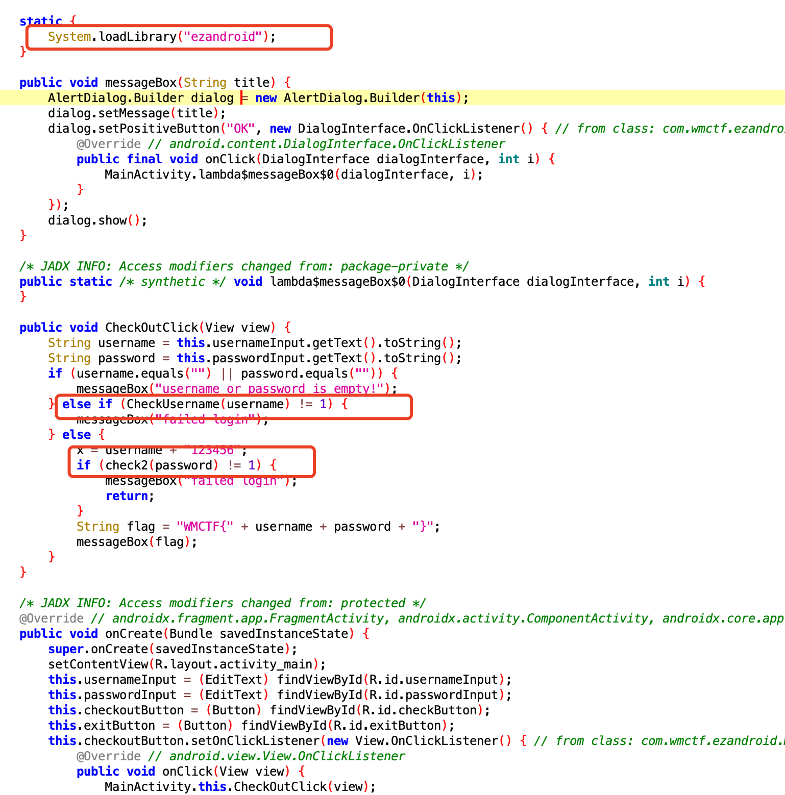

几乎没什么重点，只有两个校验点：用户名与密码。继续看 SO 层：

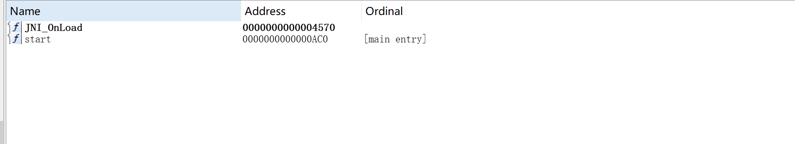

导出表里没有直接可见的函数，看起来是动态注册，可尝试 hook `RegisterNatives`：

``` js
function hook_RegisterNatives(){
    var symbols = Process.getModuleByName('libart.so').enumerateSymbols();
    var RegisterNatives_addr =null;
    for (let i = 0; i < symbols.length; i++) {
        var symbol = symbols[i];
        if (symbol.name.indexOf("RegisterNatives") != -1 && symbol.name.indexOf("CheckJNI") == -1){
            RegisterNatives_addr = symbol.address;
        }
    }
    console.log("RegisterNatives_addr: ", RegisterNatives_addr);
    Interceptor.attach(RegisterNatives_addr,{
        onEnter:function (args) {
            var env = Java.vm.tryGetEnv();
            var className =env.getClassName(args[1]);
            var methodCount = args[3].toInt32();
            for (let i = 0; i < methodCount; i++) {
                var methodName = args[2].add(Process.pointerSize*3*i).add(Process.pointerSize*0).readPointer().readCString();
                var signature = args[2].add(Process.pointerSize*3*i).add(Process.pointerSize*1).readPointer().readCString();
                var fnPtr = 
args[2].add(Process.pointerSize * 3 * i).add(Process.pointerSize * 2).readPointer();
                var module = Process.findModuleByAddress(fnPtr);
                console.log(className, methodName, signature, fnPtr, module.name, fnPtr.sub(module.base));
            }

        },onLeave:function (retval) {
        }
    })
}

hook_RegisterNatives();
```

拿到 `RegisterNatives` 后发现偏移 `0x35f0`、`0x3f58`，但直接执行会崩，怀疑被 Frida 检测到，需要后续处理。

### 0x35f0

先分析 `0x35f0`，对应 `checkUsername`，这里一开始有些绕。

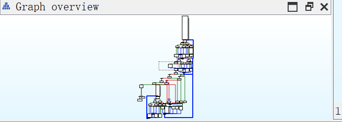

向下找到了 `memcmp`，推测是加密字符串比对。通过交叉引用，发现 `v30` 对应 `v21`，最后会进入 `sub_6C78`。

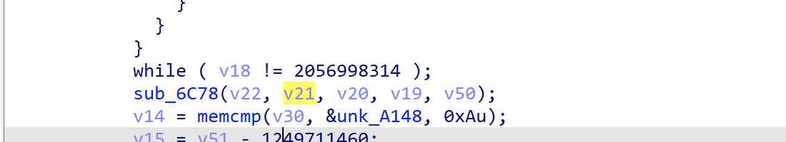

进入 `sub_6C78` 分析，带有 RC4 特征。

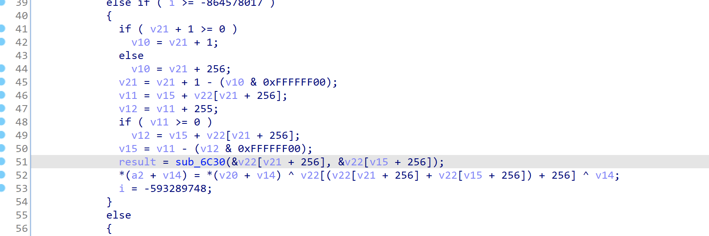

尝试 hook `sub_6C78` 获取部分数据测试，但存在 Frida 检测，需要绕过。

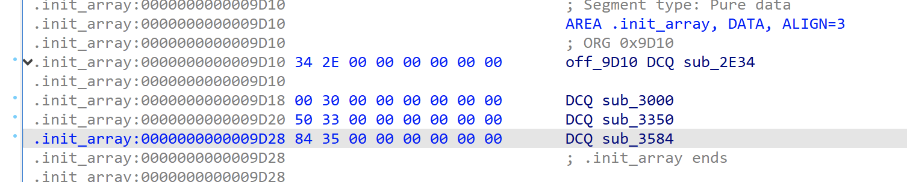

检测函数位于 `init_array` 段，`sub_3584` 是检测入口。

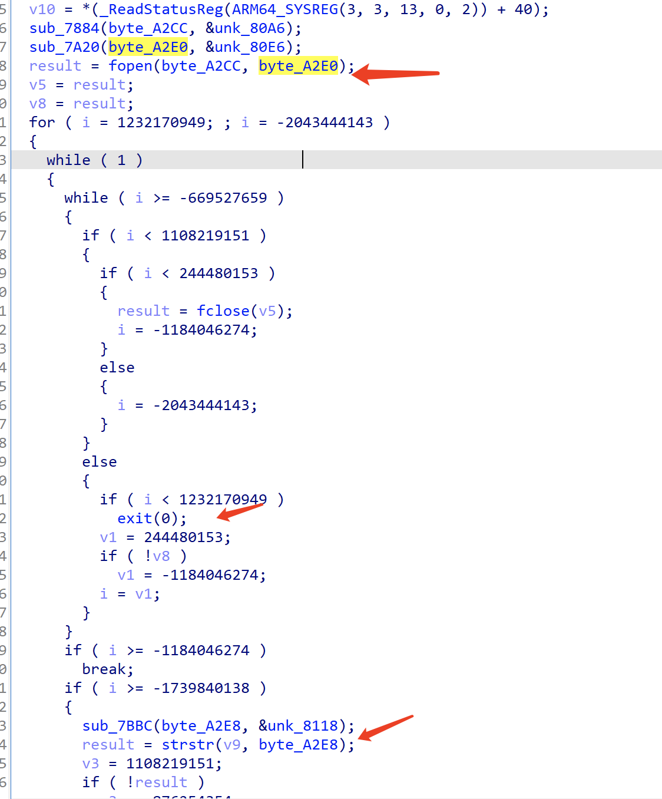

这段字符串是加密后的，先手工解一下密。

``` python
a=[  0x16, 0xFA, 0x38, 0x83, 0xCB, 0x17, 0x21, 0xF7, 0x4A, 0x90, 
  0x50, 0x57, 0x99, 0x04, 0x04, 0x6F, 0xB0, 0xD3, 0x97, 0x02, 
  0x47, 0x74, 0x52, 0x73, 0xB6, 0x02, 0xC9, 0x55, 0xEE, 0x39, 
  0x8A, 0x4A, 0xEC, 0xA8, 0x38, 0x52, 0x92, 0x26, 0xF6, 0x7F, 
  0x3A, 0xF8, 0x74, 0x77, 0x6F, 0x24, 0xE3, 0xFB, 0x49, 0x03, 
  0x96, 0xC8, 0x29, 0xA5, 0xDC, 0xB7, 0x29, 0xFB, 0x4D, 0xE6, 
  0x08, 0x83, 0x3B, 0xE6]
s=""
for i in range(15):
      s+=chr(a[i+29]^a[i%0x1d])

print(s)

#/proc/self/maps
```

解出结果指向 `/proc/self/maps` 检测：

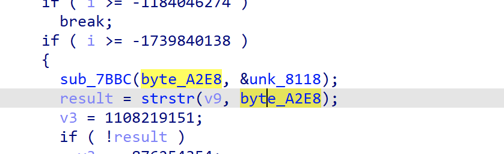

`7BBC` 也是解密函数，可尝试手工解密。

``` python
a=[    0x49, 0x94, 0x59, 0x21, 0x9F, 0x14, 0x16, 0xE2, 0x52, 0xB9,
  0x51, 0x49, 0x90, 0xAE, 0x96, 0xBC, 0x2F, 0xE6, 0x30, 0x45,
  0xFE, 0x14]
s=""
for i in range(5):
      s+=chr(a[i+16]^a[i%0x10])

print(s)
#frida
```

这说明有对 Frida 的检测。可尝试将该函数直接 `nop`，或使用 hluda 的 frida。

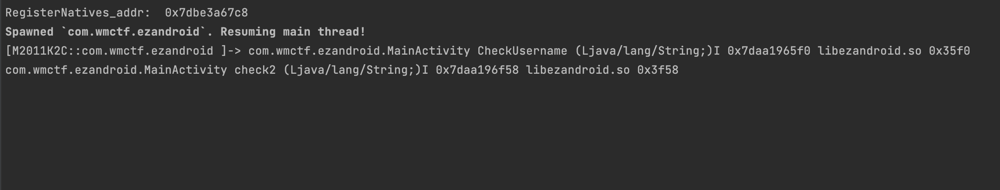

输入几个随机字符串后发现 hook 仍未生效。

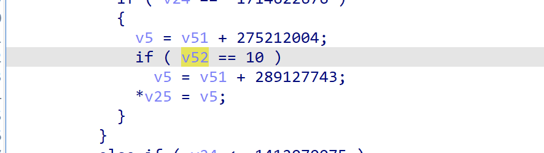

细看后发现还有长度检测；由 `memcmp` 长度可得用户名长度。

``` js
Java.perform(function (){
    var soAddr = Module.findBaseAddress("libezandroid.so");
    let rc4 = soAddr.add(0x6C78);
    Interceptor.attach(rc4,{
        onEnter(args) {
            this.arg0 = args[0];
            this.arg1 = args[1];
            this.arg2 = args[2];
            this.arg3 = args[3];
            this.arg4 = args[4];
            console.log("arg0:",hexdump(this.arg0,{length:parseInt((this.arg2))}));
            console.log("arg1:",hexdump(this.arg1,{length:parseInt((this.arg2))}));
            console.log("arg3:",hexdump(this.arg3,{length:parseInt((this.arg4))}));

        },
        onLeave(retval) {
            console.log("arg0:",hexdump(this.arg0,{length:parseInt((this.arg2))}));
            console.log("arg1:",hexdump(this.arg1,{length:parseInt((this.arg2))}));
            console.log("arg3:",hexdump(this.arg3,{length:parseInt((this.arg4))}));
        }
    })
})
```

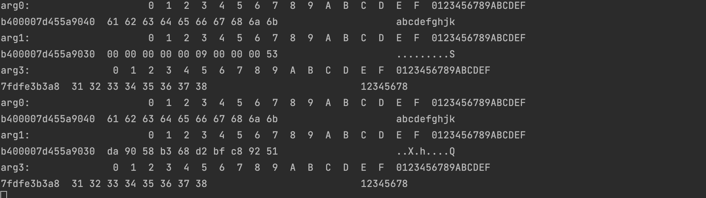

参数 1 是输入用户名，参数 2 是加密后缓冲，参数 3 为用户名长度，参数 4 为 key 长度，参数 5 为 key 长度。

`byte_A148` 是密文，在这里没有直接的线索，需要通过十字交叉继续定位其赋值点。

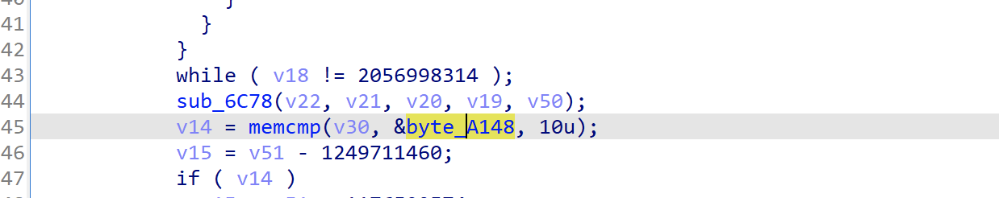

它同样在 `init_array` 段里。

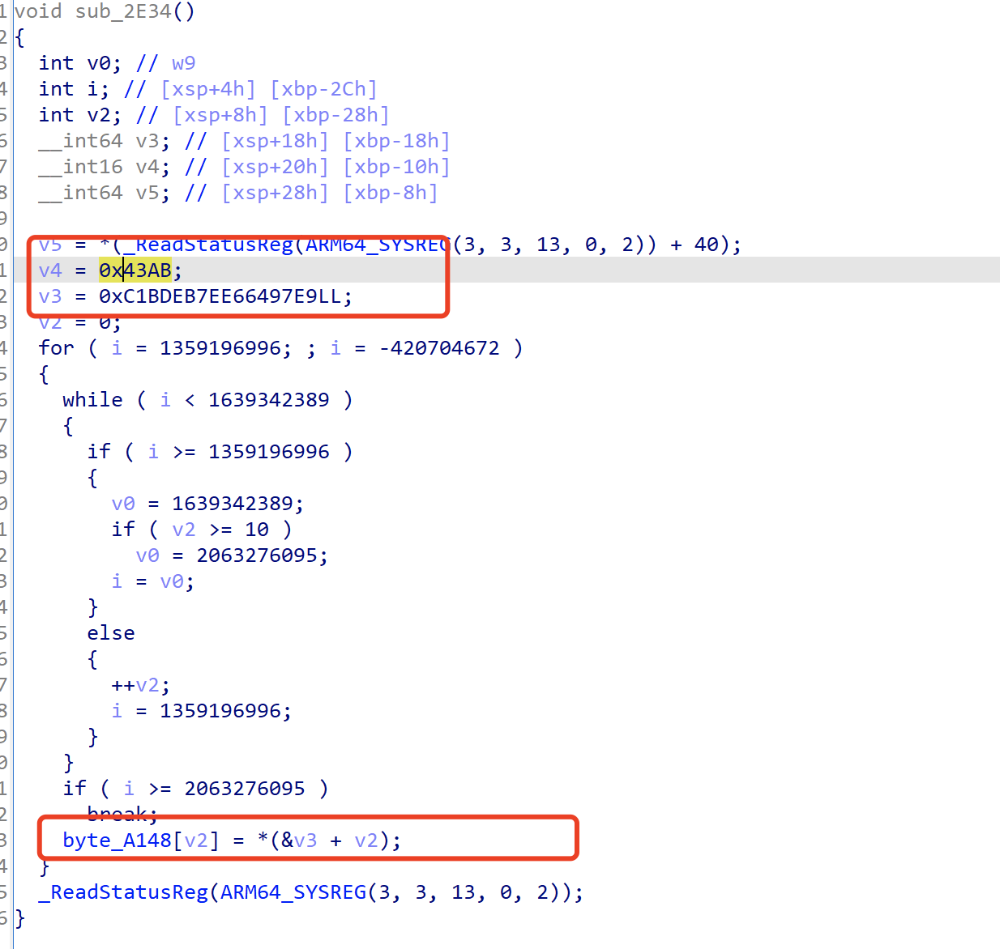

按这个思路解了下，发现还不对。

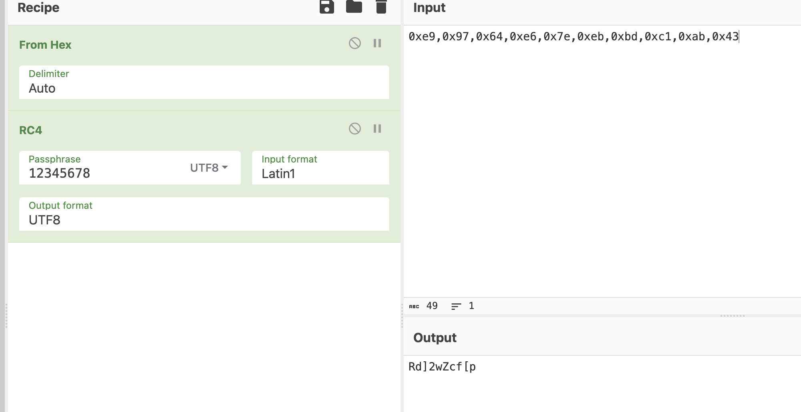

进一步分析 RC4 时，发现最终又经过一层 XOR，出现变动的异或下标。

```python
a=[0x52,0x64,0x5d,0x32,0x77,0x5a,0x63,0x66,0x5b,0x70]
for i in range(len(a)):
  print(chr(a[i]^i),end="")
#Re_1s_eaSy  
```

或者直接 patch 输入参数：

```js
Java.perform(function (){
    var soAddr = Module.findBaseAddress("libezandroid.so");
    let rc4 = soAddr.add(0x6C78);
    Interceptor.attach(rc4,{
        onEnter(args) {
            this.arg0 = args[0];
            this.arg1 = args[1];
            this.arg2 = args[2];
            this.arg3 = args[3];
            this.arg4 = args[4];

            console.log("arg0:",hexdump(this.arg0,{length:parseInt((this.arg2))}));
            this.arg0.writeByteArray([0xe9,0x97,0x64,0xe6,0x7e,0xeb,0xbd,0xc1,0xab,0x43])
            console.log("arg0:",hexdump(this.arg0,{length:parseInt((this.arg2))}));
            console.log("arg1:",hexdump(this.arg1,{length:parseInt((this.arg2))}));
            console.log("arg3:",hexdump(this.arg3,{length:parseInt((this.arg4))}));

        },onLeave(retval) {
            console.log("\r\nonleave")
            console.log("arg0:",hexdump(this.arg0,{length:parseInt((this.arg2))}));
            console.log("arg1:",hexdump(this.arg1,{length:parseInt((this.arg2))}));
            console.log("arg3:",hexdump(this.arg3,{length:parseInt((this.arg4))}));
        }
    })
})
```

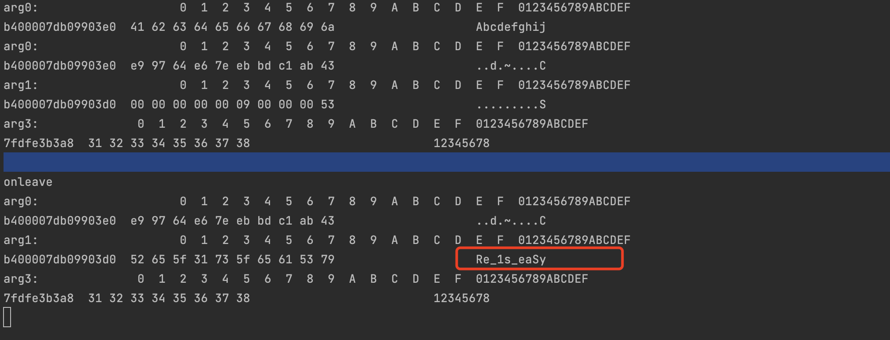

### 0x3f58

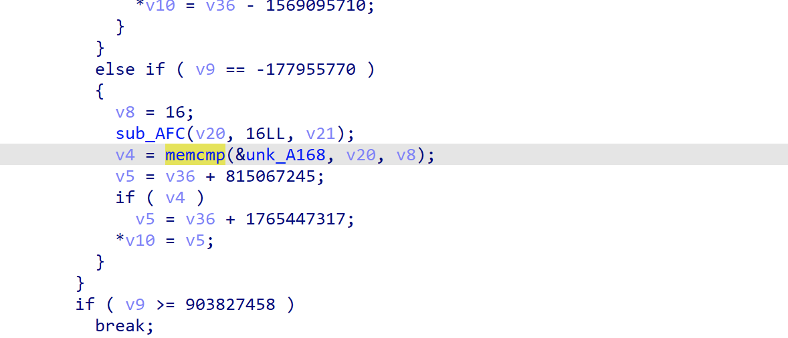

`v20` 来源于 `sub_AFC`，`v21` 来源于 `sub_3F0C`。

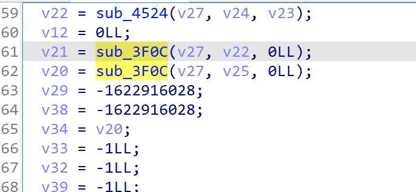

继续跟进去看是否是 Java 层拼接的字符串。

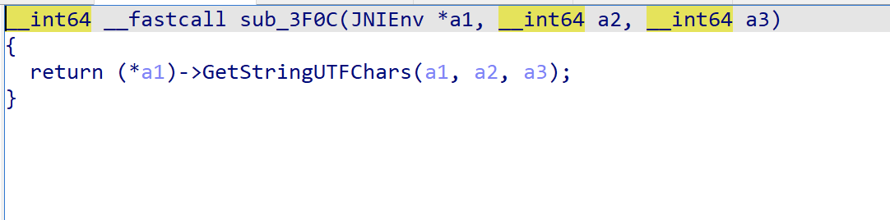

```js
function hook_libart() {
    var GetStringUTFChars_addr = null;

    // jni 系统函数都在 libart.so 中
    var module_libart = Process.findModuleByName("libart.so");
    var symbols = module_libart.enumerateSymbols();
    for (var i = 0; i < symbols.length; i++) {
        var name = symbols[i].name;
        if ((name.indexOf("JNI") >= 0)
            && (name.indexOf("CheckJNI") == -1)
            && (name.indexOf("art") >= 0)) {
            if (name.indexOf("GetStringUTFChars") >= 0) {
                console.log(name);
                // 获取到指定 jni 方法地址
                GetStringUTFChars_addr = symbols[i].address;
            }
        }
    }

    Java.perform(function(){
        Interceptor.attach(GetStringUTFChars_addr, {
            onEnter: function(args){
                console.log("native args[1] is :",Java.vm.getEnv().getStringUtfChars(args[1],null).readCString());
            }, onLeave: function(retval){
            }
        })
    })
}
```

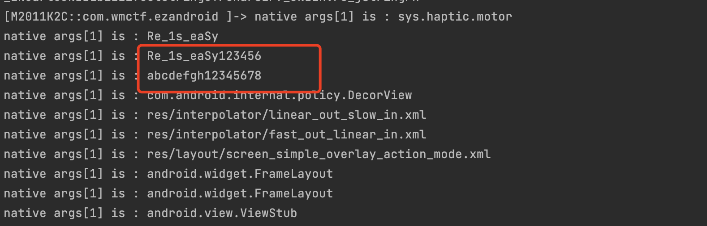

除了 Java 层传来的用户名和密码外，还出现了 `username+123456`，基本可判定为加密 key。

再去 hook `sub_AFC`。

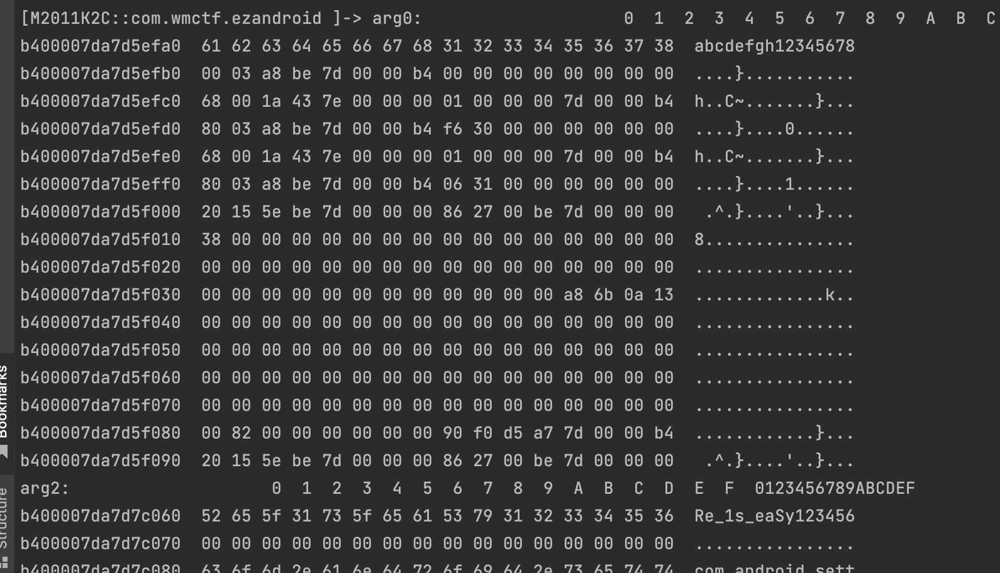

```js
Java.perform(function (){
    var soAddr = Module.findBaseAddress("libezandroid.so");
    let tmp = soAddr.add(0xAFC);
    Interceptor.attach(tmp,{
        onEnter(args) {
            this.arg0 = args[0];
            this.arg1 = args[1];
            this.arg2 = args[2];

            console.log("arg0:",hexdump(this.arg0));
            console.log("arg2:",hexdump(this.arg2));

        },
        onLeave(retval) {
            console.log("\r\nonleave")
            console.log("arg0:",hexdump(this.arg0));
            console.log("arg2:",hexdump(this.arg2));
        }
    })
})
```

可以确认 `v20`（参数 1）是输入的密码，`v21` 是 key，最终通过用户名拼接 `123456` 得到。

用 Findcrypt 导出 AES 表：

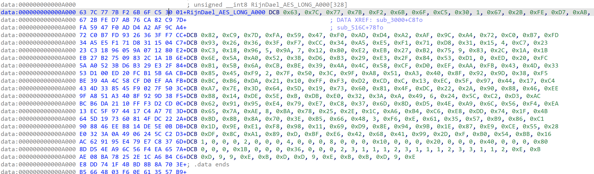

再做交叉比对可见 `S-box` 的交换操作也在 `initarray` 里实现，随后提取表并反向生成逆 S-box。

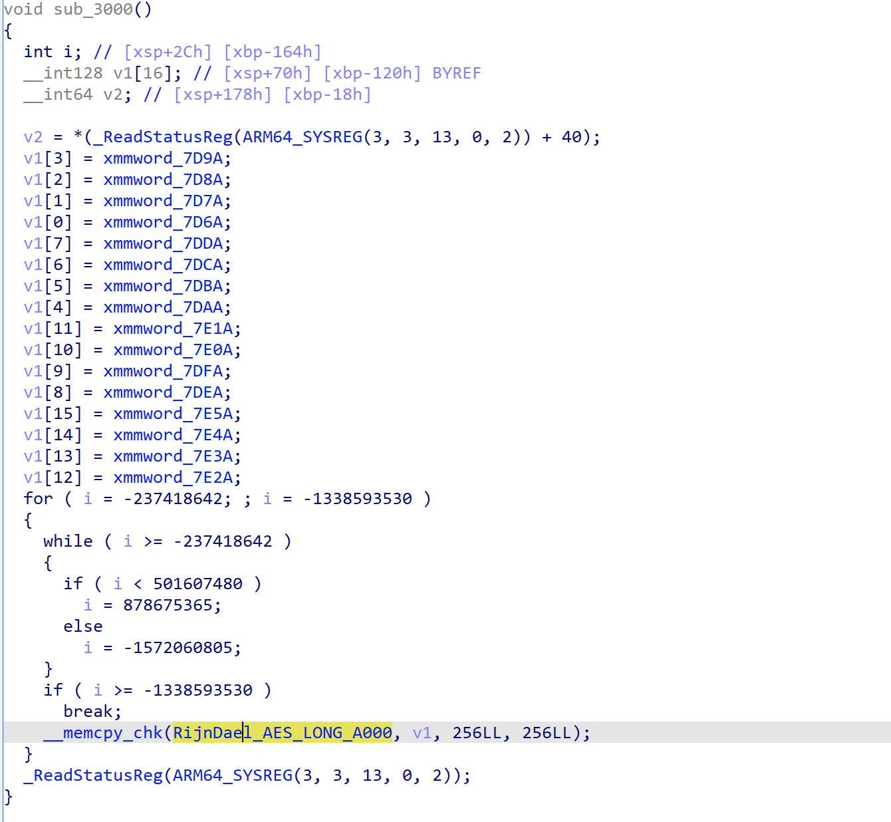

```python
new_s_box = [
    0x29, 0x40, 0x57, 0x6E, 0x85, 0x9C, 0xB3, 0xCA, 0xE1, 0xF8,
    0x0F, 0x26, 0x3D, 0x54, 0x6B, 0x82, 0x99, 0xB0, 0xC7, 0xDE,
    0xF5, 0x0C, 0x23, 0x3A, 0x51, 0x68, 0x7F, 0x96, 0xAD, 0xC4,
    0xDB, 0xF2, 0x09, 0x20, 0x37, 0x4E, 0x65, 0x7C, 0x93, 0xAA,
    0xC1, 0xD8, 0xEF, 0x06, 0x1D, 0x34, 0x4B, 0x62, 0x79, 0x90,
    0xA7, 0xBE, 0xD5, 0xEC, 0x03, 0x1A, 0x31, 0x48, 0x5F, 0x76,
    0x8D, 0xA4, 0xBB, 0xD2, 0xE9, 0x00, 0x17, 0x2E, 0x45, 0x5C,
    0x73, 0x8A, 0xA1, 0xB8, 0xCF, 0xE6, 0xFD, 0x14, 0x2B, 0x42,
    0x59, 0x70, 0x87, 0x9E, 0xB5, 0xCC, 0xE3, 0xFA, 0x11, 0x28,
    0x3F, 0x56, 0x6D, 0x84, 0x9B, 0xB2, 0xC9, 0xE0, 0xF7, 0x0E,
    0x25, 0x3C, 0x53, 0x6A, 0x81, 0x98, 0xAF, 0xC6, 0xDD, 0xF4,
    0x0B, 0x22, 0x39, 0x50, 0x67, 0x7E, 0x95, 0xAC, 0xC3, 0xDA,
    0xF1, 0x08, 0x1F, 0x36, 0x4D, 0x64, 0x7B, 0x92, 0xA9, 0xC0,
    0xD7, 0xEE, 0x05, 0x1C, 0x33, 0x4A, 0x61, 0x78, 0x8F, 0xA6,
    0xBD, 0xD4, 0xEB, 0x02, 0x19, 0x30, 0x47, 0x5E, 0x75, 0x8C,
    0xA3, 0xBA, 0xD1, 0xE8, 0xFF, 0x16, 0x2D, 0x44, 0x5B, 0x72,
    0x89, 0xA0, 0xB7, 0xCE, 0xE5, 0xFC, 0x13, 0x2A, 0x41, 0x58,
    0x6F, 0x86, 0x9D, 0xB4, 0xCB, 0xE2, 0xF9, 0x10, 0x27, 0x3E,
    0x55, 0x6C, 0x83, 0x9A, 0xB1, 0xC8, 0xDF, 0xF6, 0x0D, 0x24,
    0x3B, 0x52, 0x69, 0x80, 0x97, 0xAE, 0xC5, 0xDC, 0xF3, 0x0A,
    0x21, 0x38, 0x4F, 0x66, 0x7D, 0x94, 0xAB, 0xC2, 0xD9, 0xF0,
    0x07, 0x1E, 0x35, 0x4C, 0x63, 0x7A, 0x91, 0xA8, 0xBF, 0xD6,
    0xED, 0x04, 0x1B, 0x32, 0x49, 0x60, 0x77, 0x8E, 0xA5, 0xBC,
    0xD3, 0xEA, 0x01, 0x18, 0x2F, 0x46, 0x5D, 0x74, 0x8B, 0xA2,
    0xB9, 0xD0, 0xE7, 0xFE, 0x15, 0x2C, 0x43, 0x5A, 0x71, 0x88,
    0x9F, 0xB6, 0xCD, 0xE4, 0xFB, 0x12
]
new_contrary_sbox = [0] * 256

for i in range(256):
    line = (new_s_box[i] & 0xf0) >> 4
    rol = new_s_box[i] & 0xf
    new_contrary_sbox[(line * 16) + rol] = i

for i in range(len(new_contrary_sbox)):
    if (i % 16 == 0):
        print('\\n')
    print("0x%02X"%new_contrary_sbox[i],end=",")
```

```
0x41,0xE8,0x8F,0x36,0xDD,0x84,0x2B,0xD2,0x79,0x20,0xC7,0x6E,0x15,0xBC,0x63,0x0A,

0xB1,0x58,0xFF,0xA6,0x4D,0xF4,0x9B,0x42,0xE9,0x90,0x37,0xDE,0x85,0x2C,0xD3,0x7A,

0x21,0xC8,0x6F,0x16,0xBD,0x64,0x0B,0xB2,0x59,0x00,0xA7,0x4E,0xF5,0x9C,0x43,0xEA,

0x91,0x38,0xDF,0x86,0x2D,0xD4,0x7B,0x22,0xC9,0x70,0x17,0xBE,0x65,0x0C,0xB3,0x5A,

0x01,0xA8,0x4F,0xF6,0x9D,0x44,0xEB,0x92,0x39,0xE0,0x87,0x2E,0xD5,0x7C,0x23,0xCA,

0x71,0x18,0xBF,0x66,0x0D,0xB4,0x5B,0x02,0xA9,0x50,0xF7,0x9E,0x45,0xEC,0x93,0x3A,

0xE1,0x88,0x2F,0xD6,0x7D,0x24,0xCB,0x72,0x19,0xC0,0x67,0x0E,0xB5,0x5C,0x03,0xAA,

0x51,0xF8,0x9F,0x46,0xED,0x94,0x3B,0xE2,0x89,0x30,0xD7,0x7E,0x25,0xCC,0x73,0x1A,

0xC1,0x68,0x0F,0xB6,0x5D,0x04,0xAB,0x52,0xF9,0xA0,0x47,0xEE,0x95,0x3C,0xE3,0x8A,

0x31,0xD8,0x7F,0x26,0xCD,0x74,0x1B,0xC2,0x69,0x10,0xB7,0x5E,0x05,0xAC,0x53,0xFA,

0xA1,0x48,0xEF,0x96,0x3D,0xE4,0x8B,0x32,0xD9,0x80,0x27,0xCE,0x75,0x1C,0xC3,0x6A,

0x11,0xB8,0x5F,0x06,0xAD,0x54,0xFB,0xA2,0x49,0xF0,0x97,0x3E,0xE5,0x8C,0x33,0xDA,

0x81,0x28,0xCF,0x76,0x1D,0xC4,0x6B,0x12,0xB9,0x60,0x07,0xAE,0x55,0xFC,0xA3,0x4A,

0xF1,0x98,0x3F,0xE6,0x8D,0x34,0xDB,0x82,0x29,0xD0,0x77,0x1E,0xC5,0x6C,0x13,0xBA,

0x61,0x08,0xAF,0x56,0xFD,0xA4,0x4B,0xF2,0x99,0x40,0xE7,0x8E,0x35,0xDC,0x83,0x2A,

0xD1,0x78,0x1F,0xC6,0x6D,0x14,0xBB,0x62,0x09,0xB0,0x57,0xFE,0xA5,0x4C,0xF3,0x9A
```

```c
#include <stdio.h>
#include <stdlib.h>
#include <string.h>

/**
 * S盒
 */
static const int S[16][16] = {
   0x29, 0x40, 0x57, 0x6E, 0x85, 0x9C, 0xB3, 0xCA, 0xE1, 0xF8,
    0x0F, 0x26, 0x3D, 0x54, 0x6B, 0x82, 0x99, 0xB0, 0xC7, 0xDE,
    0xF5, 0x0C, 0x23, 0x3A, 0x51, 0x68, 0x7F, 0x96, 0xAD, 0xC4,
    0xDB, 0xF2, 0x09, 0x20, 0x37, 0x4E, 0x65, 0x7C, 0x93, 0xAA,
    0xC1, 0xD8, 0xEF, 0x06, 0x1D, 0x34, 0x4B, 0x62, 0x79, 0x90,
    0xA7, 0xBE, 0xD5, 0xEC, 0x03, 0x1A, 0x31, 0x48, 0x5F, 0x76,
    0x8D, 0xA4, 0xBB, 0xD2, 0xE9, 0x00, 0x17, 0x2E, 0x45, 0x5C,
    0x73, 0x8A, 0xA1, 0xB8, 0xCF, 0xE6, 0xFD, 0x14, 0x2B, 0x42,
    0x59, 0x70, 0x87, 0x9E, 0xB5, 0xCC, 0xE3, 0xFA, 0x11, 0x28,
    0x3F, 0x56, 0x6D, 0x84, 0x9B, 0xB2, 0xC9, 0xE0, 0xF7, 0x0E,
    0x25, 0x3C, 0x53, 0x6A, 0x81, 0x98, 0xAF, 0xC6, 0xDD, 0xF4,
    0x0B, 0x22, 0x39, 0x50, 0x67, 0x7E, 0x95, 0xAC, 0xC3, 0xDA,
    0xF1, 0x08, 0x1F, 0x36, 0x4D, 0x64, 0x7B, 0x92, 0xA9, 0xC0,
    0xD7, 0xEE, 0x05, 0x1C, 0x33, 0x4A, 0x61, 0x78, 0x8F, 0xA6,
    0xBD, 0xD4, 0xEB, 0x02, 0x19, 0x30, 0x47, 0x5E, 0x75, 0x8C,
    0xA3, 0xBA, 0xD1, 0xE8, 0xFF, 0x16, 0x2D, 0x44, 0x5B, 0x72,
    0x89, 0xA0, 0xB7, 0xCE, 0xE5, 0xFC, 0x13, 0x2A, 0x41, 0x58,
    0x6F, 0x86, 0x9D, 0xB4, 0xCB, 0xE2, 0xF9, 0x10, 0x27, 0x3E,
    0x55, 0x6C, 0x83, 0x9A, 0xB1, 0xC8, 0xDF, 0xF6, 0x0D, 0x24,
    0x3B, 0x52, 0x69, 0x80, 0x97, 0xAE, 0xC5, 0xDC, 0xF3, 0x0A,
    0x21, 0x38, 0x4F, 0x66, 0x7D, 0x94, 0xAB, 0xC2, 0xD9, 0xF0,
    0x07, 0x1E, 0x35, 0x4C, 0x63, 0x7A, 0x91, 0xA8, 0xBF, 0xD6,
    0xED, 0x04, 0x1B, 0x32, 0x49, 0x60, 0x77, 0x8E, 0xA5, 0xBC,
    0xD3, 0xEA, 0x01, 0x18, 0x2F, 0x46, 0x5D, 0x74, 0x8B, 0xA2,
    0xB9, 0xD0, 0xE7, 0xFE, 0x15, 0x2C, 0x43, 0x5A, 0x71, 0x88,
    0x9F, 0xB6, 0xCD, 0xE4, 0xFB, 0x12 };

/**
 * 逆S盒
 */
static const int S2[16][16] = {
   0x41,0xE8,0x8F,0x36,0xDD,0x84,0x2B,0xD2,0x79,0x20,0xC7,0x6E,0x15,0xBC,0x63,0x0A,

0xB1,0x58,0xFF,0xA6,0x4D,0xF4,0x9B,0x42,0xE9,0x90,0x37,0xDE,0x85,0x2C,0xD3,0x7A,

0x21,0xC8,0x6F,0x16,0xBD,0x64,0x0B,0xB2,0x59,0x00,0xA7,0x4E,0xF5,0x9C,0x43,0xEA,

0x91,0x38,0xDF,0x86,0x2D,0xD4,0x7B,0x22,0xC9,0x70,0x17,0xBE,0x65,0x0C,0xB3,0x5A,

0x01,0xA8,0x4F,0xF6,0x9D,0x44,0xEB,0x92,0x39,0xE0,0x87,0x2E,0xD5,0x7C,0x23,0xCA,

0x71,0x18,0xBF,0x66,0x0D,0xB4,0x5B,0x02,0xA9,0x50,0xF7,0x9E,0x45,0xEC,0x93,0x3A,

0xE1,0x88,0x2F,0xD6,0x7D,0x24,0xCB,0x72,0x19,0xC0,0x67,0x0E,0xB5,0x5C,0x03,0xAA,

0x51,0xF8,0x9F,0x46,0xED,0x94,0x3B,0xE2,0x89,0x30,0xD7,0x7E,0x25,0xCC,0x73,0x1A,

0xC1,0x68,0x0F,0xB6,0x5D,0x04,0xAB,0x52,0xF9,0xA0,0x47,0xEE,0x95,0x3C,0xE3,0x8A,

0x31,0xD8,0x7F,0x26,0xCD,0x74,0x1B,0xC2,0x69,0x10,0xB7,0x5E,0x05,0xAC,0x53,0xFA,

0xA1,0x48,0xEF,0x96,0x3D,0xE4,0x8B,0x32,0xD9,0x80,0x27,0xCE,0x75,0x1C,0xC3,0x6A,

0x11,0xB8,0x5F,0x06,0xAD,0x54,0xFB,0xA2,0x49,0xF0,0x97,0x3E,0xE5,0x8C,0x33,0xDA,

0x81,0x28,0xCF,0x76,0x1D,0xC4,0x6B,0x12,0xB9,0x60,0x07,0xAE,0x55,0xFC,0xA3,0x4A,

0xF1,0x98,0x3F,0xE6,0x8D,0x34,0xDB,0x82,0x29,0xD0,0x77,0x1E,0xC5,0x6C,0x13,0xBA,

0x61,0x08,0xAF,0x56,0xFD,0xA4,0x4B,0xF2,0x99,0x40,0xE7,0x8E,0x35,0xDC,0x83,0x2A,

0xD1,0x78,0x1F,0xC6,0x6D,0x14,0xBB,0x62,0x09,0xB0,0x57,0xFE,0xA5,0x4C,0xF3,0x9A
};

/**
 * 获取整形数据的低8位的左4个位
 */
static int getLeft4Bit(int num) {
    int left = num & 0x000000f0;
    return left >> 4;
}

/**
 * 获取整形数据的低8位的右4个位
 */
static int getRight4Bit(int num) {
    return num & 0x0000000f;
}
/**
 * 根据索引，从S盒中获得元素
 */
static int getNumFromSBox(int index) {
    int row = getLeft4Bit(index);
    int col = getRight4Bit(index);
    return S[row][col];
}

/**
 * 把一个字符转变成整型
 */
static int getIntFromChar(char c) {
    int result = (int)c;
    return result & 0x000000ff;
}

/**
 * 把16个字符转变成4X4的数组，
 * 该矩阵中字节的排列顺序为从上到下，
 * 从左到右依次排列。
 */
static void convertToIntArray(char* str, int pa[4][4]) {
    int k = 0;
    int i, j;
    for (i = 0; i < 4; i++)
        for (j = 0; j < 4; j++) {
            pa[j][i] = getIntFromChar(str[k]);
            k++;
        }
}

/**
 * 把连续的4个字符合并成一个4字节的整型
 */
static int getWordFromStr(char* str) {
    int one, two, three, four;
    one = getIntFromChar(str[0]);
    one = one << 24;
    two = getIntFromChar(str[1]);
    two = two << 16;
    three = getIntFromChar(str[2]);
    three = three << 8;
    four = getIntFromChar(str[3]);
    return one | two | three | four;
}

/**
 * 把一个4字节的数的第一、二、三、四个字节取出，
 * 入进一个4个元素的整型数组里面。
 */
static void splitIntToArray(int num, int array[4]) {
    int one, two, three;
    one = num >> 24;
    array[0] = one & 0x000000ff;
    two = num >> 16;
    array[1] = two & 0x000000ff;
    three = num >> 8;
    array[2] = three & 0x000000ff;
    array[3] = num & 0x000000ff;
}

/**
 * 将数组中的元素循环左移step位
 */
static void leftLoop4int(int array[4], int step) {
    int temp[4];
    int i;
    int index;
    for (i = 0; i < 4; i++)
        temp[i] = array[i];

    index = step % 4 == 0 ? 0 : step % 4;
    for (i = 0; i < 4; i++) {
        array[i] = temp[index];
        index++;
        index = index % 4;
    }
}

/**
 * 把数组中的第一、二、三和四元素分别作为
 * 4字节整型的第一、二、三和四字节，合并成一个4字节整型
 */
static int mergeArrayToInt(int array[4]) {
    int one = array[0] << 24;
    int two = array[1] << 16;
    int three = array[2] << 8;
    int four = array[3];
    return one | two | three | four;
}

/**
 * 常量轮值表
 */
static const int Rcon[10] = { 0x01000000, 0x02000000,
    0x04000000, 0x08000000,
    0x10000000, 0x20000000,
    0x40000000, 0x80000000,
    0x1b000000, 0x36000000 };
/**
 * 密钥扩展中的T函数
 */
static int T(int num, int round) {
    int numArray[4];
    int i;
    int result;
    splitIntToArray(num, numArray);
    leftLoop4int(numArray, 1);//字循环

    //字节代换
    for (i = 0; i < 4; i++)
        numArray[i] = getNumFromSBox(numArray[i]);

    result = mergeArrayToInt(numArray);
    return result ^ Rcon[round];
}

//密钥对应的扩展数组
static int w[44];


/**
 * 扩展密钥，结果是把w[44]中的每个元素初始化
 */
static void extendKey(char* key) {
    int i, j;
    for (i = 0; i < 4; i++)
        w[i] = getWordFromStr(key + i * 4);

    for (i = 4, j = 0; i < 44; i++) {
        if (i % 4 == 0) {
            w[i] = w[i - 4] ^ T(w[i - 1], j);
            j++;//下一轮
        }
        else {
            w[i] = w[i - 4] ^ w[i - 1];
        }
    }

}

/**
 * 轮密钥加
 */
static void addRoundKey(int array[4][4], int round) {
    int warray[4];
    int i, j;
    for (i = 0; i < 4; i++) {

        splitIntToArray(w[round * 4 + i], warray);

        for (j = 0; j < 4; j++) {
            array[j][i] = array[j][i] ^ warray[j];
        }
    }
}


static int GFMul2(int s) {
    int result = s << 1;
    int a7 = result & 0x00000100;

    if (a7 != 0) {
        result = result & 0x000000ff;
        result = result ^ 0x1b;
    }

    return result;
}

static int GFMul3(int s) {
    return GFMul2(s) ^ s;
}

static int GFMul4(int s) {
    return GFMul2(GFMul2(s));
}

static int GFMul8(int s) {
    return GFMul2(GFMul4(s));
}

static int GFMul9(int s) {
    return GFMul8(s) ^ s;
}

static int GFMul11(int s) {
    return GFMul9(s) ^ GFMul2(s);
}

static int GFMul12(int s) {
    return GFMul8(s) ^ GFMul4(s);
}

static int GFMul13(int s) {
    return GFMul12(s) ^ s;
}

static int GFMul14(int s) {
    return GFMul12(s) ^ GFMul2(s);
}

/**
 * GF上的二元运算
 */
static int GFMul(int n, int s) {
    int result;

    if (n == 1)
        result = s;
    else if (n == 2)
        result = GFMul2(s);
    else if (n == 3)
        result = GFMul3(s);
    else if (n == 0x9)
        result = GFMul9(s);
    else if (n == 0xb)//11
        result = GFMul11(s);
    else if (n == 0xd)//13
        result = GFMul13(s);
    else if (n == 0xe)//14
        result = GFMul14(s);

    return result;
}

/**
 * 把4X4数组转回字符串
 */
static void convertArrayToStr(int array[4][4], char* str) {
    int i, j;
    for (i = 0; i < 4; i++)
        for (j = 0; j < 4; j++)
            *str++ = (char)array[j][i];
}

/**
 * 根据索引从逆S盒中获取值
 */
static int getNumFromS1Box(int index) {
    int row = getLeft4Bit(index);
    int col = getRight4Bit(index);
    return S2[row][col];
}
/**
 * 逆字节变换
 */
static void deSubBytes(int array[4][4]) {
    int i, j;
    for (i = 0; i < 4; i++)
        for (j = 0; j < 4; j++)
            array[i][j] = getNumFromS1Box(array[i][j]);
}
/**
 * 把4个元素的数组循环右移step位
 */
static void rightLoop4int(int array[4], int step) {
    int temp[4];
    int i;
    int index;
    for (i = 0; i < 4; i++)
        temp[i] = array[i];

    index = step % 4 == 0 ? 0 : step % 4;
    index = 3 - index;
    for (i = 3; i >= 0; i--) {
        array[i] = temp[index];
        index--;
        index = index == -1 ? 3 : index;
    }
}

/**
 * 逆行移位
 */
static void deShiftRows(int array[4][4]) {
    int rowTwo[4], rowThree[4], rowFour[4];
    int i;
    for (i = 0; i < 4; i++) {
        rowTwo[i] = array[1][i];
        rowThree[i] = array[2][i];
        rowFour[i] = array[3][i];
    }

    rightLoop4int(rowTwo, 1);
    rightLoop4int(rowThree, 2);
    rightLoop4int(rowFour, 3);

    for (i = 0; i < 4; i++) {
        array[1][i] = rowTwo[i];
        array[2][i] = rowThree[i];
        array[3][i] = rowFour[i];
    }
}
/**
 * 逆列混合用到的矩阵
 */
static const int deColM[4][4] = { 0xe, 0xb, 0xd, 0x9,
    0x9, 0xe, 0xb, 0xd,
    0xd, 0x9, 0xe, 0xb,
    0xb, 0xd, 0x9, 0xe };

/**
 * 逆列混合
 */
static void deMixColumns(int array[4][4]) {
    int tempArray[4][4];
    int i, j;
    for (i = 0; i < 4; i++)
        for (j = 0; j < 4; j++)
            tempArray[i][j] = array[i][j];

    for (i = 0; i < 4; i++)
        for (j = 0; j < 4; j++) {
            array[i][j] = GFMul(deColM[i][0], tempArray[0][j]) ^ GFMul(deColM[i][1], tempArray[1][j])
                ^ GFMul(deColM[i][2], tempArray[2][j]) ^ GFMul(deColM[i][3], tempArray[3][j]);
        }
}
/**
 * 把两个4X4数组进行异或
 */
static void addRoundTowArray(int aArray[4][4], int bArray[4][4]) {
    int i, j;
    for (i = 0; i < 4; i++)
        for (j = 0; j < 4; j++)
            aArray[i][j] = aArray[i][j] ^ bArray[i][j];
}
/**
 * 从4个32位的密钥字中获得4X4数组，
 * 用于进行逆列混合
 */
static void getArrayFrom4W(int i, int array[4][4]) {
    int index, j;
    int colOne[4], colTwo[4], colThree[4], colFour[4];
    index = i * 4;
    splitIntToArray(w[index], colOne);
    splitIntToArray(w[index + 1], colTwo);
    splitIntToArray(w[index + 2], colThree);
    splitIntToArray(w[index + 3], colFour);

    for (j = 0; j < 4; j++) {
        array[j][0] = colOne[j];
        array[j][1] = colTwo[j];
        array[j][2] = colThree[j];
        array[j][3] = colFour[j];
    }

}

/**
 * 参数 c: 密文的字符串数组。
 * 参数 clen: 密文的长度。
 * 参数 key: 密钥的字符串数组。
 */
void deAes(char* c, int clen, char* key) {

    int cArray[4][4];
    int keylen, k;
    keylen = strlen(key);
    if (clen == 0 || clen % 16 != 0) {
        printf("密文字符长度必须为16的倍数！现在的长度为%d\n", clen);
        exit(0);
    }

    extendKey(key);//扩展密钥

    for (k = 0; k < clen; k += 16) {
        int i;
        int wArray[4][4];

        convertToIntArray(c + k, cArray);
        addRoundKey(cArray, 10);

        for (i = 9; i >= 1; i--) {
            deSubBytes(cArray);
            deShiftRows(cArray);
            deMixColumns(cArray);
            getArrayFrom4W(i, wArray);
            deMixColumns(wArray);

            addRoundTowArray(cArray, wArray);
        }
        deSubBytes(cArray);
        deShiftRows(cArray);
        addRoundKey(cArray, 0);
        convertArrayToStr(cArray, c + k);

    }
}
int main() {
    char encodebuffer[] = { 0x2B, 0xC8, 0x20, 0x8B, 0x5C, 0xD, 0xA7, 0x9B, 0x2A, 0x51, 0x3A, 0xD2, 0x71, 0x71, 0xCA, 0x50 };
    char* key = (char*)"Re_1s_eaSy123456";
    deAes(encodebuffer, 16, key);
    printf("%s", encodebuffer);
}
```

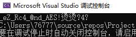

直接写入测试即可。

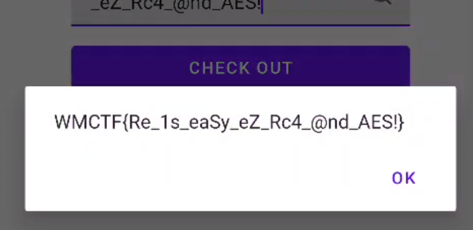

## 方法总结

- 核心技巧：对 goron 控制流平坦化和字符串加密的 Android native 库，先 hook `RegisterNatives` 定位 JNI 函数，再绕过 Frida 检测并动态抓 RC4/AES 的输入输出。
- 识别信号：SO 导出表没有目标函数、Java 层只有 native 校验、`RegisterNatives` 注册出多个偏移时，应优先 hook 注册流程建立函数映射。
- 复用要点：混淆严重时不要直接沉入全部伪代码；先定位校验函数、解反调试字符串、hook 加密例程和输出缓冲区，再补静态算法实现。
