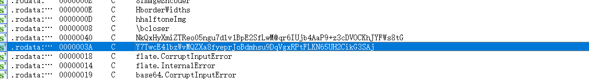
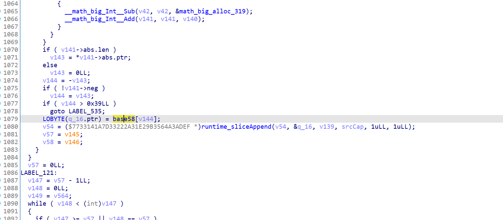
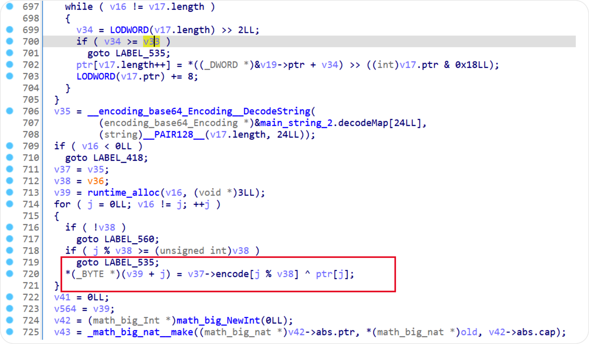
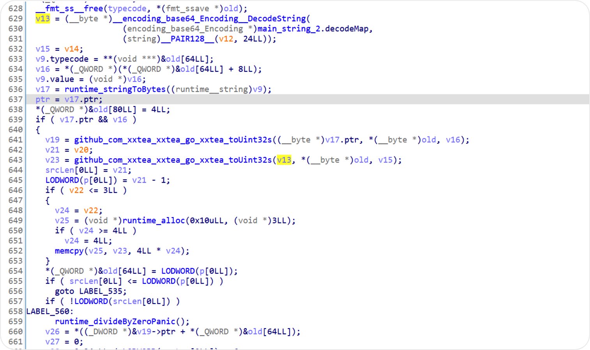

# gohunt

## 题目简述

题目是 tinygo 编译的 Go 逆向。出题方保留了符号信息，但对字符串做了 base64 或类似编码加密，并把最终可见线索藏在图片/二维码中。解法主线是先从图片扫描出密文，再逆向程序中的自定义编码、异构变换和 xxtea 加密链。

## 解题过程

出题方保留了符号化编译，题目使用 tinygo 构建。为干扰分析，所有字符串都经过了 base64 加密。

先对图片进行标记并通过二维码扫描工具扫描，得到密文：

`YMQHsYFQu7kkTqu3Xmt1ruYUDLU8uaMoPpsfjqYF4TQMMKtw5KF7cpWrkWpk3`

该字符串非常像 base64 或类似可逆编码算法产物，后续可继续做程序逆向。由于伪代码量较大，先从字符串入手，筛选一些有特征的字符串进行跟踪。

通过调试与分析可定位到该段为修改过的 base58 实现，参考实现如下：

https://blog.csdn.net/jason_cuijiahui/article/details/79280362

这里外链的关键作用是帮助识别 base58 的典型结构：它用 58 个字符组成字母表，排除容易混淆的 `0/O/I/l` 等字符；解码时把输入字符串按字母表映射成数值，反复执行“大整数乘 58 加当前值”，最后再转回字节数组。题目中的实现修改了字母表或局部处理逻辑，所以不能直接套标准库，但可以用这些结构特征确认它属于 base58 变种。

向上回溯可见上层逻辑是异构（heteroscedastic）算法（题目里这一术语保留原名），再次调试可抓到该段密钥：`NPWrpd1CEJH2QcJ3`

再继续向上可以看到 xxtea 的符号信息，以及对应的 GitHub 仓库名。调试后可得加密所用密钥：

`FMT2ZCEHS6pcfD2R`

最终得到 flag：

`wmctf{YHNEBJx1WG0cKtZk8e2PNbxJa45WQF09}`

代码详见 exp

## 方法总结

- 核心技巧：从二维码密文出发，结合符号信息逆向自定义 base58、异构变换和 xxtea 加密链。
- 识别信号：tinygo 程序保留符号但字符串全被编码时，应先从特征字符串和外部载体入手，定位编码函数再向上回溯调用链。
- 复用要点：外部 base58 资料只用于确认算法形态；真正解题时要以题目二进制里的字母表、密钥和调用顺序为准。
