# ios

## 题目简述

题目是 iOS IPA 逆向。应用使用个人开发者证书签名，安装到越狱设备后会先触发越狱检测；绕过检测后，主校验逻辑位于 `ViewController` 的按钮点击处理函数。程序对输入执行类似 RC4 的变换，并与内置密文比对，最终恢复 flag。

## 解题过程

由于 IPA 使用的是个人开发者证书签名，需在越狱手机上安装后再配合 Cydia 插件（AppSync）跳过签名校验，流程较基础，此处不再展开。
IPA 安装成功后界面如下：

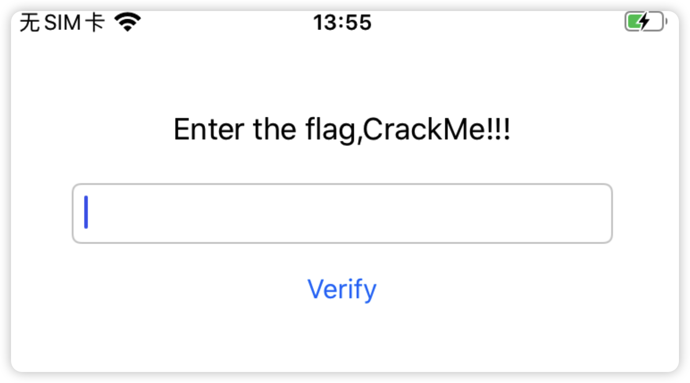

此时输入任意字母并点击 `verify` 时，会提示 `jailbreak device can not continue`，因此需要先绕过越狱检测。

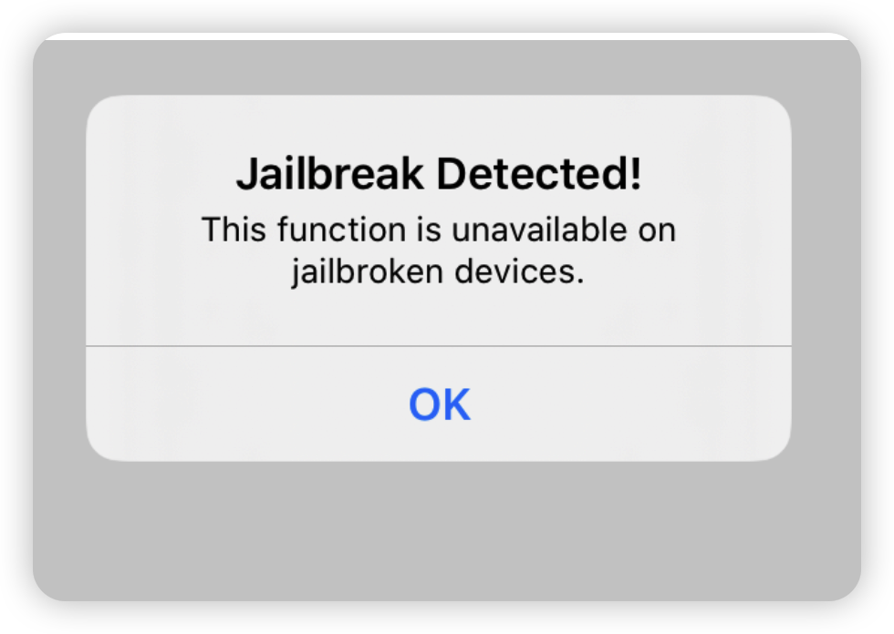

题目中明确有越狱检测。可直接安装一个屏蔽检测的插件来过掉，这里使用 **Liberty Lite**。在目标应用启用该插件后，可再次正常触发输入校验。进而进入二进制层：先解包 IPA，拿到 Mach-O 文件，再用 `class-dump` 导出该 macho 的全部 header。

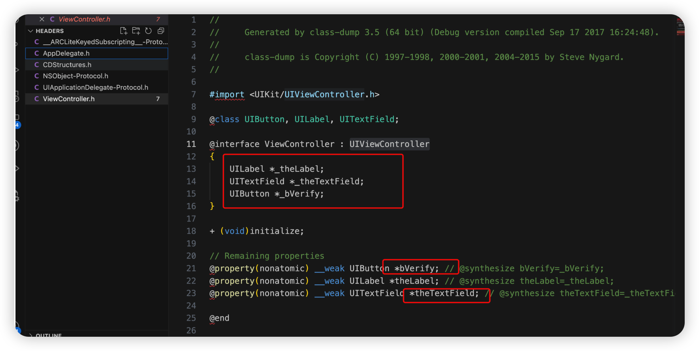

拿到对应的 `ViewController` 后，可先粗看上层逻辑，`UIButton` 对应校验代码。使用 IDA 打开对应 Mach-O，同时用 Frida 进行 hook。
现在 hook 该 UI 的弹窗逻辑：

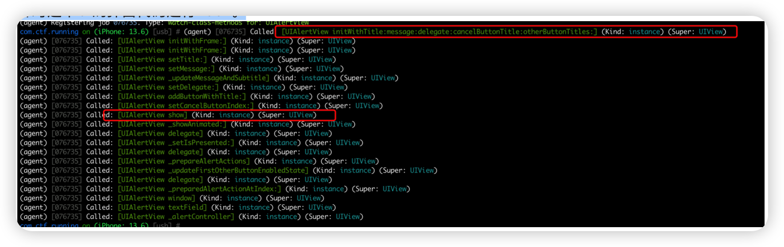

监听 `[UIAlertView initWithTitle:message:delegate:cancelButtonTitle:otherButtonTitles:]`，并打印调用栈：

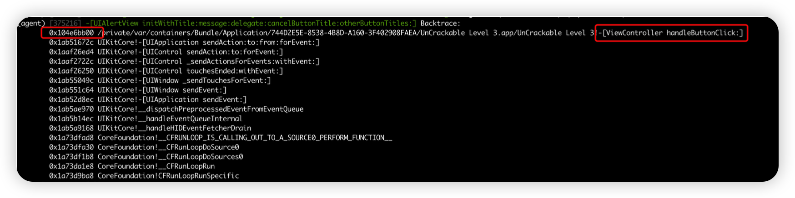

可见上层调用来自 `-[ViewController handleButtonClick:]`，其地址是 `0x104e6bb00`，主模块基址为 `0x104e64000`，所以在 IDA 中对应偏移为  
`0x104e6bb00 - 0x104e64000 + 0x100000000 = 0x100007B00`。

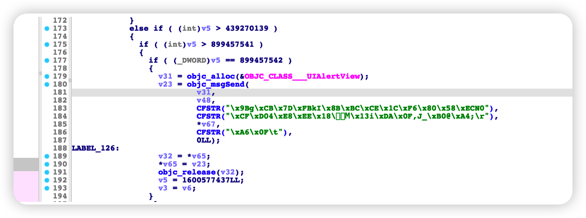

对应地址的伪代码如上，字符串显然是加密后的；继续向下追踪 `v48` 的调用，看到其调用关系如下：

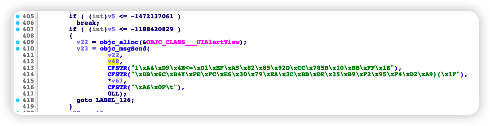

推测该窗口即为 flag 正确时弹出的界面。由于题目中涉及 OLLVM，需逐步向上追溯可见：

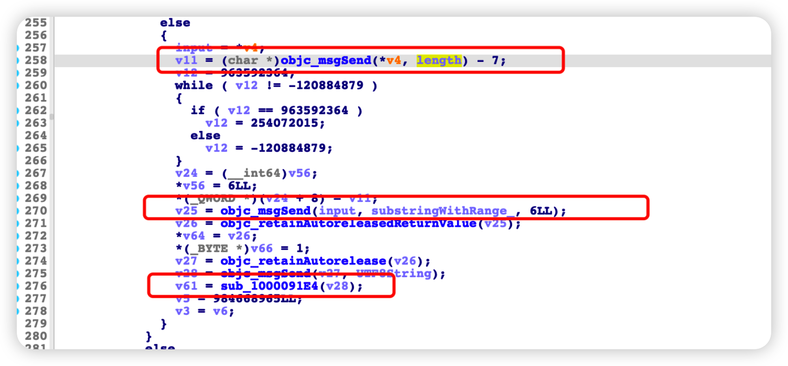

输入处理由 `sub_1000091e4` 完成，先用 hook 做确认。

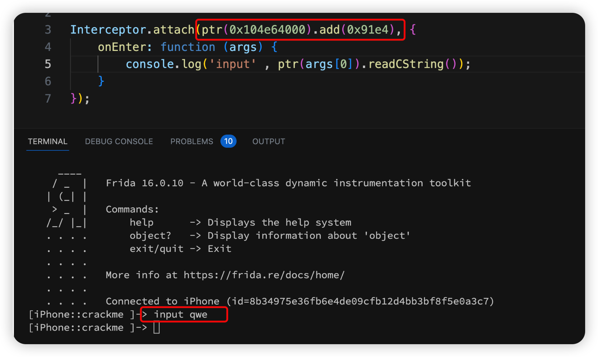

确认无误后继续跟进该函数，在 IDA 中可见一段参数处理逻辑，`v59` 即输入参数：

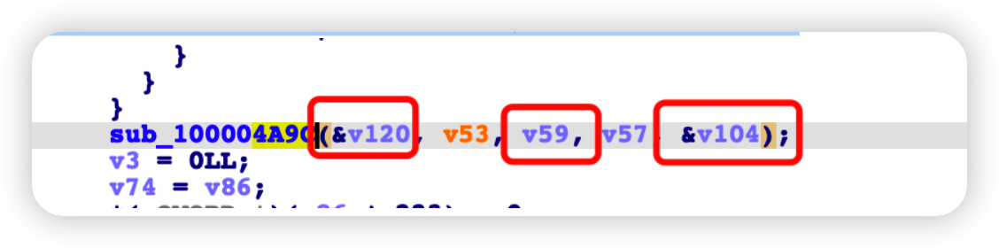

Frida hook 得到 `v120` 固定为 `"tfvq29bcom.runig"`，`v59` 的值是我们输入的 `qwe`：

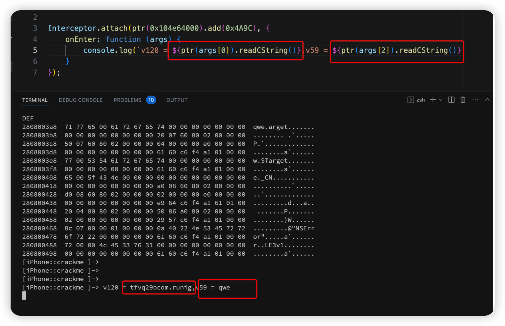

继续跟踪其他参数可见 `v104` 实际是输出地址：

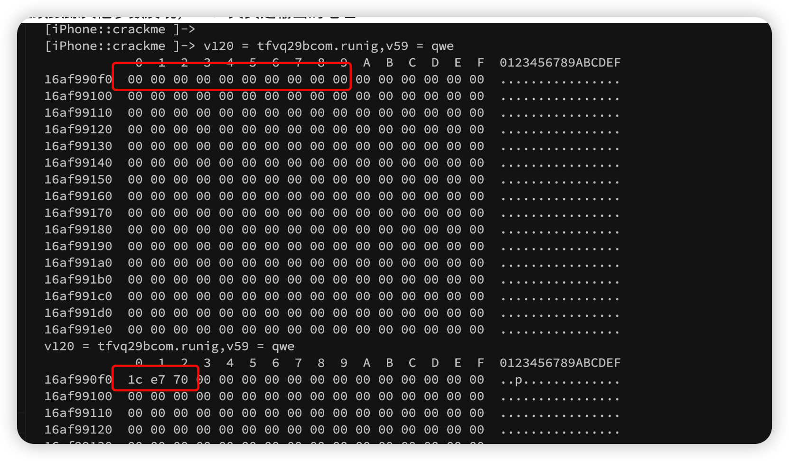

另外可见输出长度和输入长度相同（`sub100004A9C` 的静态分析可确认），得到几个关键点：

1. 生成 `v6` 数组时涉及到 key；
2. `v6` 数组长度应为 255；

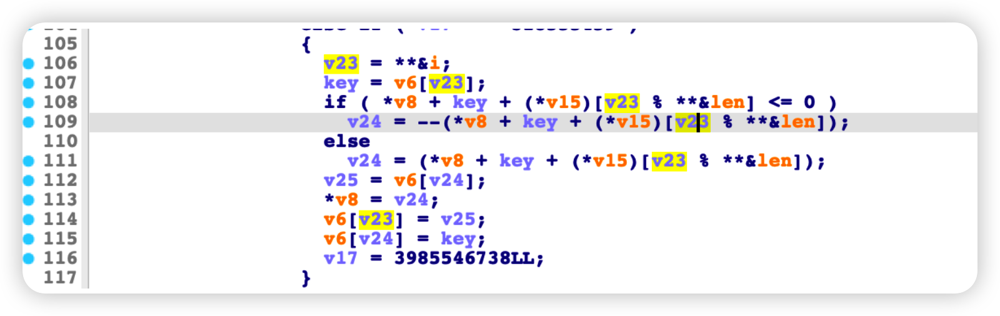

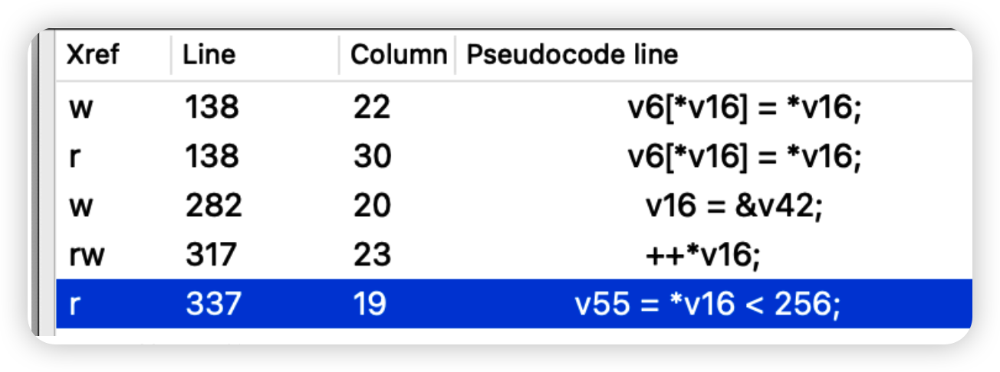

由此可推测是 RC4 算法，CyberChef 验证结果如下。

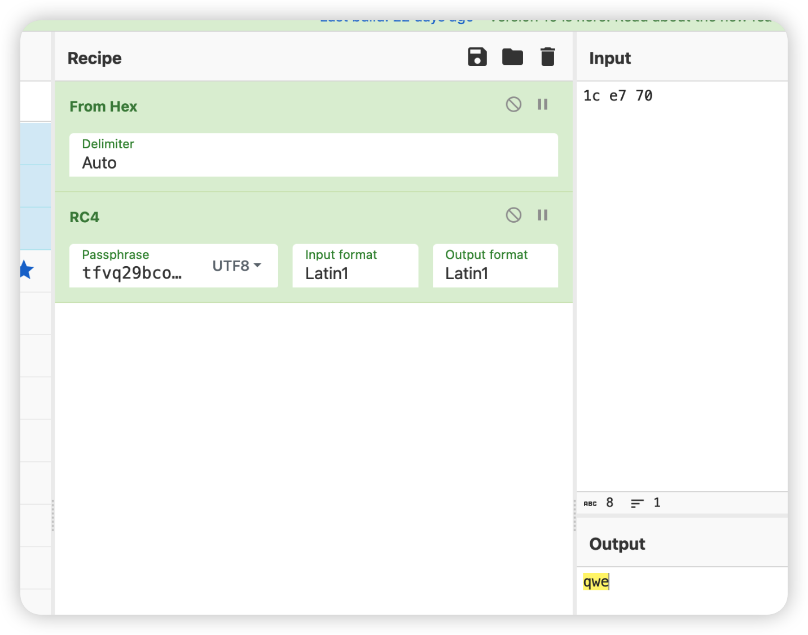

输出值应与预置数据比对。基于该特征去全局搜索 `v104` 的引用：

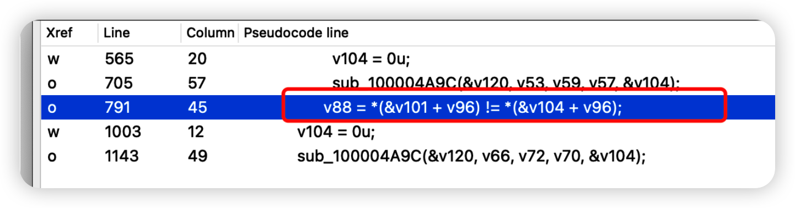

对应的汇编地址是 `0x9D84`。

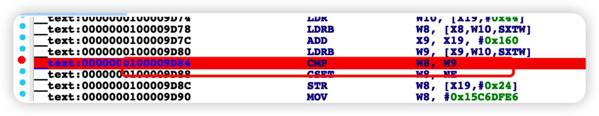

直接 inline hook 验证，确认 `x9` 确实是输出。

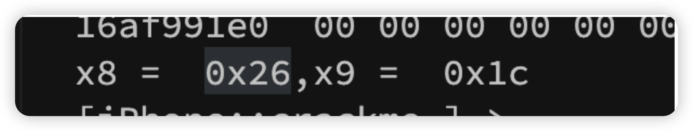

接下来要确认用于对比的数据，以及对应的 `x8` 寄存器是否来自内存，直接做 inline hook：

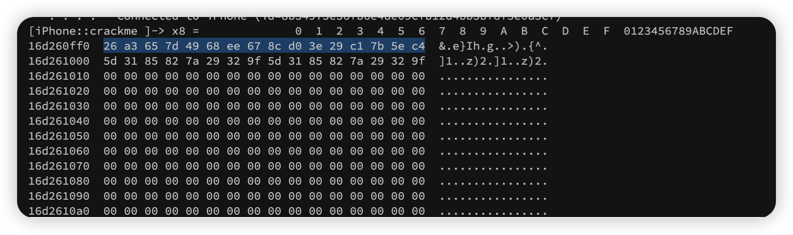

再次验证 RC4 结果：

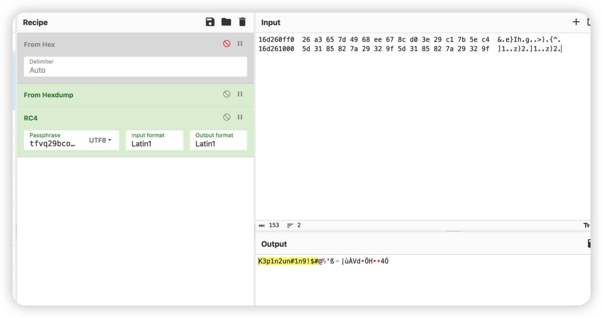

数据是否乱码？目前数据长度是多少？

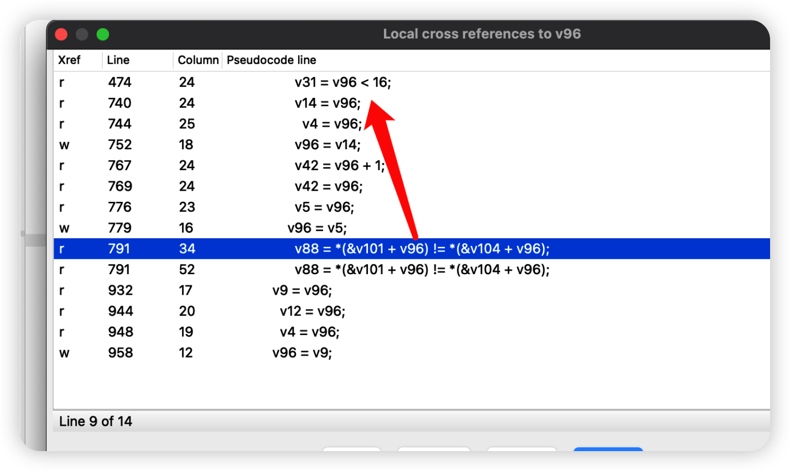

最终得到：

`wmctf{K3p1n2un#1n9!\$#@}` 

核验结果如下：

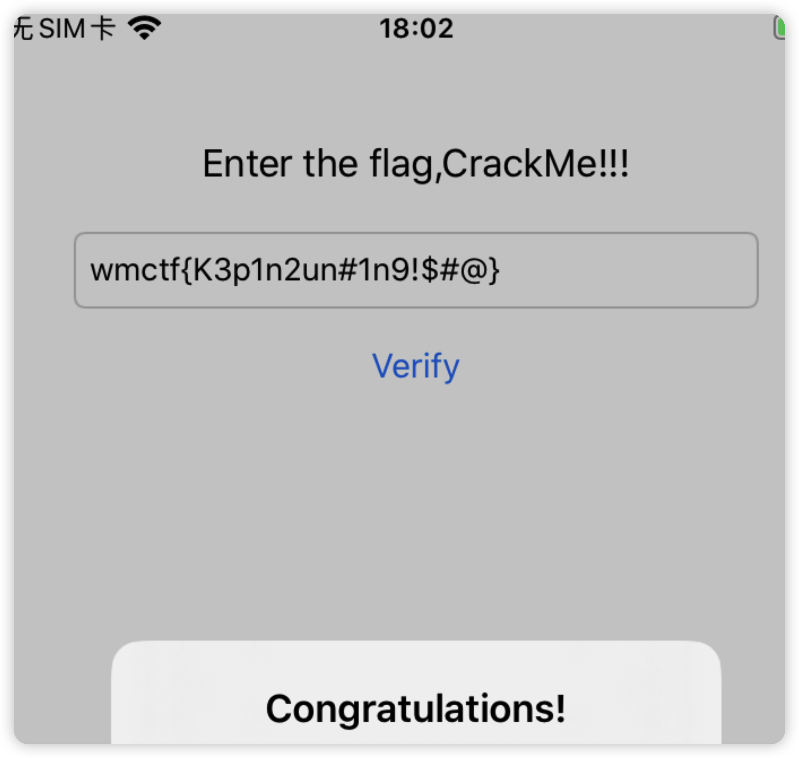

## 方法总结

- 核心技巧：在越狱设备上结合 Frida hook 和 IDA 静态分析，定位 UI 校验函数并还原 RC4 类算法。
- 识别信号：iOS 题出现越狱检测、按钮校验、加密字符串和 OLLVM 混淆时，应先绕过环境检测，再 hook 弹窗/校验入口定位真实函数。
- 复用要点：移动端逆向不要只看伪代码；用 Frida 观察寄存器、参数和输出缓冲区，可以快速确认静态分析中的算法猜测。
