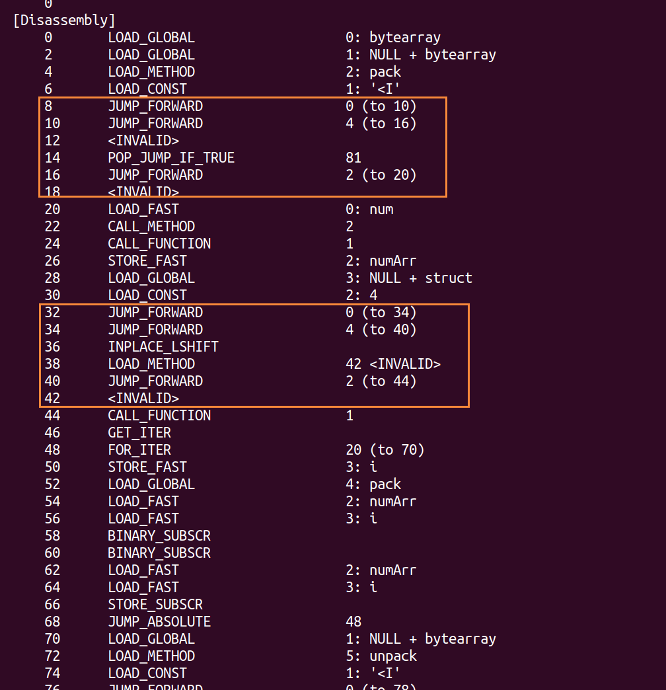
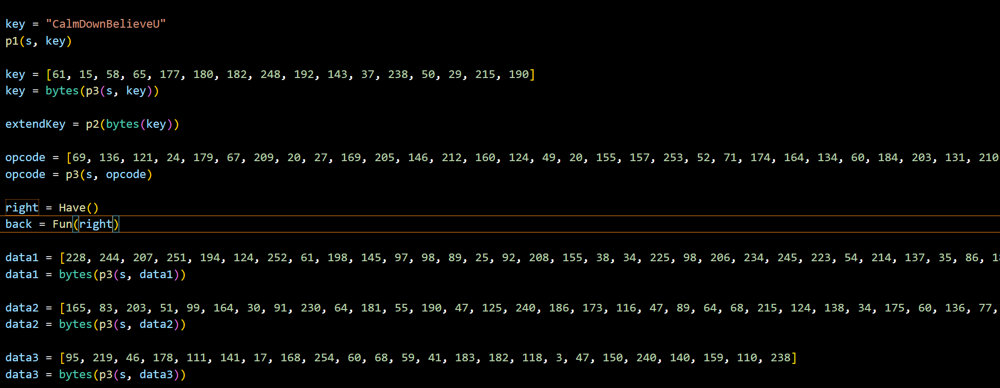
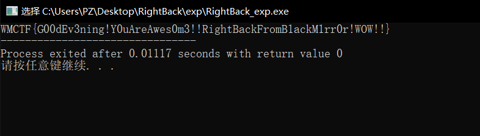

# RightBack

## 题目简述

题目是 Python 3.9 `pyc` 逆向。文件被插入大量规律性花指令，导致 `pycdc` 反编译失败；直接 NOP 又会破坏 Python code object 的字节码长度和行号映射。修复字节码后可继续分析解密逻辑，最终识别 RC5-CBC 类流程并写 C 程序解密 flag。

## 解题过程

### 0x00 Daily Shell Check

pyc 文件，读取 header 可确认是 Python 3.9 运行环境。

### 0x01 Deobfuscation

### Find Flower

Pyc 文件可直接用 `pycdc` 反编译，但会直接报错，于是先观察 Python 字节码。



可以看到大量出现同类的花指令（flower）。每条看似不同，但形式其实一致，如下：

```
# JUMP_FORWARD  0       6E 0
# JUMP_FORWARD  4       6E 4
# 4个无意义字节          1 2 3 4   
# JUMP_FORWARD  2       6E 2
# 两个无意义字节         5 6   
# org
```

因此看起来像把这些都 nop 掉就能修复？但 nop 掉后程序会无法运行，反编译工具仍不可用。

原因在于 Python 的 `co_lnotab`：

1. 这是字节码指令与源代码行号的映射表。
2. Python 用 `co_lnotab` 来做字节码偏移与源码行号对齐，用于调试。
3. 当把指令改成 nop 后，带参数的指令会变成不带参数指令，导致字节码偏移重新计算错误。

> https://svn.python.org/projects/python/branches/pep-0384/Objects/lnotab_notes.txt

该外链的关键点是：`co_lnotab` 记录字节码偏移与源代码行号变化之间的压缩映射，调试、traceback 和部分反编译逻辑会依赖这些偏移。删除或替换带参数字节码后，如果只改 opcode 而不维护 `co_code` 长度与行号表，code object 的偏移关系会失真，反编译器仍然无法正确解析。

### Remove Flower

我改为直接移除 flower 指令的字节码，并同时修复 Python 结构中的相关长度信息，其中与字节码长度直接相关的是 `co_code`：

```
'co_argcount'      # code需要的位置参数个数,不包括变长参数(*args 和 **kwargs)
'co_cellvars'      # code 所用到的 cellvar 的变量名,tuple 类型, 元素是 PyStringObject('s/t/R')
'co_code'          # PyStringObject('s'), code对应的字节码
'co_consts'        # 所有常量组成的 tuple
'co_filename'      # PyStringObject('s'), 此 code 对应的 py 文件名
'co_firstlineno'   # 此 code 对应的 py 文件里的第一行的行号
'co_flags'         # 一些标识位,也在 code.h 里定义,注释很清楚,比如 CO_NOFREE(64) 表示此 PyCodeObject 内无 freevars 和 cellvars 等
'co_freevars'      # code 所用到的 freevar 的变量名,tuple 类型, 元素是 PyStringObject('s/t/R')
'co_lnotab'        # PyStringObject('s'),指令与行号的对应表
'co_name'          # 此 code 的名称
'co_names'         # code 所用到的到符号表, tuple 类型,元素是字符串
'co_nlocals'       # code 内所有的局部变量的个数,包括所有参数
'co_stacksize'     # code段运行时所需要的最大栈深度
'co_varnames'      # code 所用到的局部变量名, tuple 类型, 元素是 PyStringObject('s/t/R')
```

也就是说，修改字节码时要同时修改 `co_code` 长度；每个函数对应一段 code 段，并且每段 code 的开头与花指令一并处理，同时根据每段代码段头 `0x73` 去读取代码段：

```python
def slice_code(code):
    # 记录代码段的 开头 与 长度
    code_attribute = []
    for i in range(len(code)):
        if code[i] == 0x73:
            size = int(struct.unpack("<I", bytes(code[i + 1:i + 5]))[0])
            try:
                if code[size + i + 5 - 2] == 0x53:
                    code_attribute.append({
                        'index': i + 5,
                        'len': size
                    })
            except:
                pass
    # 取出每个代码段    
    code_list = []
    for i in range(len(code_attribute)):
        code_list.append(code[code_attribute[i]['index']: code_attribute[i]['index'] + code_attribute[i]['len']])

    return code_attribute, code_list
```

读到这之后就可以开始修复了，重点有三点：

1. 记录被移除指令的长度，用于修正 `co_code`。
2. 修正 jump 指令。
3. 清除全部 flower 指令。

由于 Python 的跳转偏移是硬编码的，移除字节后会导致整段 jump 坏掉，所以对每条 jump 统一归纳如下：

```
两类跳转
1. 相对跳转
  1.1 检测当前地址到目标地址中间的cnt
2. 绝对跳转
  2.1 检测起始地址到目标地址之前的cnt
```

按上述思路可完整剥离所有花指令，复原后的完整去除脚本会在赛后上传到 GitHub。

> https://github.com/PoZeep

这个链接是作者用于发布赛后脚本的 GitHub 主页；关键实现思路已在上文写出：识别两类 jump，移除花指令字节，同时修复受影响跳转和 code object 长度。

### 0x02 Decryption

去混淆后，源码审计变得更顺。可见所有字符串都做了 RC4 加密；恢复源码后可直接打印字符串或关键数据。
静态审计 `sub100004A9C` 后发现关键点不多，程序主要包含 `have` 函数加密逻辑，通过 VM 进行加密。



源码可调试打印中间态后可拿到正确 opcode，因此可按以下思路还原加密流程，进而写解释器。因为加密过程并不长，手工也可分析：

```assembly
init
初始化寄存器

mov ecx, 0												   ; 0x50, 3, 3, 0
add eax, key ecx	eax += key0								; 0x1D, 1, 1, 3	
mov ecx, 1												   ; 0x50, 3, 3, 1
add ebx, key ecx	ebx += key1								; 0x1D, 1, 2, 3


add cnt, 1		循环开始  								; 0x1D, 3, 6, 1
xor eax, ebx	A^B										; 0x71, 1, 2
mov ecx, eax	ecx = A ^ B	 							 ; 0x50, 2, 3, 1
mov r8, ebx		r8 = B									; 0x50, 2, 5, 2
and ebx, 0x1F	B & 0x1F								; 0x72, 2, 0x1F
shl eax, ebx	eax = (A^B) << (B & 0x1F)				  ; 0x29, 1, 2
mov edx, 32												; 0x50, 3, 4, 32
sub edx, ebx	32 - (B & 0x1F)							 ; 0x96, 2, 4, 2
shr ecx, edx	ecx = (A^B) >> (32 - (B & 0x1F))		   ; 0x74, 3, 4
or eax, ecx	A = (A^B) << (B & 0x1F) | (A^B) >> (32 - (B & 0x1F)) ; 0x57, 1, 3
mov ebx, cnt											; 0x50, 2, 2, 6				
mul ebx, 2												; 0xDC, 3, 2, 2
mov ecx, key ebx										; 0x50, 1, 3, 2
add eax, ecx	A += roundkey[2 * i] 					 ; 0x1D, 2, 1, 3


mov ebx, r8											    ; 0x50, 2, 2, 5
xor ebx, eax	B ^ A									; 0x71, 2, 1
mov ecx, ebx	ecx = B ^ A								; 0x50, 2, 3, 2
mov edx, eax											; 0x50, 2, 4, 1
and edx, 0x1F	A & 0x1F								; 0x72, 4, 0x1F
shl ebx, edx	ebx = (B ^ A) << (A & 0x1F)				  ; 0x29, 2, 4
mov r8, 32												; 0x50, 3, 5, 32
sub r8, edx	r8 = 32 - (A & 0x1F)						 ; 0x96, 2, 5, 4
shr ecx, r8												; 0x74, 3, 5
or ebx, ecx	ebx = (B^A) << (A & 0x1F) | (B^A) >> (32 - (A & 0x1F)) ; 0x57, 2, 3
mov ecx, cnt											; 0x50, 2, 3, 6
mul ecx, 2												; 0xDC, 3, 3, 2
add ecx, 1												; 0x1D, 3, 3, 1
mov edx, key ecx										; 0x50, 1, 4, 3
add ebx, edx	B += roundkey[2 * i + 1]				  ; 0x1D, 2, 2, 4

cmp cnt, 21												; 0x7
jnz add cnt, 1
exit														0xFF				
```

### 0x03 GetFlag

将其化简为 C 代码后可见本质是 RC5 加密，唯一变更是轮数从默认变更为 21 轮。
原程序 key 可直接打印得到，因此可删除干扰脚本并直接还原：

```C
#include <stdio.h>
#include <stdint.h>

#define WORD_SIZE 32
#define KEY_SIZE 16
#define NUM_ROUNDS 21


void RC5_Decrypt(uint32_t *ct, uint32_t *pt, uint32_t *roundKey) {
    uint32_t i;
    uint32_t B = ct[1];
    uint32_t A = ct[0];

    for (i = NUM_ROUNDS; i >= 1; i--) {
        B -= roundKey[2 * i + 1];
        B = (B << (WORD_SIZE - (A & (WORD_SIZE - 1)))) | (B >> (A & (WORD_SIZE - 1)));
        B ^= A;
        A -= roundKey[2 * i];
        A = (A << (WORD_SIZE - (B & (WORD_SIZE - 1)))) | (A >> (B & (WORD_SIZE - 1)));
        A ^= B;
    }

    pt[1] = B - roundKey[1];
    pt[0] = A - roundKey[0];
}


int main() {
    uint32_t ciphertext[] = {0x43af236, 0x56b19afc, 0xf71e21dc, 0xdb8f8e94, 0x4d34e79d, 0x9c520c6e, 0xfbfad5fd, 0x32f9782c, 0xbbbe39c1, 0xd98575b6, 0x28f8cc78, 0xa4e48592, 0xebd72c5, 0xaf87912a, 0x8bf1ef96, 0x1660d112};
    uint32_t roundKey[] = {1835819331, 1853321028, 1768711490, 1432712805, 2177920767, 4020699579, 2261476601, 3551400604, 711874531, 3318306392, 1124217505, 2427199549, 3099853672, 2098025776, 1041196945, 2929936300, 246748610, 1941455090, 1303848803, 3809763535, 1395557789, 546751855, 1830937100, 2385871555, 2516030638, 3043054017, 3628118989, 1450520846, 1825094265, 3651791800, 32069749, 1469868411, 919887482, 4017993154, 4002737591, 3104343244, 4134211933, 420914335, 4152510760, 1317719524, 1990496755, 1873950060, 2553314372, 3602559392};
    int i, j;
    uint32_t flag[16] = { 0 };

	for ( i = 0; i < 8; i++ )
    {
    	RC5_Decrypt(ciphertext + 2 * i, flag + 2 * i, roundKey);
    	if (i != 0)
    	{
    		flag[i * 2] ^= ciphertext[2 * i - 2];
    		flag[i * 2 + 1] ^= ciphertext[2 * i - 1];
		}
		for ( j = 3; j >= 0; j-- )
			printf("%c", (flag[i * 2] >> (j * 8)) & 0xFF);
		for ( j = 3; j >= 0; j-- )
			printf("%c", (flag[i * 2 + 1] >> (j * 8)) & 0xFF);
	}


    return 0;
}
```

Get Flag！



## 方法总结

- 核心技巧：移除 pyc 花指令时同步修复 code object 长度和行号映射，再还原后续 RC5 解密。
- 识别信号：pyc 反编译失败但字节码中出现大量规律 `JUMP_FORWARD + 垃圾字节` 时，应先做字节码层去花，而不是只依赖反编译器。
- 复用要点：Python 逆向改 pyc 时要关注 `co_code`、嵌套 code object 和 `co_lnotab`；解密阶段则保留轮密钥、密文和分组链式异或关系。
