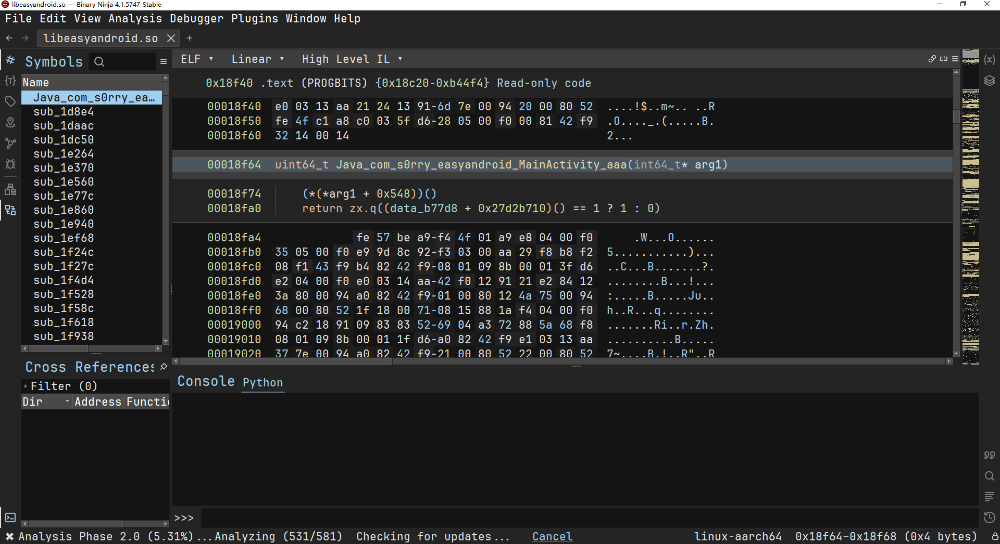
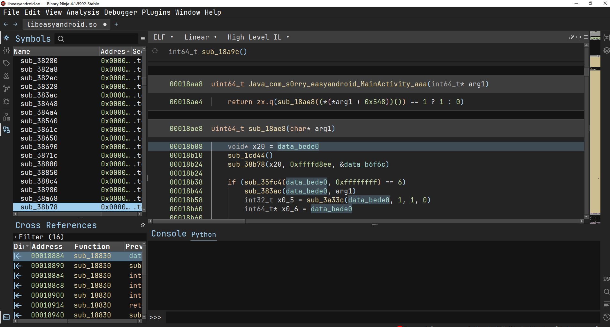
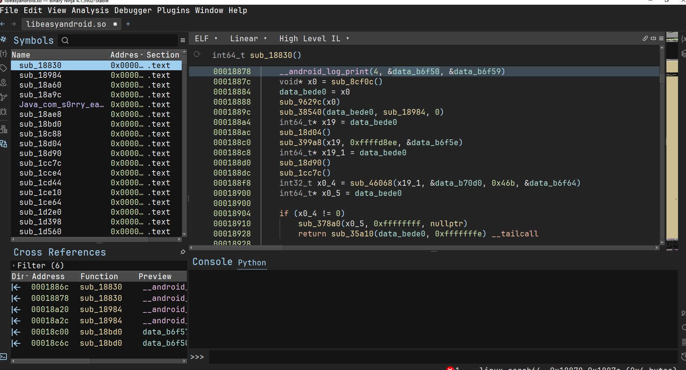
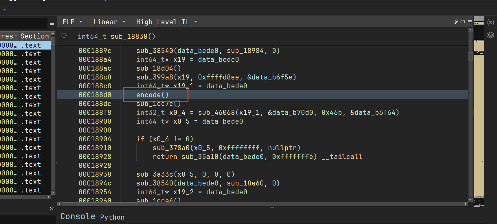
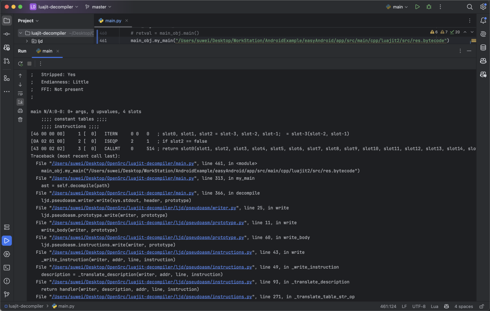
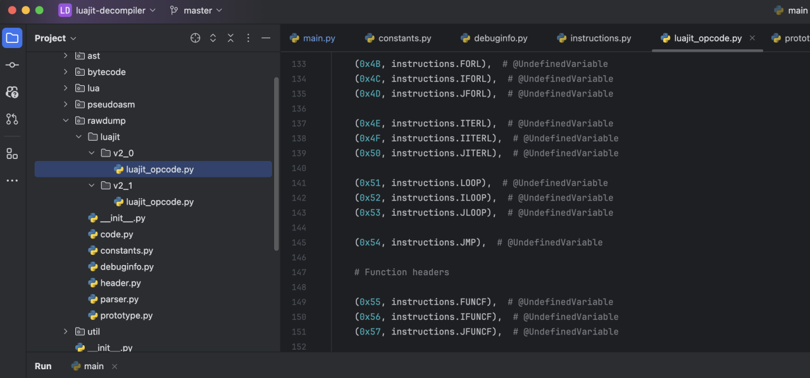
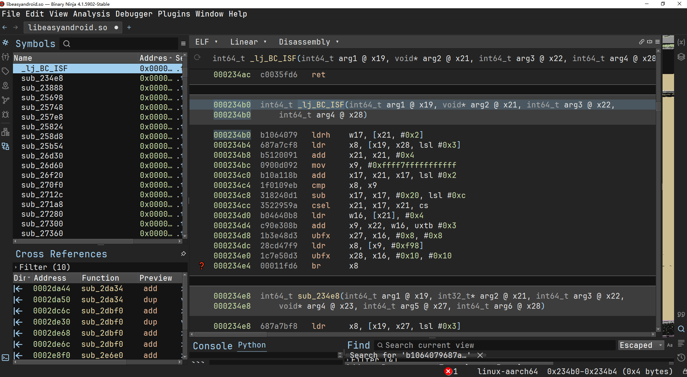

# easyAndroid

## 题目简述

题目附件为 `easyAndroid.apk`。Java 层最终进入 native 逻辑，native 中解密出一段魔改 LuaJIT 字节码；还原字节码映射后可反汇编得到 Lua 校验逻辑。

附件 `exp/exp.lua` 与官方分析一致，说明最终校验是 LuaJIT 侧的字符串变换与比较。

## 解题过程

### 关键机制

native 层先解密 LuaJIT bytecode。直接用普通 LuaJIT dumper 会报错，因为题目修改了字节码 opcode 映射。解决方法是重新建立 opcode 映射：可以分析 LuaJIT VM 分发，也可以自己编译带符号 LuaJIT，对照相同 VM 指令的机器码恢复映射。

以下 IDA 和工具视图保留了定位 bytecode、确认 LuaJIT 特征以及恢复 opcode 映射的关键过程：















恢复后主要函数如下：

```lua
function BBB(s)
    local t = {}
    for i = 1, #s do
        table.insert(t, string.format("%02x", bit.bxor(218, string.byte(s, i))))
    end
    return table.concat(t)
end

function CCC(hex, k)
    local t = {}
    for i = 1, #hex, 2 do
        table.insert(t, string.char(bit.bxor(tonumber(hex:sub(i, i + 1), 16), k or 218)))
    end
    return table.concat(t)
end
```

核心加密函数 `AAA` 是 RC4 类 KSA/PRGA，只是输出十六进制字符串。`DDD()` 表面返回一段密文，但真实数据在 native 层被 hook。

### 求解步骤

还原后校验形式为：

```lua
function checkflag(input)
    if AAA(BBB("8d97998e9ce8eae8ee"), input) == DDD() then
        return 1
    end
    return 0
end
```

分析 native hook 得到真实密文：

```text
9e5112e8ca6d1700271280763df544927f776aeed3f0e8abd16f510c79dd62bed1fe11bc
```

用恢复出的 `AAA` 逆向解密，key 为：

```text
e2bee3ede3e3e2bfe3b9bfe2bfbbbfe2bfbf
```

最终输出：

```text
WMCTF{f1711720-3f31-459b-b413-8858305b9e51}
```

## 方法总结

- 第一层障碍是 native 中隐藏 LuaJIT bytecode。
- 第二层障碍是 LuaJIT opcode 映射被魔改，普通反编译器需要先修映射。
- 第三层障碍是 `DDD()` 的静态值不是最终密文，真实值由 native hook 替换。
