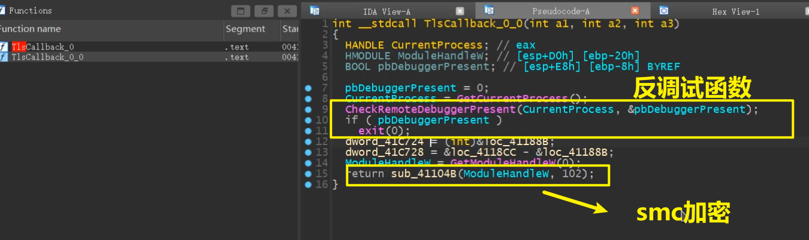
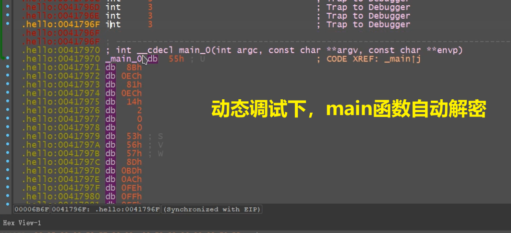
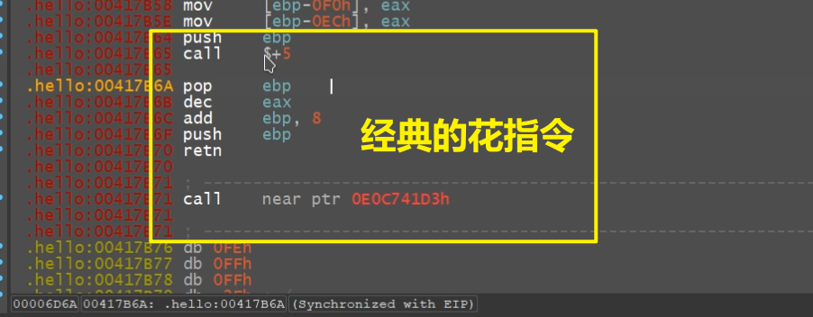
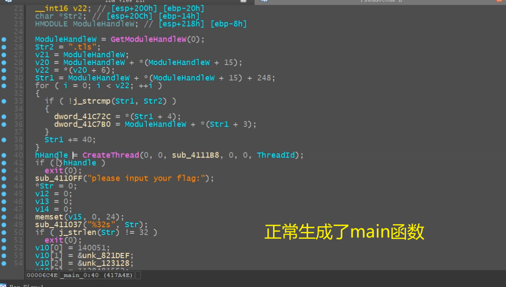
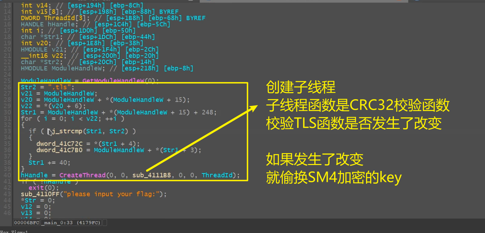
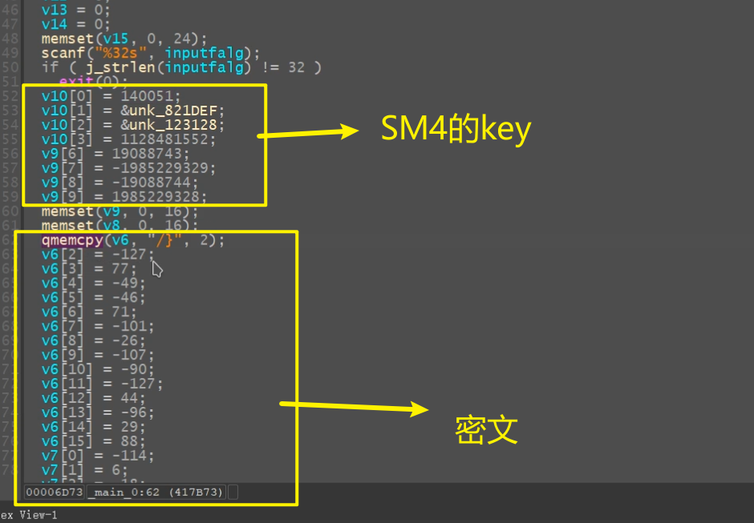
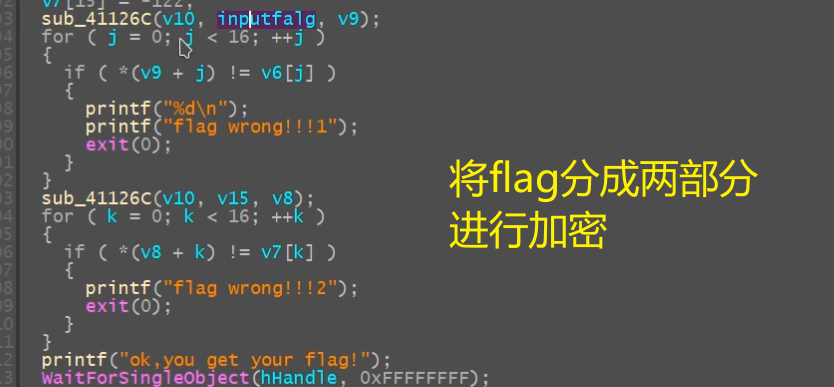
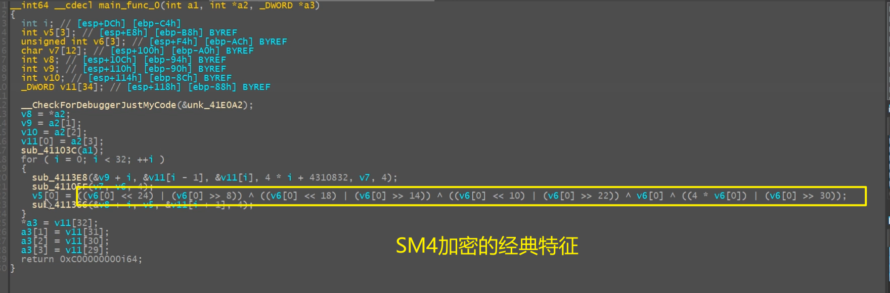
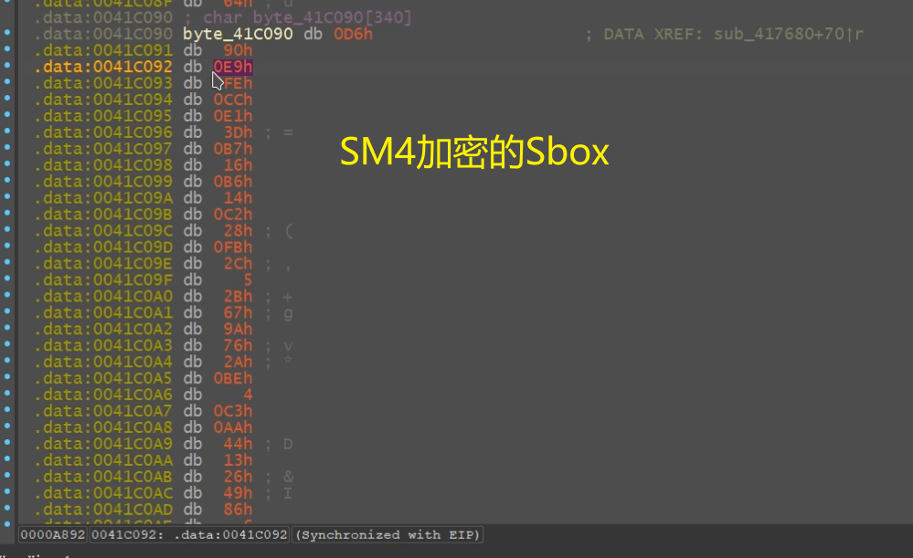

# ez_learn

## 题目简述

题目是 32 位 Windows 程序。附件包含 `ez_learn.exe`，官方仓库还给出解题脚本和 `flag.txt`，其中 flag 为：

```text
WMCTF{CRC32andAnti_IS_SO_EASY!!}
```

## 解题过程

### 关键机制

程序包含 TLS 反调试和 main 函数花指令。去掉花指令后，可看到 main 中有 CRC32 校验和 SM4 加密校验。SM4 不是标准实现，异或步骤被改过：

以下 IDA 视图保留了反调试入口、main 运行时解密、花指令清理、CRC32 检查以及 SM4 常量定位过程：



















```cpp
int sm4_to_xor_2(unsigned char* a, unsigned char* b, unsigned char* out, int len) {
    for (int i = 0; i < len; i++) {
        out[i] = a[i] ^ b[i] ^ 0x34 ^ key;
    }
    return 0;
}

int sm4_to_xor_4(unsigned char* a, unsigned char* b, unsigned char* c,
                 unsigned char* d, unsigned char* out, int len) {
    for (int i = 0; i < len; i++) {
        out[i] = a[i] ^ b[i] ^ c[i] ^ d[i] ^ 0x12 ^ key;
    }
    return 0;
}
```

其中 `0x12` 与 `0x34` 是区别于标准 SM4 的关键常量。

### 求解步骤

1. 定位 TLS Callback，patch 或绕过反调试。
2. 去掉 main 中花指令，重新生成伪代码。
3. 提取 SM4 参数：

```cpp
unsigned long mk[4] = { 0x022313, 0x821def, 0x123128, 0x43434310 };
char crypt[] = {
    0x6f,0xe8,0x76,0xc6,0xf8,0xe8,0x67,0xad,
    0xac,0xb9,0x9d,0xca,0x8e,0x06,0xae,0xb1,
    0x98,0x02,0x1b,0xd5,0xd3,0xc6,0x27,0xd8,
    0x35,0xa3,0xa5,0x31,0x66,0x7a,0x3a,0x89
};
```

4. 按魔改 SM4 解密两块 16 字节密文，拼接得到 flag。

## 方法总结

- 不要直接套标准 SM4，必须还原题目修改过的 XOR 常量。
- TLS 反调试和花指令是分析障碍，不是最终加密核心。
- 仓库给出的 `flag.txt` 与解题脚本互相印证，最终 flag 为 `WMCTF{CRC32andAnti_IS_SO_EASY!!}`。
