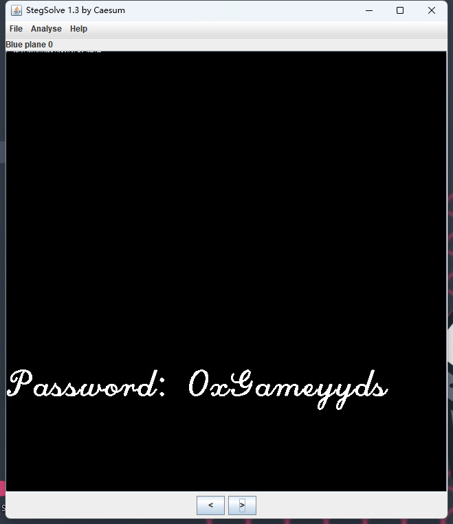

# week2不太普通的图片

## 题目简述

附件图片的最低有效位中存在两类信息：蓝色通道最低位直接显示一段密码，而 RGB 最低位还包含一份由带密码 LSB 工具嵌入的载荷。普通位平面查看只能发现异常，不能直接还原最终内容。

## 解题过程

先用 StegSolve 逐个查看颜色位平面。`RGB plane 0` 呈现出明显的结构，不像自然图像中随机分布的最低位，说明存在 LSB 隐写；但直接按常规 RGB 顺序抽取无法得到有效文本，表明载荷还使用了工具自带的密码机制。

继续查看单独的蓝色最低位 `Blue plane 0`，可以直接读到：

```text
Password: 0xGameyyds
```



原 PDF 链接到的 Cloacked-Pixel 是一类支持密码的 LSB 嵌入/提取工具。对原图执行其提取模式，并输入密码 `0xGameyyds`，即可还原隐藏文本：

```text
0xGame{Hidd3n_1n_Pic}
```

## 方法总结

位平面中“看得到异常”不等于能够按裸 LSB 顺序直接读出载荷。本题把可见密码放在蓝色最低位，把真正内容交给带密码的 LSB 工具处理，因此正确顺序是先遍历单通道位平面取密码，再用对应工具提取 RGB LSB 载荷。工具链接不是复现所必需，WP 已保留工具名称、通道、密码和结果，故不再保留外部 URL。
