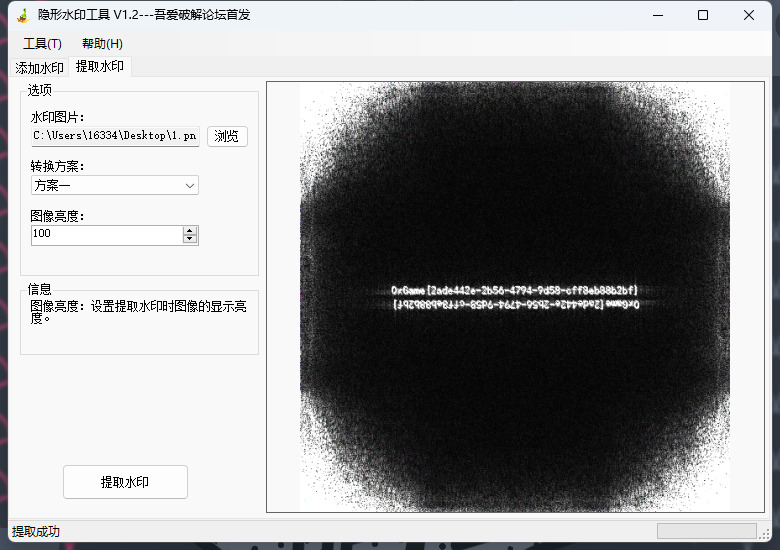

# week3Time To Live

## 题目简述

附件文本由一列十进制 TTL 值组成。每个值按 8 位二进制表示时，低 4 位固定为 `1111`，高 4 位才是隐蔽信道数据。把每个 TTL 的高半字节依次拼接，可恢复一段 Base64；其解码结果是带频域盲水印的 JPEG。

## 解题过程

经典 TTL 隐蔽信道常让低 6 位保持固定、只使用高 2 位传输。本题把容量改为每个值携带 4 位，因此应验证低半字节均为 `0xF`，再提取高半字节。两个 TTL 正好组成一个字节：

```python
import base64
from pathlib import Path

values = [
    int(line.strip())
    for line in Path("Time To Live.txt").read_text().splitlines()
    if line.strip()
]

assert all(0 <= value <= 255 for value in values)
assert all(value & 0x0F == 0x0F for value in values)

bits = "".join(f"{value:08b}"[:4] for value in values)
assert len(bits) % 8 == 0

base64_bytes = int(bits, 2).to_bytes(len(bits) // 8, "big")
jpeg = base64.b64decode(base64_bytes, validate=True)
assert jpeg.startswith(b"\xFF\xD8\xFF")
Path("ttl.jpg").write_bytes(jpeg)
```

直接查看 `ttl.jpg` 不会看到 flag。对灰度图做二维离散傅里叶变换，把零频分量移到中心，再对幅度谱取对数以压缩动态范围：

```python
import cv2
import numpy as np

image = cv2.imread("ttl.jpg", cv2.IMREAD_GRAYSCALE)
assert image is not None

spectrum = np.fft.fftshift(np.fft.fft2(image))
magnitude = np.log1p(np.abs(spectrum))
visible = cv2.normalize(
    magnitude,
    None,
    0,
    255,
    cv2.NORM_MINMAX,
).astype(np.uint8)

cv2.imwrite("ttl_spectrum.png", visible)
```

频谱中央出现水印文字。上下两份互为镜像，这是实值图像傅里叶频谱的共轭对称结果，并非两条不同 flag：



```text
0xGame{2adc442e-2b56-4794-9d58-cff8eb88b2bf}
```

## 方法总结

本题串联了 TTL 低位模式、Base64 文件恢复和频域水印。提取前必须先验证固定低 4 位这一统计特征，不能只因题目名就盲取某几位；位串转字节时还要指定完整长度，避免整数转换丢失前导零。JPEG 正常可见不代表分析结束，FFT 幅度谱中的规则文字才是第二层载荷。
