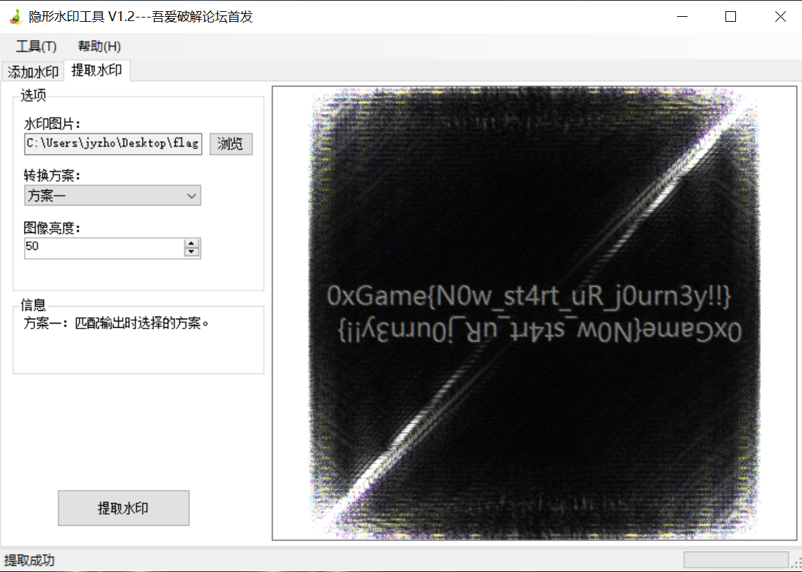

# 一明一暗

## 题目简述

附件 `attachment.zip` 中包含一个加密的 `1.zip` 和一份明文 `f1ag.jpg`。内层 `1.zip` 也保存了同名、同 CRC 的 `f1ag.jpg`，因此可以对传统 ZipCrypto 执行已知明文攻击；解密后得到的 `flag.png` 还需要提取盲水印。

## 解题过程

先查看两层 ZIP 的文件信息：

- 外层 `attachment.zip`：`1.zip`、`f1ag.jpg`；
- 内层 `1.zip`：`f1ag.jpg`、`flag.png`、`hint.txt`，三项均使用传统 ZIP 加密；
- 两层的 `f1ag.jpg` 原始大小均为 `221466` 字节，CRC32 均为 `d7c7c1c9`；
- 外层明文项压缩后为 `216970` 字节，内层密文项为 `216982` 字节，差出的 12 字节正是 ZipCrypto 加密头。

这些信息说明外层图片就是内层同名文件的已知明文。ZipCrypto 加密的是“压缩后的数据”，所以明文 ZIP 中该文件的压缩方法和压缩结果必须一致。出题环境使用 Bandizip 7.36 的“快速压缩”；最稳妥的做法是从外层包复制出只含 `f1ag.jpg` 的明文 ZIP，从而直接复用一致的压缩数据。

在 ARCHPR 中选择内层 `1.zip` 作为加密包、上述明文 ZIP 作为已知明文包，并指定同名文件 `f1ag.jpg`。当工具恢复出内部密钥并显示可以解密时即可停止搜索，保存已解密 ZIP，无需等待后续口令枚举结束。

解密后读取 `hint.txt`，可知 `flag.png` 使用了盲水印。把 `flag.png` 载入盲水印提取工具并选择正确的提取方案，结果图中直接出现：

```text
0xGame{N0w_st4rt_uR_j0urn3y!!!}
```



## 方法总结

本题包含两层机制：先利用重复文件对 ZipCrypto 做已知明文攻击，再从解密图片中提取盲水印。已知明文攻击要求的是一致的压缩字节流，不只是“原图看起来相同”；压缩软件或压缩等级不一致都可能导致攻击失败。
