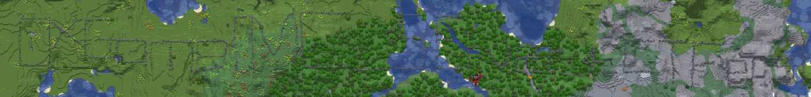

# 我的世界基岩版（？）

## 题目简述

题目把 flag 的字符轮廓用基岩方块大范围铺在 Minecraft 世界地面上。站在地面视角无法看全，必须获得俯视地图或升到足够高的位置，利用空间轮廓读取字符。

仓库中没有保存世界存档，只留下了原始附件的网盘地址；因此下述机制以官方 WP 的地图截图为证据，不把已经可能失效的下载链接当作解题步骤。

## 解题过程

进入世界后，可以使用 Xaero's Minimap 与 Xaero's World Map 生成大范围俯视图。等相关区块被加载后，地图上会出现由颜色明显不同的基岩方块组成的连续字符轮廓。



沿字符方向逐段放大辨认，并回到对应位置确认容易混淆的大小写和数字，得到：

```text
0xGame{MC_SErver_4_CTFers}
```

如果不使用地图模组，也可以向上搭建高塔、使用自由视角或飞行能力观察；这些方法的共同目标都是获得足够大的俯视范围，而不是寻找箱子、告示牌或常规物品中的文本。

## 方法总结

本题把信息编码在游戏世界的空间布局中。遇到类似场景，应优先考虑俯视地图、扩大视野和区块级观察，并对易混淆字符进行近距离复核；服务器中玩家后来添加的告示牌或建筑不属于题目证据。
