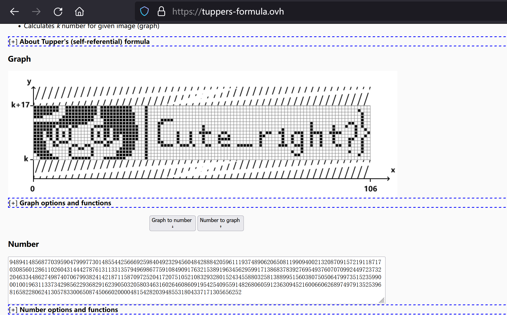

# 报告哈基米

## 题目简述

题目只提供一张 `报告哈基米.png`。完整 flag 被拆成两部分：前半部分需要恢复图片上的 Arnold 猫映射，后半部分藏在异常 PNG 数据块中的 ZIP 文件里。

## 解题过程

### 1. 检查 PNG 结构

用十六进制编辑器查看文件，可以看到 `IEND` 后仍有 34 字节数据；将这段尾随数据逆序后得到提示：

```text
Maybe You Need To Know Arnold Cat?
```

同时，正常 IDAT 数据尚未结束时，文件末尾又出现了一个长度仅为 455 字节的额外 IDAT 块，说明这里还藏有另一份数据。

### 2. 从 RGB 最低位提取 Arnold 参数

按行遍历像素，依次取 R、G、B 三个通道的最低位，并按高位在前的顺序每 8 位组成一个字节：

```python
import re
from PIL import Image

img = Image.open("报告哈基米.png").convert("RGB")
bits = []

for r, g, b in img.getdata():
    bits.extend((r & 1, g & 1, b & 1))

raw = bytes(
    sum(bits[i + j] << (7 - j) for j in range(8))
    for i in range(0, len(bits) - 7, 8)
)

pattern = rb"a,b=\d+,\d+\(a,b=\d+,\d+\),shuffle_times=\d+"
print(re.search(pattern, raw).group().decode())
```

输出为：

```text
a,b=7,35(a,b=35,7),shuffle_times=1
```

提示同时给出了正向参数和逆向参数。逆变换使用 $a=35$、$b=7$，执行一次即可：

```python
from PIL import Image

def arnold_inverse(image, a, b):
    if image.width != image.height:
        raise ValueError("Arnold 变换要求图片为正方形")

    n = image.width
    decoded = Image.new(image.mode, image.size)

    for sy in range(n):
        for sx in range(n):
            ox = ((a * b + 1) * sx - b * sy) % n
            oy = (sy - a * sx) % n
            decoded.putpixel((ox, oy), image.getpixel((sx, sy)))

    return decoded

source = Image.open("报告哈基米.png")
arnold_inverse(source, 35, 7).save("arnold-decoded.png")
```

恢复后的图片给出 flag 前半部分：


```text
0xGame{hajimi_is_
```

### 3. 提取逆序 ZIP

下面的代码逐块解析 PNG，取出最后一个 IDAT 的载荷。该载荷整体逆序后缺少 ZIP 本地文件头签名，因此补上 `PK\x03\x04`，即可直接读取其中的 `mijiha.txt`：

```python
import io
import struct
import zipfile
from pathlib import Path

png = Path("报告哈基米.png").read_bytes()
offset = 8
idat_payloads = []
tail = b""

while offset + 12 <= len(png):
    length = struct.unpack(">I", png[offset:offset + 4])[0]
    chunk_type = png[offset + 4:offset + 8]
    payload = png[offset + 8:offset + 8 + length]

    if chunk_type == b"IDAT":
        idat_payloads.append(payload)

    offset += 12 + length
    if chunk_type == b"IEND":
        tail = png[offset:]
        break

print(tail[::-1].decode())

zip_data = b"PK\x03\x04" + idat_payloads[-1][::-1]
with zipfile.ZipFile(io.BytesIO(zip_data)) as archive:
    text = archive.read("mijiha.txt").decode()

print(text)
```

文本本身仍是整体逆序的。再次逆序后，开头出现提示 `Is This Tupper?`，其余内容是一串用于 Tupper 自指公式位图的十进制整数：

```text
9489414856877039590479997730148554425666925984049232945604842888420596111937489062065081199094002132087091572191187170308560128611026043144427876131133135794969867759108490917632153891963456295991713868378392769549376070709924497237322046334486274987407067993824142187115870972520417207510521083293280152434558803258138899515603807505064799735152359900010019631133734298562293682916239050320580346316026460860919542540955914826806059123630945216006606268974979135253968165822806241305783300650874506602000048154282039485531804337171305656252
```

无需依赖在线工具，按 Tupper 位图的编码方式直接还原 $106\times17$ 个像素：

```python
from PIL import Image

k = 9489414856877039590479997730148554425666925984049232945604842888420596111937489062065081199094002132087091572191187170308560128611026043144427876131133135794969867759108490917632153891963456295991713868378392769549376070709924497237322046334486274987407067993824142187115870972520417207510521083293280152434558803258138899515603807505064799735152359900010019631133734298562293682916239050320580346316026460860919542540955914826806059123630945216006606268974979135253968165822806241305783300650874506602000048154282039485531804337171305656252
value = k // 17

bitmap = Image.new("1", (106, 17), 0)
pixels = bitmap.load()
for x in range(106):
    for y in range(17):
        pixels[x, 16 - y] = (value >> (17 * x + y)) & 1

bitmap.resize((1060, 170)).save("tupper.png")
```

位图内容为 `Cute_right?}`：



拼接两部分得到：

```text
0xGame{hajimi_is_Cute_right?}
```

## 方法总结

本题同时使用了 PNG 尾随数据、额外 IDAT、RGB 通道 LSB、Arnold 猫映射和 Tupper 位图编码。处理复合隐写题时，应把文件结构异常、像素位平面和解出的提示串联起来；每得到一个提示，都应落实为可复现的本地提取步骤，而不是把在线工具截图当作唯一依据。
