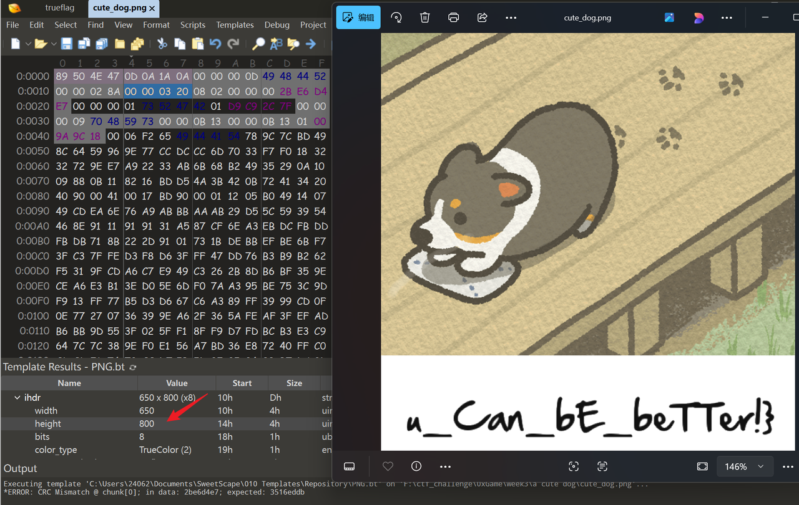

# A cute dog

## 题目简述

题目附件是一张能够正常播放的 APNG 小狗图片，但 flag 被拆成多层藏在同一载体中。完整链路为：

```text
APNG 帧延时字段
    → 指向第 24 帧
    → RGB 最低位中的倒序 ZIP
    → flag 第一段、OurSecret 提示与密码
    → OurSecret 中的 part2.zip
    → IHDR 宽高损坏的 PNG
    → flag 第二段
```

分析时应保留题目给出的原始 `a_cute_dog.png`，不要用图片编辑器重新保存，否则 APNG 控制块、最低位数据或 OurSecret 载荷都可能被破坏。

## 解题过程

### 1. 从 APNG 时间轴提取提示

APNG 在普通 PNG 分块之外增加了 `acTL`、`fcTL` 和 `fdAT`。其中每个 `fcTL` 帧控制块长度为 26 字节，依次保存帧序号、尺寸、偏移、延时分子 `delay_num`、延时分母 `delay_den`、处置方式和混合方式。[APNG 格式与帧控制块参考](https://lastnigtic.cn/posts/apng-editor/)详细介绍了这些字段；本题真正需要的是 `fcTL` 数据区偏移 `20:22` 的大端 16 位 `delay_num`。

逐块读取并把可打印的延时分子转成 ASCII：

```python
import struct


def extract_delay_numbers(path):
    numbers = []

    with open(path, "rb") as f:
        if f.read(8) != b"\x89PNG\r\n\x1a\n":
            raise ValueError("not a PNG/APNG file")

        while True:
            length_raw = f.read(4)
            if not length_raw:
                break

            length = struct.unpack(">I", length_raw)[0]
            chunk_type = f.read(4)
            chunk_data = f.read(length)
            f.read(4)  # CRC

            if chunk_type == b"fcTL":
                if length != 26:
                    raise ValueError("invalid fcTL length")
                numbers.append(struct.unpack(">H", chunk_data[20:22])[0])

            if chunk_type == b"IEND":
                break

    hint = "".join(chr(n) for n in numbers if 32 <= n <= 126)
    print(numbers)
    print(hint)


extract_delay_numbers("a_cute_dog.png")
```

输出的开头为：

```text
[116, 104, 101, 95, 50, 52, 116, 104, 95, 109, 97, 121, 98,
 101, 95, 117, 115, 101, 102, 117, 108, 10, 10, ...]
the_24th_maybe_useful
```

因此下一步检查自然序号第 24 帧。

### 2. 分离帧并恢复倒序 ZIP

使用 `apng` 库无损导出各帧：

```python
from pathlib import Path
from apng import APNG


source = "a_cute_dog.png"
output = Path("dog_frames")
output.mkdir(exist_ok=True)

image = APNG.open(source)
for index, (png, control) in enumerate(image.frames):
    png.save(output / f"frame_{index:03d}.png")
```

在 StegSolve 中打开提示指向的帧，进入数据提取界面并勾选红、绿、蓝三个通道的最低位，即 `R0/G0/B0`。预览中能看到 ZIP 结构痕迹，但字节顺序相反。

把 StegSolve 导出的原始数据保存为 `reversed.bin`，再整体倒序：

```python
from pathlib import Path


data = Path("reversed.bin").read_bytes()
Path("part1.zip").write_bytes(data[::-1])

assert Path("part1.zip").read_bytes().startswith(b"PK\x03\x04")
```

解压 `part1.zip` 得到：

```text
Congratulations!!!(  •̀  ω  •́  )y
the gifts are these:

1.0xGame{Y0u_nn@stered_LSb_And_y0
2.the next challenge is in oursecret
3.the key is flag_part1
```

这段文本同时给出 flag 第一段、下一层工具 OurSecret，以及密码 `flag_part1`。

### 3. 用 OurSecret 提取第二层载荷

在 OurSecret 的 `UNHIDE` 区域选择原始载体 `a_cute_dog.png`，输入密码 `flag_part1`，点击 `Unhide`，得到 `part2.zip`。这里必须使用原始 APNG，而不是导出的第 24 帧。

解压后得到一张无法正常显示的 PNG。其 PNG 签名和 `IHDR` 块仍在，但宽高字段被破坏；原始 `IHDR` CRC 保留，因此可以枚举宽高并以 CRC 是否匹配作为唯一判据。[PNG CRC 宽高恢复参考](https://www.yo1o.top/2025/04/13/png-challenge/#CRC-%E5%AE%BD%E9%AB%98%E7%88%86%E7%A0%B4)给出了同类思路，关键计算已经整理为下面的完整脚本：

```python
import struct
import zlib
from pathlib import Path


source = Path("cute_dog.png")
output = Path("cute_dog_fixed.png")
data = bytearray(source.read_bytes())

if data[:8] != b"\x89PNG\r\n\x1a\n" or data[12:16] != b"IHDR":
    raise ValueError("invalid PNG header")

stored_crc = struct.unpack(">I", data[29:33])[0]
ihdr_tail = bytes(data[24:29])

for width in range(1, 2001):
    for height in range(1, 2001):
        ihdr = b"IHDR" + struct.pack(">II", width, height) + ihdr_tail
        if zlib.crc32(ihdr) & 0xFFFFFFFF == stored_crc:
            print(f"width={width}, height={height}")
            data[16:24] = struct.pack(">II", width, height)
            output.write_bytes(data)
            raise SystemExit

raise RuntimeError("dimensions not found in search range")
```

CRC 命中结果为 `650 × 800`。修复宽高后，图片底部显示第二段：

```text
u_Can_bE_beTTer!}
```



与第一段按原顺序直接拼接，最终得到：

```text
0xGame{Y0u_nn@stered_LSb_And_y0u_Can_bE_beTTer!}
```

## 方法总结

本题把时间轴字段、像素最低位、倒序文件、专用隐写工具和 PNG 结构修复串成了五层隐蔽信道。每层输出都同时承担两项作用：提供下一层载荷，并给出下一步工具、位置或密码。因此不能只依赖一键扫描，而要记录“载体、通道、顺序、输出、提示”之间的对应关系。

关键检查点是：从 `fcTL.delay_num` 读取大端数值得到第 24 帧提示；在该帧的 `R0/G0/B0` 提取数据并整体倒序；用第一层文本给出的 `flag_part1` 解 OurSecret；最后利用 PNG 的 `IHDR` CRC 恢复宽高。任何中途转码都会破坏后续层，所以始终应在副本上操作并保留原始 APNG。
