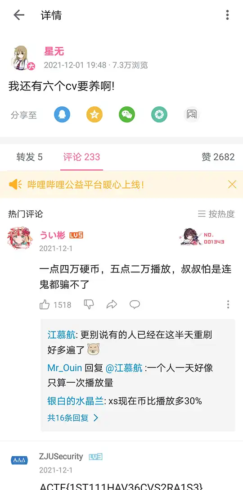

# 탕쿠쿠의유혹

## 题目简述

附件 `6cv_large.zip` 中有两张 $1536\times2048$ 的渐进式 JPEG：`6cv_large.jpg` 与 `6cv_large_competition_edition.jpg`。两者的 JPEG 标记段并不完全相同，但量化表、Huffman 表以及三通道的量化 DCT 系数一致，因此任选其一都能完成后续提取。

题面截图显示发布者为 `Liyuuu`（`@Liyu0109`），推文内容是宣布担任《Love Live! Superstar!!》中 Liella! 成员唐可可的声优，配图是一张人物自拍。结合文件名中的 `large`，可以判断线索指向 Twitter/X 的多尺寸媒体机制：先定位这条[原始推文](https://x.com/Liyu0109/status/1338320110176518144)，再取得原始尺寸配图作为封面图。参与系数比较的是下载的原图，而不是题面中的推文截图。

本题把载荷编码在封面图与题目图的“量化 DCT 系数是否发生变化”中。它不是常见工具直接识别的 JPEG 隐写，也不能先把 JPEG 解码成 RGB/YCrCb 像素再做 DCT；必须直接读取 JPEG 文件保存的量化系数。

## 解题过程

### 1. 确认正确的封面图

从原推文下载原始尺寸图片后，先核对以下特征：

- 尺寸与题目图一致，均为 $1536\times2048$；
- JPEG 的量化表和 Huffman 表一致；
- 两张图解码后的视觉内容相同，但压缩数据区存在规律性的少量差异。

原图 SHA-256 为：

```text
98ca6e7377fa893f5e3ccf199cdadf31bfc0d33658ef4b0dc4ff60a0cf9054ca
```

进一步按 JPEG 结构比较，可以确认 DQT、DHT 与图像尺寸一致，APP1 等部分标记段不同，熵编码数据区存在规律性差异。比赛托管时曾改写部分标记段并删除文件末尾的小提示，所以不能要求两个文件头逐字节相同；判断封面图是否正确，应以量化表、Huffman 表和后续系数差分结果为依据。

### 2. 在量化 DCT 系数域统计差异

JPEG 将亮度与色度通道分成 $8\times8$ 块，对每块进行 DCT 和量化。直接比较题目图与原图的量化系数，可以得到非常整齐的结果：

- Cb、Cr 两个色度通道完全没有变化；
- 只有亮度 $Y$ 通道发生变化；
- 每个 $8\times8$ 亮度块中，只有 Zigzag 序号 $0$ 到 $5$ 的六个系数可能改变；
- 改变时差值的绝对值恒为 $1$，未改变时差值为 $0$。

Zigzag 前六项在二维块中的位置依次为：

```text
(0,0), (0,1), (1,0), (2,0), (1,1), (0,2)
```

图片包含 $192\times256=49152$ 个亮度块，每块承载 6 bit，所以总载荷槽位为：

$$
49152\times6\div8=36864\text{ bytes}
$$

解出的 36864 字节中包含一个完整 WebP 和末尾的零填充；RIFF 长度字段给出的有效 WebP 大小是 29952 字节，剩余 6912 字节全部为零。

### 3. 按块顺序恢复比特流

读取时不跟随渐进式 JPEG 各 scan 在文件中的物理排列，而是遍历解码后的量化系数数组：亮度块从左到右、从上到下；每个块内按上述六个 Zigzag 位置依次读取。系数发生变化记为 `1`，没有变化记为 `0`，每 8 bit 按最高位在前打包。

下面的脚本使用 `jpegio` 直接读取量化 DCT 系数。三个参数依次为题目图、原始封面图和输出文件：

```python
#!/usr/bin/env python3
from pathlib import Path
import sys

import jpegio as jio


def main() -> None:
    if len(sys.argv) != 4:
        raise SystemExit(
            f"usage: {sys.argv[0]} <stego.jpg> <original.jpg> <output.webp>"
        )

    stego = jio.read(sys.argv[1])
    original = jio.read(sys.argv[2])

    if len(stego.coef_arrays) != 3 or len(original.coef_arrays) != 3:
        raise ValueError("expected one Y channel and two chroma channels")

    for channel in (1, 2):
        if (stego.coef_arrays[channel] != original.coef_arrays[channel]).any():
            raise ValueError(f"unexpected difference in chroma channel {channel}")

    stego_y = stego.coef_arrays[0]
    original_y = original.coef_arrays[0]
    if stego_y.shape != original_y.shape:
        raise ValueError("coefficient array shapes do not match")

    zigzag6 = ((0, 0), (0, 1), (1, 0), (2, 0), (1, 1), (0, 2))
    allowed = set(zigzag6)
    bits = []

    for block_y in range(0, stego_y.shape[0], 8):
        for block_x in range(0, stego_y.shape[1], 8):
            for row in range(8):
                for column in range(8):
                    difference = int(
                        stego_y[block_y + row, block_x + column]
                        - original_y[block_y + row, block_x + column]
                    )
                    if abs(difference) > 1:
                        raise ValueError("coefficient difference is larger than one")
                    if (row, column) not in allowed and difference != 0:
                        raise ValueError("difference outside the first six zigzag entries")

            for row, column in zigzag6:
                changed = (
                    stego_y[block_y + row, block_x + column]
                    != original_y[block_y + row, block_x + column]
                )
                bits.append(int(changed))

    if len(bits) % 8:
        raise ValueError("bit stream is not byte-aligned")

    payload = bytes(
        sum(bits[offset + bit] << (7 - bit) for bit in range(8))
        for offset in range(0, len(bits), 8)
    )
    if payload[:4] != b"RIFF" or payload[8:12] != b"WEBP":
        raise ValueError("decoded stream does not begin with a WebP RIFF header")

    webp_length = int.from_bytes(payload[4:8], "little") + 8
    if webp_length > len(payload):
        raise ValueError("RIFF length exceeds the extracted carrier capacity")
    if any(payload[webp_length:]):
        raise ValueError("unexpected non-zero data after the RIFF container")

    Path(sys.argv[3]).write_bytes(payload)
    print(
        f"stream_length={len(payload)}, riff_length={webp_length}, "
        f"header={payload[:12]!r}"
    )


if __name__ == "__main__":
    main()
```

正确结果首先输出：

```text
stream_length=36864, riff_length=29952, header=b'RIFF\xf8t\x00\x00WEBP'
```

`RIFF....WEBP` 说明比特极性、遍历顺序和字节序全部正确；长度字段 `f8 74 00 00` 按小端序解释为 29944，再加 8 字节 RIFF 头即 29952。其后 6912 字节全部为零，不属于 RIFF 容器；脚本保留完整的 36864 字节提取流，以便和载荷槽位逐字节对应。恢复出的 `recovered-flag.webp` 尺寸为 $540\times1088$，SHA-256 为：

```text
b16fee79dcdd67c604e24036f09072e9299589b00b6815f0595f880846114b0a
```



图片底部给出 flag：

```text
ACTF{1ST111HAV36CVS2RA1S3}
```

其中 `1ST111HAV36CVS2RA1S3` 是 `I STILL HAVE 6 CVS TO RAISE` 的数字替换写法。

### 4. 为什么像素域方案会得到损坏文件

OpenCV 和 Pillow 通常先把 JPEG 解码成 RGB/BGR，再转换到 YCrCb。颜色空间转换和整数取整会引入约 $0.05\%$ 的系数判断误差；对普通图片而言这些误差可能不明显，但对带有 RIFF 结构和压缩码流的 WebP，只要少数 bit 错误就会使输出无法通过 WebP 解码。这个失败现象及其原因已经能够用文本完整说明，损坏的二进制本身不再提供额外视觉证据。

因此本题必须绕过像素域，使用 `jpegio`、libjpeg 的 `jpeg_read_coefficients()` 或其他等价底层接口读取量化系数。

## 方法总结

本题的关键不是套用某个 JPEG 隐写工具，而是识别“原图与题目图共享同一压缩结构”这一证据，再在正确的数据层比较差异：

1. 依据题面、文件名和图片内容定位原推文，取得原始尺寸封面图；
2. 不受 APP1 等标记段差异干扰，核对 DQT、DHT 与图像尺寸；
3. 直接读取量化 DCT 系数，确认只有亮度块的 Zigzag 前六项发生 $\pm1$ 变化；
4. 以“改变为 1、未改变为 0”按块顺序和 MSB-first 方式打包；
5. 用 RIFF/WebP 文件头解析有效长度，确认尾部只有零填充，再以完整提取流的尺寸和哈希验证结果。

最容易踩坑的是先解码到 RGB/YCrCb 再比较 DCT。该路线改变了证据层，极少量舍入误差也足以损坏压缩载荷；处理 JPEG 系数域隐写时，应尽量直接操作文件内的量化系数。
