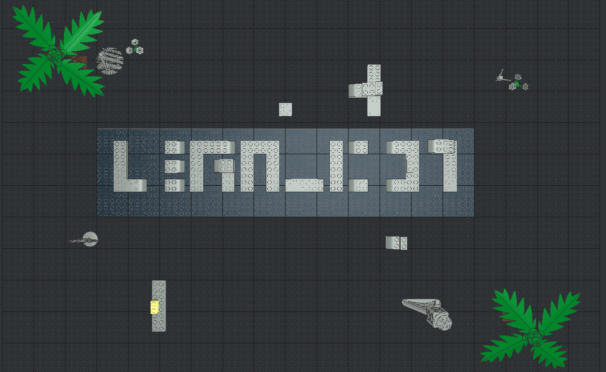
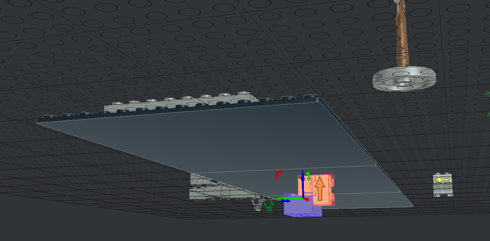
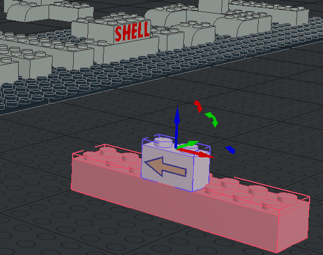
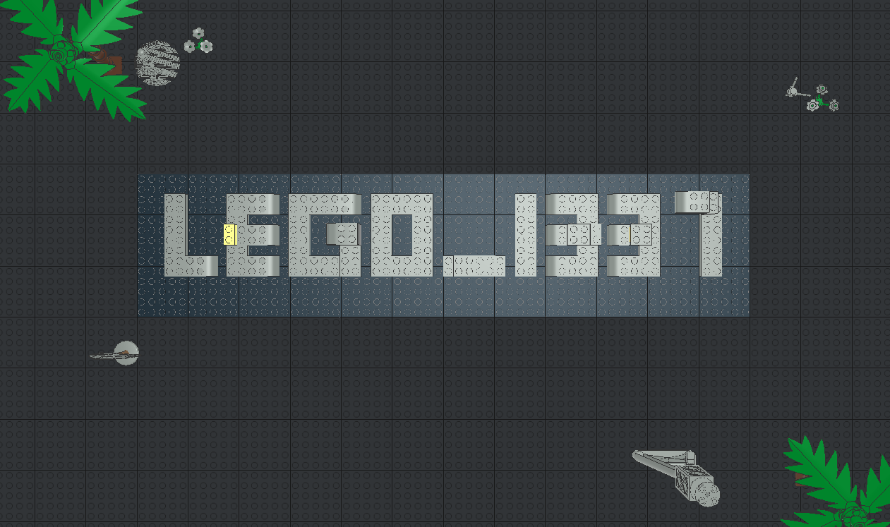

# LeoGO

## 题目简述

附件名为 unknown，但内容以“0 Name: New Model.ldr”开头，后续大量记录形如“1 color x y z matrix part.dat”。这是 LDraw/LeoCAD 使用的 LDR 乐高模型文本格式：类型 1 行描述一个零件的颜色、三维位置、旋转矩阵和零件编号。

模型可以正常打开，但中央字符由积木拼成且缺少若干部件；散落零件和箭头提供空间摆放提示。flag 需要从修复后的三维模型中读取，因此归入 stego。

## 解题过程

先把 unknown 复制或重命名为 .ldr，再用 LeoCAD 打开。源码中的坐标和矩阵只是模型描述，不适合把完整列表贴进 WP；真正决定解法的是渲染后的空间关系。

转动视角检查模型下方，可以发现箭头指向应修补的位置：

场景中另有带箭头的散落积木，箭头给出移动方向和朝向：

在 LeoCAD 中选择这些零件，按箭头提示进行平移和必要的旋转，使它们填入中央字符的空缺。完成后顶视图清楚显示最终文本：

因此提交：

~~~text
shellmates{LEGO_1337}
~~~

原官方说明中的源码编辑器截图和“哪些程序能打开 LDR”的网页截图都只是可转写文本，未保留。

## 方法总结

扩展名缺失时应先看文件头和记录语法，而不是猜媒体格式。LDraw 类型 1 记录中的 part.dat、三维坐标和变换矩阵是强识别信号。对空间模型题，顶视图、底视图和零件朝向本身就是证据，不能全部压成文字；但文件列表和格式搜索结果可以直接转写，只保留真正影响摆放判断的视觉材料。
