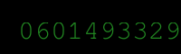

# Revenge of the ZIP

## 题目简述

题目把 flag 放在 `UnzipME0.zip` 中，再连续套入 `UnzipME1.zip` 到 `UnzipME50.zip`。每一层都使用新的十位数字密码；当前层同时包含一张被逐行水平错位的 `password.png` 和 60 个整数构成的 `shift_keys`，二者共同给出下一层 ZIP 的密码。

真正决定解法的不是 ZIP 层数，而是从图像的空间错位中恢复口令。图像高 60 像素，`shift_keys` 也恰好有 60 行，说明每个数对应一条扫描行，因此本题归入隐写方向。

## 解题过程

出题脚本先在 $200\times60$ 的黑色图像上绘制绿色密码，再对每一行选择随机位移量 `key`：

```python
for y in range(height):
    key = random.randint(0, width - 1)
    keys.append(key)
    for x in range(width):
        pixels[(x + key) % width, y] = backup[x]
```

如果原像素横坐标为 $x$、图像宽度为 $w$，扰乱后的位置为 $(x+k)\bmod w$。逆变换只需使用相反方向：把扰乱图中横坐标为 $x$ 的像素写到 $(x-k)\bmod w$。

对最外层图片执行逆变换后，可以清楚看到十位数字密码：



该图不是终端或代码截图，而是题目用来承载每层口令的直接视觉证据，因此予以保留。最外层恢复值为 `0601493329`，它可以解开 `UnzipME50.zip`；解压后又得到 `UnzipME49.zip` 以及下一组图片和位移量。

下面的完整求解脚本使用 Pillow 还原图像、Tesseract 识别十位数字，并用 Python 标准库逐层解压。运行前需要安装 `Pillow`、`pytesseract`，同时让系统能够调用 Tesseract OCR：

```python
from pathlib import Path
from zipfile import ZipFile

from PIL import Image
from pytesseract import image_to_string


def restore_password(image_path, keys_path):
    image = Image.open(image_path).convert("RGB")
    keys = [int(line) for line in keys_path.read_text().splitlines()]
    width, height = image.size
    assert height == len(keys)

    restored = Image.new("RGB", image.size)
    for y, key in enumerate(keys):
        for x in range(width):
            restored.putpixel(
                ((x - key) % width, y),
                image.getpixel((x, y)),
            )
    return restored


work = Path("work")
work.mkdir(exist_ok=True)

with ZipFile("chall.zip") as archive:
    archive.extractall(work)

for layer in range(50, -1, -1):
    restored = restore_password(
        work / "password.png",
        work / "shift_keys",
    )
    password = image_to_string(
        restored,
        config="--psm 7 -c tessedit_char_whitelist=0123456789",
    ).strip().replace(" ", "")

    assert len(password) == 10 and password.isdigit(), password
    with ZipFile(work / f"UnzipME{layer}.zip") as archive:
        archive.extractall(work, pwd=password.encode())

print((work / "flag.txt").read_text().strip())
```

实际对 51 组图片逐层复原，并让每个候选密码通过下一层 ZIP 的解密与 CRC 校验后，最终得到：

```text
shellmates{z1ppity_5hiFty_th3_fl4g_1s_n0w_YouR_pr0p3rty}
```

## 方法总结

本题的识别信号是“图像高度与密钥行数相同”，它把看似随机的数列解释成逐行位移量。循环位移的逆操作仍是循环位移，只需把偏移从 $+k$ 改成 $-k$；恢复出的十位数字再作为下一层 ZIP 密码，形成固定的迭代过程。

自动化时应限制 OCR 字符集并检查结果是否恰好为十位数字，还要以 ZIP 解密和 CRC 通过作为最终验证，不能只相信 OCR 文本。题目每层图片的视觉机制相同，保留一张代表性的恢复图即可；其余 50 张只会重复同一证据，没有必要全部归档。
