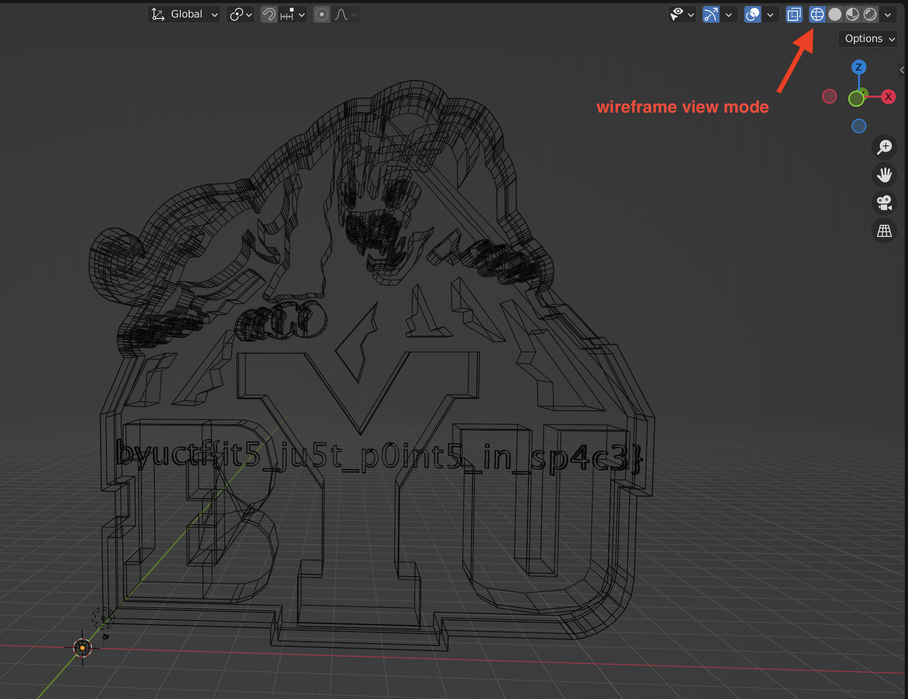

# BYUCTF 2022 - Banana Smoothie

## 题目简述

附件名为 `flag.png`，却无法按 PNG 打开。题目把真实文件类型伪装在扩展名下，并把文字藏在三维模型的内部线框结构中。

## 解题过程

先检查文件头与文本内容：

```bash
file flag.png
head flag.png
```

开头可见：

```text
# This file uses centimeters as units for non-parametric coordinates.
mtllib byu2.mtl
g default
```

后续大量 `v` 顶点记录表明它实际是 Wavefront OBJ，而不是图片。把文件改为 `.obj` 后导入 Blender；普通实体视图主要显示 BYU 标志，切换到 Wireframe 并调整观察角度，模型内部的点和边组成清晰文字：



读取得到：

```text
byuctf{it5_ju5t_p0int5_in_sp4c3}
```

## 方法总结

扩展名不能代表真实格式，应先检查魔数和内容结构。OBJ 的顶点、面和材质声明可以直接从文本识别；模型打开后若实体表面没有信息，还应检查线框、背面、内部几何与不同投影视角。
