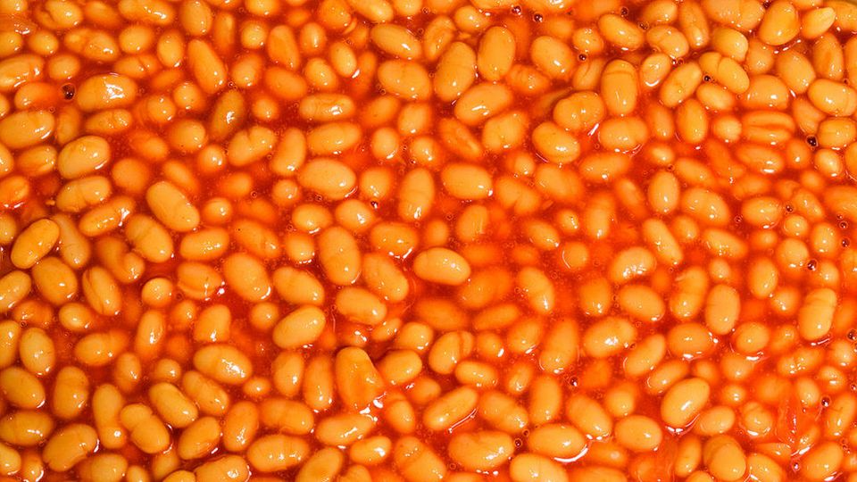
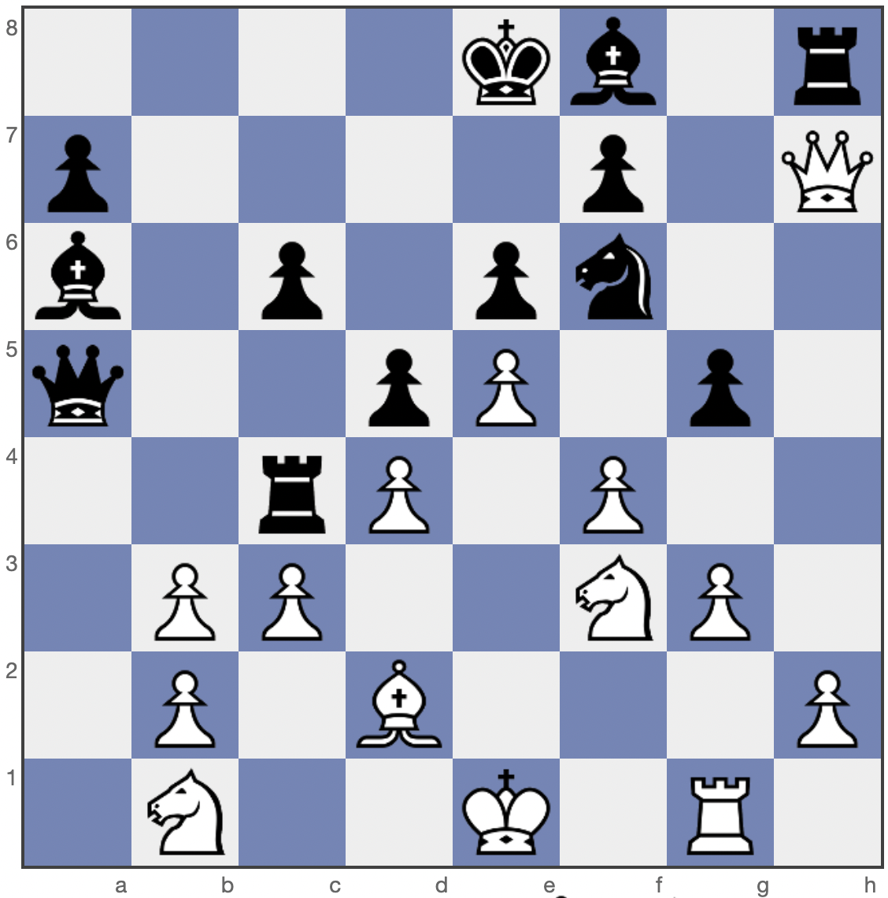

# BYUCTF 2022 - Beans Beans Beans

## 题目简述

题目给出一张豆子图片和一张摆有棋子的棋盘。第一张图实际是 PNG 数据却使用 `.jpg` 扩展名；第二张图不是装饰，而是指出应组合哪些颜色通道位平面。





## 解题过程

棋盘的列字母 `G`、`B` 分别表示 Green 与 Blue 通道；行号表示位编号，按零基换算后得到需要抽取的位：

```text
G0, G2, G4, B0, B1, B2
```

选择的位集合是 `G0/G2/G4/B0/B1/B2`。若查看器的组合界面按输出高位到低位排列，则应在界面中填写 `G4, G2, G0, B2, B1, B0`；这只是显示顺序，与棋盘给出的位编号并不矛盾。恢复出的图像直接显示：

```text
byuctf{b4k3d_b34n5_4r3_the_b35t}
```

如果结果只有噪点，先确认软件显示的位编号是从最低位 `0` 开始，以及组合顺序是否被反转。

## 方法总结

本题把“提取参数”藏在另一张图片里。棋盘列确定颜色通道、棋盘行确定 bit plane；载体文件的错误扩展名则是第一层提示。位集合和输出位序必须分别确认。
